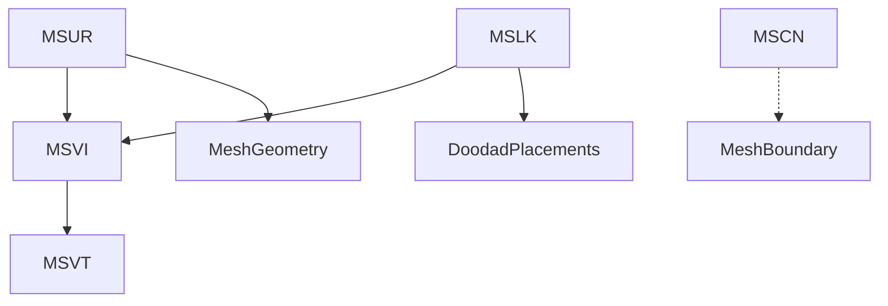

# PM4 Mesh Extraction Pipeline

## Overview
The mesh extraction pipeline for PM4 files reconstructs renderable geometry and boundary data from navigation files. This is essential for visualization, analysis, and comparison with WMO/ADT assets.

## Steps
1. **Parse Chunks**: Load all relevant chunks (MSVT, MSVI, MSUR, MSCN, MSLK, etc.).
2. **Build Vertex List**: Extract vertices from MSVT.
3. **Build Index List**: Extract indices from MSVI.
4. **Build Faces**: Use MSUR to define faces, referencing MSVI indices.
5. **Extract Boundary Vertices**: Use MSCN to get exterior (boundary) vertices.
6. **Map Doodad Placements**: Use MSLK to extract doodad placements, mapping to anchor points via MSVI/MSVT.
7. **Export Mesh**: Assemble MeshGeometry object, optionally export as OBJ/YAML.

## Data Flow


## Edge Cases & Ambiguities
- Some PM4 files may have missing or malformed chunks; robust error handling is required.
- Index type mismatches (uint vs int) can cause build/runtime errors.
- The relationship between MSCN and MSLK is not fully mapped; further research is ongoing.
- Doodad placement decoding (MSLK) may require additional context from MDBH or ADT files.

# Data Flow and Relationships: MSCN, MSLK, MSVT, MSVI

## Visualization

```mermaid
graph TD
  MSVT[MSVT (Vertex Table)] --> MSVI[MSVI (Index Table)]
  MSVI --> MSUR[MSUR (Surface Definitions)]
  MSVI --> MSLK[MSLK (Doodad Placements)]
  MSLK --> MSLKAnchor[MSLK Anchor Points (via MSVI/MSVT)]
  MSCN[MSCN (Boundary Vertices)]
  MSCN -.-> MergedMesh[? Merged Mesh/Spatial Relationship]
  MSLKAnchor -.-> MergedMesh
  MSVT --> MergedMesh
```

## Narrative
- **MSVT** is the canonical vertex table, referenced by indices in **MSVI**.
- **MSVI** provides indices for both mesh faces (via **MSUR**) and for anchor points in **MSLK** entries.
- **MSLK** entries use an anchor index (Unknown_0x10) into MSVI, which then references a vertex in MSVT. These anchors are used for doodad placements or nodes.
- **MSCN** contains a list of exterior (boundary) vertices. The count of MSCN points often exceeds the number of MSVT vertices, suggesting it is not a simple subset or direct mapping.
- The relationship between MSCN points and MSLK anchors (or MSVT vertices) is not direct. There may be a spatial or structural mapping, but this remains an open question.
- A merged mesh or point cloud analysis (combining MSCN, MSLK anchors, and MSVT vertices) may reveal patterns or relationships not obvious from indices alone.

## Ambiguities
- **MSCN count > MSVT count:** Why does this occur? Are MSCN points representing additional geometry, navigation boundaries, or something else?
- **Anchor Mapping:** Are MSLK anchor points always present in MSCN, or are they distinct? Is there a spatial proximity or other mapping?
- **Next Steps:** Merged mesh analysis and further statistical/spatial investigation are needed to clarify these relationships. 