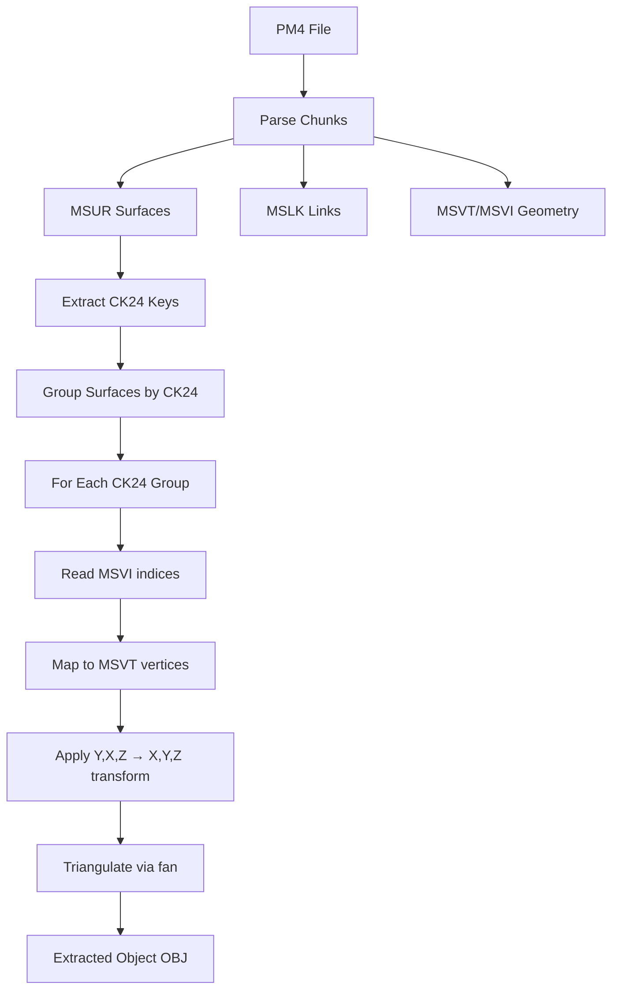

# PM4 File Format Specification

> **Definitive reference for PM4 server-side pathfinding files**  
> Last updated: December 12, 2025

PM4 files are server-side pathfinding supplements to ADT terrain files. One PM4 exists per root ADT. They are **not shipped to clients** and contain navigation mesh data, object boundaries, and placement references.

---

## File Structure

PM4 uses IFF-style chunked format with **reversed FourCCs** on disk (e.g., "MVER" stored as "REVM").

| Chunk | Size/Entry | Purpose |
|-------|------------|---------|
| MVER | 4 bytes | Version (typically 1) |
| MSHD | 32 bytes | Header metadata |
| MSLK | 20 bytes | Object catalog/linkage |
| MSPI | 4 bytes | Path indices → MSPV |
| MSPV | 12 bytes | Path vertices (navigation mesh) |
| MSVT | 12 bytes | Mesh vertices (render geometry) |
| MSVI | 4 bytes | Mesh indices → MSVT |
| MSUR | 32 bytes | Surface definitions |
| MSCN | 12 bytes | Exterior/collision vertices |
| MPRL | 24 bytes | Position references |
| MPRR | 4 bytes | Reference data |
| MDBH/MDOS/MDSF | Variable | Destructible buildings |

---

## Coordinate Systems

> [!CAUTION]
> Different chunks use different coordinate systems!

### MSVT (Mesh Vertices)
```
File: (Y, X, Z) → World: (X, Y, Z)
Transform: new Vector3(vertex.Y, vertex.X, vertex.Z)
```

### MSPV (Path Vertices)  
```
File: (X, Y, Z) → World: (X, Y, Z)
Transform: No change (standard coordinates)
```

### MSCN (Exterior Vertices)
```
File: (X, Y, Z) → World: (Y, -X, Z)
Transform: new Vector3(vertex.Y, -vertex.X, vertex.Z)
```
> [!WARNING]
> The 180° X rotation documented in Pm4CoordinateTransforms.cs is **WRONG**!
> Visual verification proves MSCN needs (Y, -X, Z) to match minimap orientation.

### MPRL (Position References)
```
File: (X, Y, Z) → World: (X, -Z, Y)
Transform Matrix: 
  [1, 0,  0, 0]
  [0, 0, -1, 0]
  [0, 1,  0, 0]
  [0, 0,  0, 1]
```

---

## ADT Patching (MODF Chunk)

> [!IMPORTANT]
> Critical findings from ADT patching implementation.

### MODF Entry Structure (64 bytes)

| Offset | Size | Field | Notes |
|--------|------|-------|-------|
| 0x00 | 4 | NameId | Index into MWID |
| 0x04 | 4 | UniqueId | **Must be globally unique!** |
| 0x08 | 12 | Position | C3Vector XZY (Y/Z swapped) |
| 0x14 | 12 | Rotation | C3Vector **XYZ (NOT swapped!)** |
| 0x20 | 24 | Extents | CAaBox (min/max) XZY |
| 0x38 | 2 | Flags | |
| 0x3A | 2 | DoodadSet | |
| 0x3C | 2 | NameSet | |
| 0x3E | 2 | Scale | **3.3.5: padding=0, Legion+: scale/1024** |

### Rotation Order Fix

> [!WARNING]
> Rotation is **NOT** swapped like position!

**WRONG** (causes tilt instead of heading):
```csharp
bw.Write(rotation.X);
bw.Write(rotation.Z);  // WRONG - heading goes to tilt!
bw.Write(rotation.Y);
```

**CORRECT**:
```csharp
bw.Write(rotation.X);  // pitch
bw.Write(rotation.Y);  // heading (yaw)
bw.Write(rotation.Z);  // roll
```

Wiki placement matrix uses: `rotateY(rot[1]-270°)`, `rotateZ(-rot[0])`, `rotateX(rot[2]-90°)`

### UniqueId Requirements
- Must be **globally unique** across ALL ADT tiles
- Pre-scan all source ADTs to collect existing UniqueIds
- Assign new IDs starting from high values (e.g., 100,000,000+)

---

## WL* Liquid Files

WL* files (WLW, WLM, WLQ, WLL) contain liquid height data for restoration.

### Conversion to MH2O
- WL* files use 4x4 vertex grids per block (360 bytes/block)
- MH2O uses 9x9 height grids - requires bilinear upsampling
- **MH2O serialization is complex** - format issues can crash Noggit

> [!CAUTION]
> Current MH2O serialization has format issues. Injection is disabled pending fix.

---

## Key Chunk Details

### MSLK (20 bytes/entry)
Object catalog linking surfaces to geometry.

```c
struct MSLKEntry {
    uint8_t  type_flags;       // Object type (1-18)
    uint8_t  subtype;          // Variant (0-7)
    uint16_t padding;          // Always 0
    uint32_t group_object_id;  // Grouping ID
    int24_t  mspi_first;       // Index into MSPI (-1 = no geometry)
    uint8_t  mspi_count;       // Count of MSPI entries
    uint24_t link_id;          // Tile crossing: 0xFFFFYYXX
    uint16_t ref_index;        // Cross-reference
    uint16_t system_flag;      // Always 0x8000
};
```

### MSUR (32 bytes/entry)
Surface definitions for triangulation.

```c
struct MSUREntry {
    uint8_t  group_key;        // 0=M2 props, non-zero=walkable
    uint8_t  index_count;      // Indices in MSVI for this surface
    uint8_t  attribute_mask;   // bit7=liquid candidate
    uint8_t  padding;
    float    normal_x, normal_y, normal_z;  // Surface normal
    float    height;           // Plane height (Y-world)
    uint32_t msvi_first;       // Starting index in MSVI
    uint32_t mdos_index;       // Link to destructibles
    uint32_t packed_params;    // Contains CK24 key
};
```

**CK24 Extraction:**
```csharp
uint CK24 = (packed_params & 0xFFFFFF00) >> 8;
```

---

## Object Extraction Pipeline



### Triangulation Method
MSUR surfaces use **fan triangulation** from MSVI indices:
```csharp
for (int i = 2; i < surface.IndexCount; i++) {
    int v0 = msvi[surface.MsviFirstIndex];      // Fan center
    int v1 = msvi[surface.MsviFirstIndex + i - 1];
    int v2 = msvi[surface.MsviFirstIndex + i];
    EmitTriangle(msvt[v0], msvt[v1], msvt[v2]);
}
```

---

## Known Unknowns

| Item | Status | Notes |
|------|--------|-------|
| MSCN segmentation | Unknown | Cannot split by CK24, may be unified collision |
| MSHD header fields | Unknown | 8 uint32s, purpose TBD |
| MPRL rotation data | Partial | May contain object orientation? |
| MPRR purpose | Unknown | Reference data linking MPRL |
| MH2O serialization | Broken | Instance structure needs wiki compliance |

---

## References

- [wowdev.wiki/ADT#MODF_chunk](https://wowdev.wiki/ADT#MODF_chunk)
- [wowdev.wiki/PM4](https://wowdev.wiki/PM4)
- [WoWRollback.PM4Module](file:///J:/wowDev/parp-tools/gillijimproject_refactor/WoWRollback/WoWRollback.PM4Module/)
