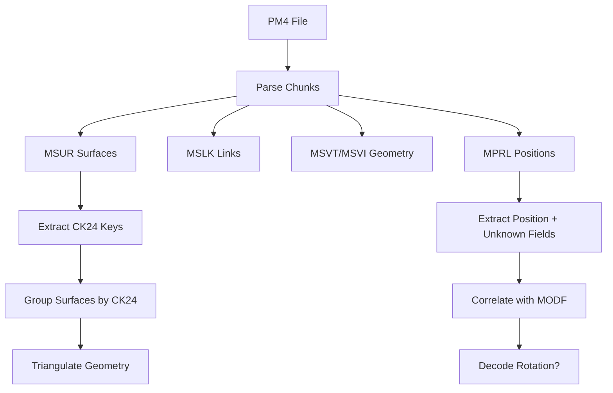

# PM4 File Format Specification

> **Definitive reference for PM4 server-side pathfinding files**  
> Last updated: December 12, 2025

PM4 files are server-side pathfinding supplements to ADT terrain files. One PM4 exists per root ADT. They are **not shipped to clients** and contain navigation mesh data, object boundaries, and placement references.

---

## File Structure

PM4 uses IFF-style chunked format with **reversed FourCCs** on disk (e.g., "MVER" stored as "REVM").

| Chunk | Size/Entry | Purpose |
|-------|------------|---------|
| MVER | 4 bytes | Version (typically 1) |
| MSHD | 32 bytes | Header metadata |
| MSLK | 20 bytes | Object catalog/linkage |
| MSPI | 4 bytes | Path indices → MSPV |
| MSPV | 12 bytes | Path vertices (navigation mesh) |
| MSVT | 12 bytes | Mesh vertices (render geometry) |
| MSVI | 4 bytes | Mesh indices → MSVT |
| MSUR | 32 bytes | Surface definitions |
| MSCN | 12 bytes | Exterior/collision vertices |
| **MPRL** | **24 bytes** | **Position references (may contain rotation!)** |
| MPRR | Variable | Reference data (index sequences) |
| MDBH/MDOS/MDSF | Variable | Destructible buildings |

---

## Coordinate Systems

> [!CAUTION]
> Different chunks use different coordinate systems!

### MSVT (Mesh Vertices)
```
File: (Y, X, Z) → World: (X, Y, Z)
Transform: new Vector3(vertex.Y, vertex.X, vertex.Z)
```

### MSPV (Path Vertices)  
```
File: (X, Y, Z) → World: (X, Y, Z)
Transform: No change (standard coordinates)
```

### MSCN (Exterior Vertices)
```
File: (X, Y, Z) → World: (Y, -X, Z)
Transform: new Vector3(vertex.Y, -vertex.X, vertex.Z)
```

### MPRL (Position References)
```
File: floats stored directly as X, Y, Z
Transform: May need (X, -Z, Y) based on wiki
```

---

## MPRL Chunk (24 bytes/entry) - ROTATION INVESTIGATION

> [!IMPORTANT]
> MPRL may contain object rotation data in undecoded fields!

### Structure

| Offset | Size | Field | Status |
|--------|------|-------|--------|
| 0x00 | 2 | Unknown_0x00 | Always 0 |
| 0x02 | 2 | Unknown_0x02 | -1 for "command" entries |
| **0x04** | **2** | **Unknown_0x04** | **← ROTATION CANDIDATE** |
| 0x06 | 2 | Unknown_0x06 | Always 0x8000 (constant) |
| 0x08 | 4 | Position.X | Float |
| 0x0C | 4 | Position.Y | Float |
| 0x10 | 4 | Position.Z | Float |
| **0x14** | **2** | **Unknown_0x14** | **← ROTATION CANDIDATE ("floor_offset")** |
| 0x16 | 2 | Unknown_0x16 | Attribute flags |

### Rotation Hypotheses

**Unknown_0x04 (ushort):**
- Could encode **heading angle** as 0-65535 → 0°-360°
- Conversion: `heading = (Unknown0x04 / 65536.0f) * 360.0f`

**Unknown_0x14 (short):**
- Labeled "floor_offset" in old docs
- Could encode **facing direction** or **pitch**
- Worth correlating with known MODF rotations

### Validation Constants (from MprrHypothesisAnalyzer)
```csharp
MPRL_UNK02_EXPECTED = -1;    // Command entry marker
MPRL_UNK06_EXPECTED = 0x8000; // Always set
```

---

## ADT Patching (MODF Chunk)

> [!IMPORTANT]
> Critical findings from ADT patching implementation.

### MODF Entry Structure (64 bytes)

| Offset | Size | Field | Notes |
|--------|------|-------|-------|
| 0x00 | 4 | NameId | Index into MWID |
| 0x04 | 4 | UniqueId | **Must be globally unique!** |
| 0x08 | 12 | Position | C3Vector XZY (Y/Z swapped) |
| 0x14 | 12 | Rotation | C3Vector **XYZ (NOT swapped!)** |
| 0x20 | 24 | Extents | CAaBox (min/max) XZY |
| 0x38 | 2 | Flags | |
| 0x3A | 2 | DoodadSet | |
| 0x3C | 2 | NameSet | |
| 0x3E | 2 | Scale | **3.3.5: padding=0, Legion+: scale/1024** |

### Rotation Order Fix

> [!WARNING]
> Rotation is **NOT** swapped like position!

```csharp
// WRONG (causes tilt instead of heading):
bw.Write(rotation.X);
bw.Write(rotation.Z);  // heading goes to tilt!
bw.Write(rotation.Y);

// CORRECT:
bw.Write(rotation.X);  // pitch
bw.Write(rotation.Y);  // heading (yaw)
bw.Write(rotation.Z);  // roll
```

### Position Calculation

Use **bounding box center** instead of vertex centroid:
```csharp
var pm4BoundsCenter = (pm4Stats.BoundsMin + pm4Stats.BoundsMax) / 2;
var wmoBoundsCenter = (wmoStats.BoundsMin + wmoStats.BoundsMax) / 2;
var translation = pm4BoundsCenter - (wmoBoundsCenter * scale);
```

### Proximity Deduplication

Skip PM4 entries within 5 units of existing museum placements:
```csharp
const float PROXIMITY_THRESHOLD = 5.0f;
if (distanceToExisting < PROXIMITY_THRESHOLD)
    continue; // Prefer museum placement
```

---

## Key Chunk Details

### MSLK (20 bytes/entry)
Object catalog linking surfaces to geometry.

```c
struct MSLKEntry {
    uint8_t  type_flags;       // Object type (1-18)
    uint8_t  subtype;          // Variant (0-7)
    uint16_t padding;          // Always 0
    uint32_t group_object_id;  // Grouping ID
    int24_t  mspi_first;       // Index into MSPI (-1 = no geometry)
    uint8_t  mspi_count;       // Count of MSPI entries
    uint24_t link_id;          // Tile crossing: 0xFFFFYYXX
    uint16_t ref_index;        // Cross-reference
    uint16_t system_flag;      // Always 0x8000
};
```

### MSUR (32 bytes/entry)
Surface definitions for triangulation.

**CK24 Extraction:**
```csharp
uint CK24 = (packed_params & 0xFFFFFF00) >> 8;
```

---

## Object Extraction Pipeline



---

## Known Unknowns

| Item | Status | Notes |
|------|--------|-------|
| MPRL Unknown_0x04 | **INVESTIGATE** | Potential heading angle |
| MPRL Unknown_0x14 | **INVESTIGATE** | Potential facing/pitch |
| MSCN segmentation | Unknown | Cannot split by CK24 |
| MSHD header fields | Unknown | 8 uint32s |
| MH2O serialization | Broken | SMLiquidInstance format wrong |

---

## References

- [wowdev.wiki/ADT#MODF_chunk](https://wowdev.wiki/ADT#MODF_chunk)
- [wowdev.wiki/PM4](https://wowdev.wiki/PM4)
- [MprrHypothesisAnalyzer.cs](file:///J:/wowDev/parp-tools/gillijimproject_refactor/WoWRollback/WMOv14/WMO2Q3/old_sources/src/WoWToolbox/WoWToolbox.AnalysisTool/MprrHypothesisAnalyzer.cs)
