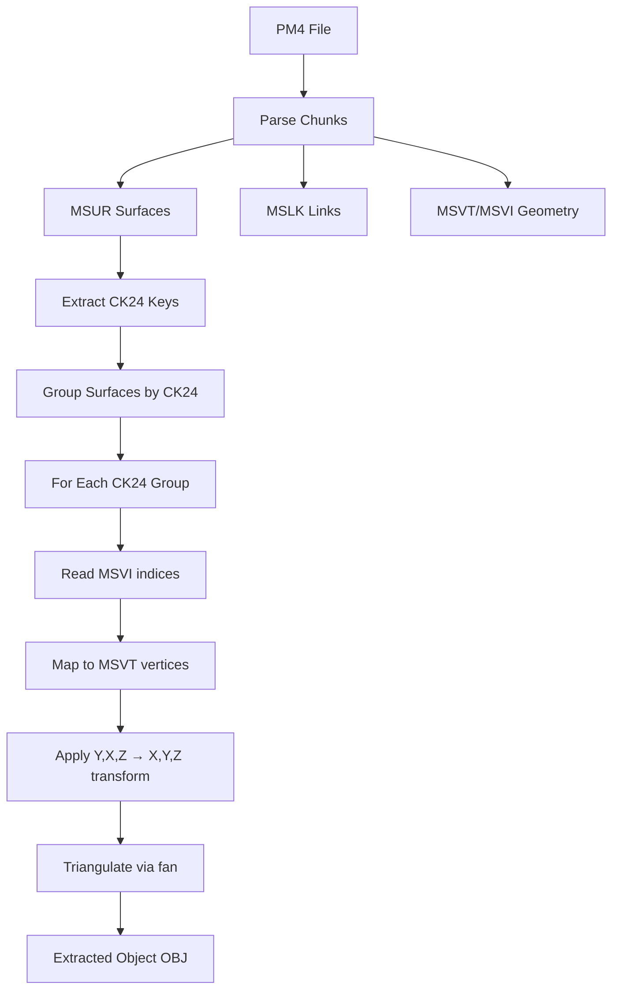

# PM4 File Format Specification

> **Definitive reference for PM4 server-side pathfinding files**  
> Last updated: December 12, 2025

PM4 files are server-side pathfinding supplements to ADT terrain files. One PM4 exists per root ADT. They are **not shipped to clients** and contain navigation mesh data, object boundaries, and placement references.

---

## File Structure

PM4 uses IFF-style chunked format with **reversed FourCCs** on disk (e.g., "MVER" stored as "REVM").

| Chunk | Size/Entry | Purpose |
|-------|------------|---------|
| MVER | 4 bytes | Version (typically 1) |
| MSHD | 32 bytes | Header metadata |
| MSLK | 20 bytes | Object catalog/linkage |
| MSPI | 4 bytes | Path indices → MSPV |
| MSPV | 12 bytes | Path vertices (navigation mesh) |
| MSVT | 12 bytes | Mesh vertices (render geometry) |
| MSVI | 4 bytes | Mesh indices → MSVT |
| MSUR | 32 bytes | Surface definitions |
| MSCN | 12 bytes | Exterior/collision vertices |
| MPRL | 24 bytes | Position references |
| MPRR | 4 bytes | Reference data |
| MDBH/MDOS/MDSF | Variable | Destructible buildings |

---

## Coordinate Systems

> [!CAUTION]
> Different chunks use different coordinate systems!

### MSVT (Mesh Vertices)
```
File: (Y, X, Z) → World: (X, Y, Z)
Transform: new Vector3(vertex.Y, vertex.X, vertex.Z)
```

### MSPV (Path Vertices)  
```
File: (X, Y, Z) → World: (X, Y, Z)
Transform: No change (standard coordinates)
```

### MSCN (Exterior Vertices)
```
File: (Y, X, Z) → World: (X, Y, Z)
Transform: new Vector3(vertex.Y, vertex.X, vertex.Z)
```
> [!WARNING]
> The 180° X rotation documented in Pm4CoordinateTransforms.cs is **WRONG**!
> Visual verification proves MSCN uses same (Y,X,Z) ordering as MSVT.

### MPRL (Position References)
```
File: (X, Y, Z) → World: (X, -Z, Y)
Transform Matrix: 
  [1, 0,  0, 0]
  [0, 0, -1, 0]
  [0, 1,  0, 0]
  [0, 0,  0, 1]
```

---

## Key Chunk Details

### MSLK (20 bytes/entry)
Object catalog linking surfaces to geometry.

```c
struct MSLKEntry {
    uint8_t  type_flags;       // Object type (1-18)
    uint8_t  subtype;          // Variant (0-7)
    uint16_t padding;          // Always 0
    uint32_t group_object_id;  // Grouping ID
    int24_t  mspi_first;       // Index into MSPI (-1 = no geometry)
    uint8_t  mspi_count;       // Count of MSPI entries
    uint24_t link_id;          // Tile crossing: 0xFFFFYYXX
    uint16_t ref_index;        // Cross-reference
    uint16_t system_flag;      // Always 0x8000
};
```

**Key Properties:**
- `HasGeometry`: `mspi_first >= 0`
- `LinkId`: Encodes tile crossing (YY=Y tile, XX=X tile)

---

### MSUR (32 bytes/entry)
Surface definitions for triangulation.

```c
struct MSUREntry {
    uint8_t  group_key;        // 0=M2 props, non-zero=walkable
    uint8_t  index_count;      // Indices in MSVI for this surface
    uint8_t  attribute_mask;   // bit7=liquid candidate
    uint8_t  padding;
    float    normal_x, normal_y, normal_z;  // Surface normal
    float    height;           // Plane height (Y-world)
    uint32_t msvi_first;       // Starting index in MSVI
    uint32_t mdos_index;       // Link to destructibles
    uint32_t packed_params;    // Contains CK24 key
};
```

**CK24 Extraction:**
```csharp
uint CK24 = (packed_params & 0xFFFFFF00) >> 8;
```

CK24 groups surfaces belonging to the same object.

---

### MSCN (12 bytes/vertex)
Exterior boundary vertices for collision/pathing.

> [!WARNING]
> MSCN has **no linking metadata** to segment by object (CK24). It may represent a **unified collision network** spanning all tiles.

```c
struct MSCNVertex {
    float x, y, z;  // Requires complex transform (see above)
};
```

---

### MPRL (24 bytes/entry)
Position/placement reference data.

```c
struct MPRLEntry {
    uint16_t unk_0x00;    // Always 0
    int16_t  unk_0x02;    // -1 for command entries
    uint16_t unk_0x04;
    uint16_t unk_0x06;
    int32_t  pos_x, pos_y, pos_z;  // C3Vectori position
    int16_t  floor_offset;
    uint16_t attribute_flags;
};
```

**Entry Types:**
- Position entries: `unk_0x02 != -1`
- Command entries: `unk_0x02 == -1`

---

## Object Extraction Pipeline



### Triangulation Method
MSUR surfaces use **fan triangulation** from MSVI indices:
```csharp
// For surface with IndexCount indices starting at MsviFirstIndex
for (int i = 2; i < surface.IndexCount; i++) {
    int v0 = msvi[surface.MsviFirstIndex];      // Fan center
    int v1 = msvi[surface.MsviFirstIndex + i - 1];
    int v2 = msvi[surface.MsviFirstIndex + i];
    EmitTriangle(msvt[v0], msvt[v1], msvt[v2]);
}
```

---

## Known Unknowns

| Item | Status | Notes |
|------|--------|-------|
| MSCN segmentation | Unknown | Cannot split by CK24, may be unified collision |
| MSHD header fields | Unknown | 8 uint32s, purpose TBD |
| MPRL attribute_flags | Partial | Some bits decoded, others unknown |
| MPRR purpose | Unknown | Reference data linking MPRL |

---

## References

- [next/parpDocumentation/pm4-specification.md](file:///J:/wowDev/parp-tools/gillijimproject_refactor/next/parpDocumentation/pm4-specification.md)
- [reference_data/wowdev.wiki/PM4.md](file:///J:/wowDev/parp-tools/gillijimproject_refactor/reference_data/wowdev.wiki/PM4.md)
- [reference_data/wowdev.wiki/PD4.md](file:///J:/wowDev/parp-tools/gillijimproject_refactor/reference_data/wowdev.wiki/PD4.md)
- [WoWRollback.PM4Module/PM4File.cs](file:///J:/wowDev/parp-tools/gillijimproject_refactor/WoWRollback/WoWRollback.PM4Module/PM4File.cs)
- [Pm4CoordinateTransforms.cs](file:///J:/wowDev/parp-tools/gillijimproject_refactor/WoWRollback/WMOv14/WMO2Q3/old_sources/src/WoWToolbox/WoWToolbox.Core.v2/Foundation/Transforms/Pm4CoordinateTransforms.cs)
