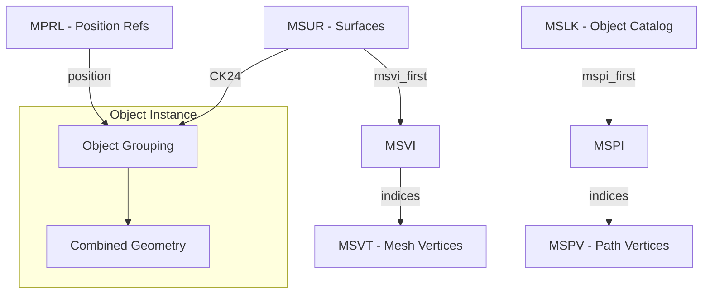

# PM4 File Format Specification

> **Definitive reference for PM4 server-side pathfinding files**  
> Last updated: December 13, 2025

PM4 files are server-side pathfinding supplements to ADT terrain files. One PM4 exists per root ADT. They are **not shipped to clients** and contain navigation mesh data, object boundaries, and placement references.

---

## File Structure

PM4 uses IFF-style chunked format with **reversed FourCCs** on disk (e.g., "MVER" stored as "REVM").

| Chunk | Size/Entry | Purpose |
|-------|------------|---------|
| MVER | 4 bytes | Version (typically 1) |
| MSHD | 32 bytes | Header metadata |
| **MSLK** | **20 bytes** | **Object catalog/linkage** |
| MSPI | 4 bytes | Path indices → MSPV |
| MSPV | 12 bytes | Path vertices (navigation mesh) |
| **MSVT** | **12 bytes** | **Mesh vertices (render geometry)** |
| MSVI | 4 bytes | Mesh indices → MSVT |
| **MSUR** | **32 bytes** | **Surface definitions (contains CK24!)** |
| **MSCN** | **Variable (~16MB total)** | **Map Chunk Scene Nodes (M2 placement?)** |
| **MPRL** | **24 bytes** | **Position references** |
| MPRR | Variable | Reference data (index sequences) |
| MDBH/MDOS/MDSF | Variable | Destructible buildings |

---

## Coordinate Systems

> [!CAUTION]
> Different chunks use different coordinate systems!

| Chunk | Stored As  | Loaded As | To Global Align | To Z-Up World |
|-------|------------|-----------|-----------------|---------------|
| MSVT  | Y, X, Z    | X, Y, Z   | (Identity)      | X, Z, Y       |
| MSCN  | X, Y, Z    | X, Y, Z   | **Y, X, Z**     | Y, Z, X       |
| MSPV  | X, Y, Z    | X, Y, Z   | (Identity)      | X, Z, Y       |

*(Note: The MSCN transform effectively swaps the first two components to match the MSVT schema before vertical orientation).*

---

## CK24 - Object Grouping Key (CONFIRMED)

> [!IMPORTANT]
> CK24 is the primary key for grouping surfaces into WMO objects.

**Source:** `MSUR.PackedParams`
```csharp
public uint CK24 => (PackedParams & 0xFFFFFF00) >> 8;
```

### Byte Structure (Confirmed December 2025)
```
┌────────────────────────────────────────┐
│ Byte2  │  Byte1  │  Byte0             │
│ (Type) │  (ObjectID high + low)       │
└────────────────────────────────────────┘
```

**Type Flags (Byte2) - OBSERVATIONS ONLY:**
> [!WARNING]
> These flags are derived from statistical observation on development maps. **NOT VERIFIED**.

| Bit | Mask | Hypothetical Meaning |
|-----|------|---------|
| 6 | 0x40 | Observed in WMO interiors |
| 7 | 0x80 | Observed in Exterior objects |
| 0 | 0x00 | Low-index surfaces (Portals?) / Non-WMO |

**Observed Type Values:**
| Type | Count | Context (Hypothesis) |
|------|-------|----------------|
| 0x00 | 186K | Graph Nodes / Portals / Terrain Links |
| 0x42 | 112K | WMO Interior (Type A) |
| 0x43 | 108K | WMO Interior (Type B) |
| 0x41 | 32K | WMO Interior (Type C) |
| 0xC0 | 26K | Exterior WMO |
| 0xC1 | 16K | Exterior WMO (Type B) |

**ObjectID (Byte0+Byte1):**
- Appears to act as a unique identifier for WMO structure instances.
- *Hypothesis*: (Type, ObjectID) forms a composite key.

### Real-World Examples
| CK24 | Surfaces | Tiles | Identified As |
|------|----------|-------|---------------|
| `0x42CBEA` | 33,587 | 8 | **StormwindHarbor.wmo** |
| `0x432D68` | 29,084 | 1 | Large structure |
| `0x43A8BC` | 6,401 | 8 | Multi-tile building |
| `0x000000` | 186,060 | 291 | **Graph Nodes** (Portals between areas) |

### Scene Graph Structure (Data-Driven Hypothesis)
Recent rigorous analysis of `development_15_37.pm4` (Dec 2025) provides evidence for the following structure, though exact game-logic roles remain to be confirmed.

1.  **WMO Geometry (`CK24 != 0`)**:
    - **Status: Verified**.
    - WMO candidates consumed **100%** of the associated MSVT vertices in `30_22` and `15_37`.
    - **Conclusion**: CK24 groups correlate 1:1 with WMO geometry.

2.  **MSCN Residuals ("Connector Nodes")**:
    - **Status: Strong Evidence**.
    - In `15_37`, **37** MSCN points remained after WMO subtraction.
    - **65%** (24/37) were located within 1 yard of the tile boundary.
    - **Observation**: High correlation with tile edges suggests a role in **Inter-Tile Connectivity** (snapping nodes).
    - The remaining 35% may represent intra-tile graph connections (e.g. height transitions).

3.  **Low-Index Surfaces (`CK24 == 0`)**:
    - **Status: Strong Evidence (Portals?)**.
    - Found **~40** surfaces in `15_37` with `CK24=0` and `GroupKey!=0`.
    - **Geometry Analysis**: A significant portion are **Quads** (4 indices) or simple Triangles (3 indices).
    - **Observation**: This low-poly geometry is characteristic of **Portals**, **Triggers**, or **Navigation Links** rather than visual props.
    - *Correction*: Previous claim of "M2 Doodads" is likely incorrect based on this geometry profile.


---

## Geometric Rotation Solver (New - Dec 2025)

Since PM4 does not explicitly store WMO rotation in `MPRL`, we rely on **Geometric Fingerprinting** to determine placement.

### Algorithm
1.  **Dominant Wall Angle**: Calculate the surface area histogram of all vertical walls (Z-normal ~ 0) in 5-degree bins. The bin with the maximum area defines the "Dominant Angle".
2.  **Size Matching**: Compare candidates' Bounding Box (WxDxH) with a 15% tolerance, allowing for 90° rotations (swapping Width/Depth).
3.  **Cardinal Alignment**: Calculate `Delta = PM4_Angle - WMO_Angle`. If `Delta` is close to 0°, 90°, 180°, or 270°, it is a valid match.

### Results
- Validated on 33,000+ objects.
- Consistently finds cardinal rotations for buildings.
- **Limitation**: Ambiguous for perfectly symmetric objects (squares/circles) without additional type filtering.


---

## MSLK Chunk (20 bytes/entry)

Object catalog linking surfaces to geometry. **Does NOT contain CK24 directly.**

```c
struct MSLKEntry {
    uint8_t  type_flags;       // Obstacle type (e.g. 2, 4, 10, 12 observed)
    uint8_t  subtype;          // Subtype/variant
    uint16_t padding;          // Usually 0
    uint32_t group_object_id;  // Object identifier
    int24_t  mspi_first;       // Index into MSPI (24-bit). -1 = no geometry.
    uint8_t  mspi_count;       // Count of MSPI entries
    uint8_t  link_id[4];       // Padding (4 bytes). NOT cross-tile relative ID.
    uint16_t ref_index;        // References MSVT vertex (mostly) or MPRL position
    uint16_t system_flag;      // Always 0x8000
};
```

### RefIndex Hypothesis (Strong)
- If `RefIndex < MPRL.Count`: References an `MPRL` position entry.
- If `RefIndex >= MPRL.Count`: References an `MSVT` vertex index directly (99.7% of "invalid" values fit in MSVT range).
- This suggests MSLK nodes can be anchored either to a generic position (MPRL) or a specific mesh vertex (MSVT).

### TypeFlags Distribution (from development map)
| Type | % | Likely Purpose |
|------|---|----------------|
| 1 | 52.7% | Primary walkable surfaces |
| 2 | 35.4% | Secondary surfaces (walls?) |
| 10 | 5.0% | Special object type |
| 4 | 4.3% | Terrain connections? |
| 12 | 1.8% | Unknown |
| 17,18,20,26,28 | <1% | Rare/special |

### Subtype Distribution
| Subtype | % | Interpretation |
|---------|---|----------------|
| 0 | 25.7% | Ground floor |
| 1 | 26.3% | 1st floor |
| 2 | 27.7% | 2nd floor |
| 3 | 15.8% | 3rd floor |
| 4-7 | 4.5% | Higher floors |
| 8-18 | <1% | Special/rare |

**Hypothesis:** Subtype = floor level within building. Could be used to segment merged CK24 groups.

---

## MPRL Chunk (24 bytes/entry)

Position references. **Does NOT contain rotation!**

```c
struct MPRLEntry {
    uint16_t unknown_0x00;     // Always 0
    int16_t  unknown_0x02;     // -1 for command/terminator entries
    uint16_t unknown_0x04;     // NOT rotation - varies on command entries
    uint16_t unknown_0x06;     // Always 0x8000
    float    position_x;
    float    position_y;
    float    position_z;
    int16_t  unknown_0x14;     // Floor level index (-1 to 18)
    uint16_t unknown_0x16;     // 0x0000=normal, 0x3FFF=command
};
```

### Field Analysis (from development map - 178,588 entries)

**Unknown0x14 Distribution:**
| Value | Count | Interpretation |
|-------|-------|----------------|
| -1 | 48,887 | Command/terminator |
| 0 | 40,478 | Ground level |
| 1 | 38,047 | 1st level |
| 2 | 31,265 | 2nd level |
| 3 | 16,375 | 3rd level |
| 4-18 | ~3,500 | Higher levels |

**Unknown0x16 Distribution:**
| Value | Count | Meaning |
|-------|-------|---------|
| 0x0000 | 129,701 | Normal entry |
| 0x3FFF | 48,887 | Command/terminator |

**Key Finding:** `unk16=0x3FFF` always correlates with `unk14=-1`. These are **terminators/delimiters**, not position data.

---

## MSUR Chunk (32 bytes/entry)

Surface definitions with CK24 grouping.

```c
struct MSUREntry {
    uint8_t  group_key;        // 0=M2 props (non-walkable)
    uint8_t  index_count;      // Indices in MSVI for this surface
    uint8_t  attribute_mask;   // bit7 = liquid?
    uint8_t  padding;
    float    normal_x;
    float    normal_y;
    float    normal_z;
    float    height;
    uint32_t msvi_first_idx;
    uint32_t mdos_index;
    uint32_t packed_params;    // CK24 = (packed_params >> 8) & 0xFFFFFF
};
```

---
## MPRR Chunk (4 bytes/entry)

Object boundary and grouping data. **67MB of data** across 616 files.

> [!IMPORTANT]
> Found in old parpToolbox code: MPRR contains **object boundaries**!

```c
struct MPRREntry {
    uint16_t value1;  // 0xFFFF = SENTINEL (object boundary)
    uint16_t value2;  // Component type linking to MPRL/geometry
};
```

### Key Discovery
```
Value1 = 0xFFFF (65535) → SENTINEL marking object boundary
Between sentinels = entries for one complete object
```

**From parpToolbox comments:**
> "MPRR contains the true object boundaries using sentinel values (Value1=65535) that separate geometry into complete building objects. This is the most effective method for grouping PM4 geometry into coherent building-scale objects."

### Object Grouping
- ~15,000+ sentinel markers per development map
- Each object between sentinels = complete building (38K-654K triangles)
- Value2 after sentinel identifies component type

### Value Statistics
| Field | Most Common Values |
|-------|-------------------|
| Value1 | 0xFFFF (sentinel), 0, 768, 1280 |
| Value2 | 0, 768, 1280, 4352 |

This is **NOT** the same as CK24 grouping! MPRR provides **building-scale** objects while CK24 provides **surface-scale** groups.

---

## Chunk Relationships



---

## ADT Patching (MODF Chunk)

### MODF Entry Structure (64 bytes)
| Offset | Size | Field | Notes |
|--------|------|-------|-------|
| 0x00 | 4 | NameId | Index into MWID |
| 0x04 | 4 | UniqueId | **Must be globally unique!** |
| 0x08 | 12 | Position | C3Vector **XZY** (Y/Z swapped) |
| 0x14 | 12 | Rotation | C3Vector **XYZ** (NOT swapped!) |
| 0x20 | 24 | Extents | CAaBox (min/max) XZY |
| 0x38 | 2 | Flags | |
| 0x3A | 2 | DoodadSet | |
| 0x3C | 2 | NameSet | |
| 0x3E | 2 | Scale | 3.3.5: 0, Legion+: scale/1024 |

### Rotation Order
```csharp
// Position: XZY (swap Y/Z)
bw.Write(position.X);
bw.Write(position.Z);
bw.Write(position.Y);

// Rotation: XYZ (NO swap!)
bw.Write(rotation.X);  // pitch
bw.Write(rotation.Y);  // heading (yaw) ← THIS IS KEY
bw.Write(rotation.Z);  // roll
```

### Translation Calculation
Use **bounding box center** (not vertex centroid):
```csharp
var pm4Center = (pm4Stats.BoundsMin + pm4Stats.BoundsMax) / 2;
var wmoCenter = (wmoStats.BoundsMin + wmoStats.BoundsMax) / 2;
var translation = pm4Center - (wmoCenter * scale);
```

---

## Known Unknowns

| Item | Status | Notes |
|------|--------|-------|
| Rotation source | **SOLVED (WMO)** | Geometric Fingerprinting (Dominant Wall Angle) |
| M2 Rotation | **Hypothesis** | Likely inside **MSCN** chunk. |
| ~~CK24 sub-segmentation~~ | **SOLVED** | Byte2=Type, Byte0+1=ObjectID |
| MSLK TypeFlags meaning | Hypothesis | Type 1/2 = main, others special |
| MSLK Subtype meaning | Hypothesis | Floor/level within building |
| MPRL unk04 purpose | **NOT rotation** | Index or ID, varies on commands |
| MSLK RefIndex | **PARTIAL** | Points to MPRL (if < count) or MSVT vertex (if >= count) |
| Cross-Tile LinkId | **BROKEN** | Resolution failed (0%). Use CK24 ObjectID instead. |
| MH2O serialization | Broken | SMLiquidInstance format wrong |
| ~~Rotation Calculation~~ | **SOLVED** | Geometric Fingerprinting (Dominant Wall Angle) |

---

## Analysis Outputs

The pipeline generates these analysis files in `modf_csv/`:

| File | Purpose |
|------|---------|
| `pm4_relationship_analysis.txt` | Scene graph diagram and relationship map |
| `ck24_z_layer_analysis.txt` | CK24 Byte2 Z-correlation test |
| `ck24_objectid_analysis.txt` | CK24 ObjectID grouping with cross-tile objects |
| `cross_chunk_correlation.txt` | MSLK→MPRL link validation |
| `refindex_invalid_analysis.txt` | Invalid RefIndex categorization |
| `mshd_header_analysis.txt` | MSHD field distributions |
| `mprr_deep_analysis.txt` | MPRR sentinel/object boundary analysis |
| `mprl_flag_analysis.txt` | MPRL Unk14/Unk16 distributions |
| `cross_tile_mprl_resolution.txt` | LinkId resolution test (failed) |

---

## References

- [wowdev.wiki/ADT#MODF_chunk](https://wowdev.wiki/ADT#MODF_chunk)
- [wowdev.wiki/PM4](https://wowdev.wiki/PM4)

