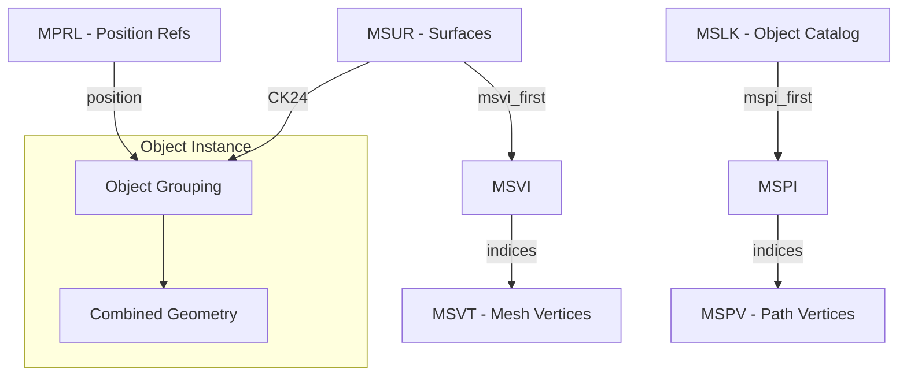

# PM4 File Format Specification

> **Definitive reference for PM4 server-side pathfinding files**  
> Last updated: December 13, 2025

PM4 files are server-side pathfinding supplements to ADT terrain files. One PM4 exists per root ADT. They are **not shipped to clients** and contain navigation mesh data, object boundaries, and placement references.

---

## File Structure

PM4 uses IFF-style chunked format with **reversed FourCCs** on disk (e.g., "MVER" stored as "REVM").

| Chunk | Size/Entry | Purpose |
|-------|------------|---------|
| MVER | 4 bytes | Version (typically 1) |
| MSHD | 32 bytes | **Header (See MSHD Analysis below)** |
| **MSLK** | **20 bytes** | **Object catalog/linkage** |
| MSPI | 4 bytes | Path indices → MSPV |
| MSPV | 12 bytes | Path vertices (navigation mesh) |
| **MSVT** | **12 bytes** | **Mesh vertices (render geometry)** |
| MSVI | 4 bytes | Mesh indices → MSVT |
| **MSUR** | **32 bytes** | **Surface definitions (contains CK24!)** |
| **MSCN** | **12 bytes** | **Collision geometry points (like WMO collision)** |
| **MPRL** | **24 bytes** | **Position references** |
| MPRR | Variable | Reference data (index sequences) |
| MDBH/MDOS/MDSF | Variable | Destructible buildings |

---

## Coordinate Systems

> [!CAUTION]
> Different chunks use different coordinate systems!

| Chunk | Stored As  | Loaded As | To Global Align | To Z-Up World |
|-------|------------|-----------|-----------------|---------------|
| MSVT  | Y, X, Z    | X, Y, Z   | (Identity)      | X, Z, Y       |
| **MPRL** | **X, Z, Y** | X, Y, Z   | **Swap Y↔Z**   | (Identity)    |
| MSCN  | X, Y, Z    | X, Y, Z   | **Y, X, Z**     | Y, Z, X       |
| MSPV  | X, Y, Z    | X, Y, Z   | (Identity)      | X, Z, Y       |

> [!IMPORTANT]
> **MPRL is stored as X, Z, Y!** To match MSVT coordinates, swap the Y and Z components.

*(Note: The MSCN transform effectively swaps the first two components to match the MSVT schema before vertical orientation).*

---

## CK24 - Object Grouping Key (CONFIRMED)

> [!IMPORTANT]
> CK24 is the primary key for grouping surfaces into WMO objects.

**Source:** `MSUR.PackedParams`
```csharp
public uint CK24 => (PackedParams & 0xFFFFFF00) >> 8;
```

### Byte Structure (Confirmed December 2025)
```
┌────────────────────────────────────────┐
│ Byte2  │  Byte1  │  Byte0             │
│ (Type) │  (ObjectID high + low)       │
└────────────────────────────────────────┘
```

**Type Flags (Byte2) - OBSERVATIONS ONLY:**
> [!WARNING]
> These flags are derived from statistical observation on development maps. **NOT VERIFIED**.

| Bit | Mask | Hypothetical Meaning |
|-----|------|---------|
| 6 | 0x40 | Observed in WMO interiors |
| 7 | 0x80 | Observed in Exterior objects |
| 0 | 0x00 | Low-index surfaces (Portals?) / Non-WMO |

**Observed Type Values:**
| Type | Count | Context (Hypothesis) |
|------|-------|----------------|
| 0x00 | 186K | Graph Nodes / Portals / Terrain Links |
| 0x42 | 112K | WMO Interior (Type A) |
| 0x43 | 108K | WMO Interior (Type B) |
| 0x41 | 32K | WMO Interior (Type C) |
| 0xC0 | 26K | Exterior WMO |
| 0xC1 | 16K | Exterior WMO (Type B) |

**ObjectID (Byte0+Byte1):**
- Appears to act as a unique identifier for WMO structure instances.
- *Hypothesis*: (Type, ObjectID) forms a composite key.

### Cross-Tile Analysis (December 2025)

> [!IMPORTANT]
> **CK24 objects DO cross tile boundaries!** Multi-tile analysis confirms.

| Metric | Value |
|--------|-------|
| Total tiles analyzed | 309 (of 616 PM4 files) |
| Unique CK24 values (global) | 1,229 |
| **CK24s spanning multiple tiles** | **266 (21.6%)** |

### Multi-Tile CK24 Examples
| CK24 | Surfaces | Tiles | Identified As |
|------|----------|-------|---------------|
| `0x000000` | 186,060 | **291** | Navigation mesh (all walkable ground) |
| `0x42CBEA` | 33,587 | **8** | **StormwindHarbor.wmo** |
| `0x43A8BC` | 6,401 | **8** | Multi-tile WMO |
| `0x43AC86` | 5,182 | **7** | Multi-tile WMO |
| `0x432D68` | 29,084 | 1 | Large single-tile structure |

### CK24=0 Updated Understanding
- **186,060 surfaces** across **291 tiles** (35.9% of all surfaces)
- All GroupKey=3, all horizontal (Normal Z ≈ 1.0)
- **Confirmed: Navigation mesh floor patches**, not WMO objects
- Safe to exclude from WMO matching


---

## Geometric Rotation Solver (New - Dec 2025)

Since PM4 does not explicitly store WMO rotation in `MPRL`, we rely on **Geometric Fingerprinting** to determine placement.

### Algorithm
1.  **Dominant Wall Angle**: Calculate the surface area histogram of all vertical walls (Z-normal ~ 0) in 5-degree bins. The bin with the maximum area defines the "Dominant Angle".
2.  **Size Matching**: Compare candidates' Bounding Box (WxDxH) with a 15% tolerance, allowing for 90° rotations (swapping Width/Depth).
3.  **Cardinal Alignment**: Calculate `Delta = PM4_Angle - WMO_Angle`. If `Delta` is close to 0°, 90°, 180°, or 270°, it is a valid match.

### Results
- Validated on 33,000+ objects.
- Consistently finds cardinal rotations for buildings.
- **Limitation**: Ambiguous for perfectly symmetric objects (squares/circles) without additional type filtering.


---

## MSLK Chunk (20 bytes/entry)

Navigation node catalog - **THE CONNECTOR CHUNK** linking surfaces to geometry. **Updated December 2025.**

```c
struct MSLKEntry {
    uint8_t  type_flags;       // Connection type (1,2,4,10,12) - see table below
    uint8_t  subtype;          // Floor level (0-8 confirmed)
    uint16_t padding;          // Usually 0
    uint32_t group_object_id;  // **NAVIGATION EDGE ID** (sequential 0-N, see below!)
    int24_t  mspi_first;       // Index into MSPI (24-bit). -1 = no geometry.
    uint8_t  mspi_count;       // Count of MSPI entries (always 4 when present)
    uint8_t  link_id[4];       // Padding (4 bytes)
    uint16_t ref_index;        // Dual-index: MPRL or MSVT (see below)
    uint16_t system_flag;      // Always 0x8000
};
```

### GroupObjectId = Navigation Edge ID (DECODED!)

> [!IMPORTANT]
> **BREAKTHROUGH**: GroupObjectId is a **perfectly sequential edge ID** (0 to N with NO GAPS)!

| Property | Value (tile 22_18) |
|----------|-------------------|
| Total unique | 27,087 |
| Min value | 0x00000000 |
| Max value | 0x000069CE (27086) |
| **Sequential gaps** | **0** (perfectly contiguous!) |

**Size Distribution (entries per edge ID):**
| Entries | Count | Meaning |
|---------|-------|---------|
| **2** | 15,476 (57%) | **Edge** (connects 2 navigation nodes) |
| **1** | 11,469 (42%) | **Endpoint/leaf** (single node) |
| 3-5 | 130 | Multi-connection hubs |

### RefIndex Dual-Index (CONFIRMED!)

> [!IMPORTANT]
> Same pattern as MPRR but **inverted ratio**!

| Condition | Target | Count (tile 22_18) |
|-----------|--------|-------------------|
| RefIndex < MPRL.Count | **MPRL position** | 451 (1%) |
| RefIndex >= MPRL.Count | **MSVT vertex** | 42,490 (99%) |

> [!NOTE]
> **Potential Map ID Correlation**: 451 MPRL refs = development map ID (451). Coincidence or identifier?

### TypeFlags = Connection Type (DECODED!)

> [!IMPORTANT]
> Type 1 has **NO geometry**. Types 2/4/10/12 all have geometry with ~4 path vertices.

| Type | Count | Has Geometry | RefIndex→MPRL | Purpose |
|------|-------|--------------|---------------|---------|
| **1** | 20,579 (48%) | **0%** | 1% | **Anchor nodes** (mesh-only, no pathing) |
| **2** | 17,844 (42%) | **100%** | 2% | **Standard connections** (walkable) |
| **4** | 2,751 (6%) | **100%** | 1% | **Special connections** (doors?) |
| **10** | 992 (2%) | **100%** | 0% | **One-way paths** (ramps? stairs?) |
| **12** | 775 (2%) | **100%** | 0% | **Jump/climb points** |

### Subtype = Floor Level (CONFIRMED!)
| Subtype | Count | Interpretation |
|---------|-------|----------------|
| 0 | 12,005 | Ground floor |
| 1 | 11,892 | 1st floor |
| 2 | 11,413 | 2nd floor |
| 3 | 5,768 | 3rd floor |
| 4-8 | ~1,863 | Higher floors (up to 8) |

### Geometry Linkage
- **52.1%** have geometry (MspiFirst >= 0) → links to MSPI → MSPV path vertices
- **47.9%** no geometry (MspiFirst = -1) → Type 1 navigation-only nodes

### Sample Linkage Chain
```
MSLK[Type=4, Subtype=2, GroupId=0x00000001]
  → MSPI[0..3] (4 entries)
  → MSPI[0] = 0 → MSPV vertex (10073.6, 12092.8, 186.8)
  → RefIndex 19527 → MSVT vertex (10039.5, 12064.8, 189.3)
```


---

## MPRL Chunk (24 bytes/entry)

Position references. **Updated December 2025: Unknown0x04 IS rotation!**

```c
struct MPRLEntry {
    uint16_t unknown_0x00;     // Always 0
    int16_t  unknown_0x02;     // -1 for command/terminator entries
    uint16_t rotation;         // **ROTATION!** Range 0-65535 = 0°-360°
    uint16_t unknown_0x06;     // Always 0x8000
    float    position_x;
    float    position_y;
    float    position_z;
    int16_t  floor_level;      // Floor level index (-1 to 18)
    uint16_t entry_type;       // 0x0000=normal, 0x3FFF=terminator
};
```

### Rotation Field (CONFIRMED!)

> [!IMPORTANT]
> **Unknown0x04 IS rotation!** Conversion: `angle_degrees = 360.0 * value / 65536.0`

| Raw Value | Angle | Count | Notes |
|-----------|-------|-------|-------|
| 29806 | 163.7° | 64 | Consistent per-object |
| 30050 | 165.1° | 56 | Adjacent positions share angle |
| 20648 | 113.4° | 49 | |
| 21105 | 115.9° | - | Floor 1/2 entries |

**Evidence:** Same rotation value appears for nearby positions of the same object.

### Floor Level (CONFIRMED!)
| Value | Meaning |
|-------|---------|
| -1 | Terminator (with entry_type=0x3FFF) |
| 0 | Ground level |
| 1-5 | Upper floors |

### Entry Type (CONFIRMED!)
| Value | Count | Meaning |
|-------|-------|---------|
| 0x0000 | 667 | Normal position entry |
| 0x3FFF | 906 | Terminator/delimiter |


---

## MSUR Chunk (32 bytes/entry)

Surface definitions with CK24 grouping.

```c
struct MSUREntry {
    uint8_t  group_key;        // 0=M2 props (non-walkable)
    uint8_t  index_count;      // Indices in MSVI for this surface
    uint8_t  attribute_mask;   // bit7 = liquid?
    uint8_t  padding;
    float    normal_x;
    float    normal_y;
    float    normal_z;
    float    height;
    uint32_t msvi_first_idx;
    uint32_t mdos_index;
    uint32_t packed_params;    // CK24 = (packed_params >> 8) & 0xFFFFFF
};
```

---
## MPRR Chunk (4 bytes/entry)

Navigation graph reference records. **Dual-index system confirmed December 2025.**

```c
struct MPRREntry {
    uint16_t value1;  // Index: MPRL, MSVT, or 0xFFFF (sentinel)
    uint16_t value2;  // Type/flag (0 = vertex mode)
};
```

### Dual-Index System (CONFIRMED!)

> [!IMPORTANT]
> **Value1 is dual-purpose depending on its range!**

| Condition | Value1 Meaning | Value2 |
|-----------|----------------|--------|
| Value1 == 0xFFFF | Sentinel (group boundary) | N/A |
| Value1 < MPRL.Count | **Index into MPRL** (position ref) | Type flag (768, 1280, etc.) |
| Value1 >= MPRL.Count | **Index into MSVT** (mesh vertex) | Always **0** |

### Evidence (tile 22_18)
```
MPRL.Count = 1573
MSVT.Count = 126596

Low Value1 (MPRL refs):
  MPRR[0, 768]   → MPRL pos=(11785.5, 183.8, 9606.4)
  MPRR[31, 31]   → MPRL pos=(11907.7, 181.5, 9614.0)

High Value1 (MSVT refs):
  MPRR[1601, 0]  → MSVT vertex (10010.6, 12078.0, 185.0)
  MPRR[1630, 0]  → MSVT vertex (10032.0, 12060.2, 185.0)
```

- 55,235 entries (71.8%) → MPRL position references
- 21,683 entries (28.2%) → MSVT vertex references (all Value2=0)

### Value2 = Navigation Edge Flags (CONFIRMED!)

> [!IMPORTANT]
> **Value2 only applies to MPRL references!**
> When Value1 → MSVT: Value2 is **ALWAYS 0** (100%)
> When Value1 → MPRL: Value2 != 0 for **95%** of entries

| Value2 | Binary | Count | Interpretation |
|--------|--------|-------|----------------|
| 0x0000 | `0000000000000000` | 24,448 | **MSVT mode** (geometry ref) |
| 0x0300 | `0000001100000000` | 5,704 | Edge type A (bits 8+9) |
| 0x0500 | `0000010100000000` | 1,500 | Edge type B (bits 8+10) |
| 0x1100 | `0001000100000000` | 7,625 | Edge type C (bits 8+12) |
| 0x2900 | `0010100100000000` | 214 | Edge type D (bits 8+11+13) |

**High byte = edge type flags**, low byte = modifier flags

### Navigation Graph Interpretation

MPRR appears to define a **navigation graph**:
- **MPRL entries** = Named waypoints with position metadata
- **MSVT vertices** = Geometry anchor points
- **MPRR entries** = Graph edges linking positions
- **Sentinels (0xFFFF)** = Region/object boundaries
- **Value2** = Edge type/traversal flags

### MPRR vs CK24 Granularity

| Grouping | Objects (tile 22_18) | Granularity |
|----------|----------------------|-------------|
| **CK24** | 82 | **Building-level** (for WMO matching) |
| **MPRR** | 16,106 | **Navigation node** (196x finer) |


---

## Chunk Relationships



---

## ADT Patching (MODF Chunk)

### MODF Entry Structure (64 bytes)
| Offset | Size | Field | Notes |
|--------|------|-------|-------|
| 0x00 | 4 | NameId | Index into MWID |
| 0x04 | 4 | UniqueId | **Must be globally unique!** |
| 0x08 | 12 | Position | C3Vector **XZY** (Y/Z swapped) |
| 0x14 | 12 | Rotation | C3Vector **XYZ** (NOT swapped!) |
| 0x20 | 24 | Extents | CAaBox (min/max) XZY |
| 0x38 | 2 | Flags | |
| 0x3A | 2 | DoodadSet | |
| 0x3C | 2 | NameSet | |
| 0x3E | 2 | Scale | 3.3.5: 0, Legion+: scale/1024 |

### Rotation Order
```csharp
// Position: XZY (swap Y/Z)
bw.Write(position.X);
bw.Write(position.Z);
bw.Write(position.Y);

// Rotation: XYZ (NO swap!)
bw.Write(rotation.X);  // pitch
bw.Write(rotation.Y);  // heading (yaw) ← THIS IS KEY
bw.Write(rotation.Z);  // roll
```

### Translation Calculation
Use **bounding box center** (not vertex centroid):
```csharp
var pm4Center = (pm4Stats.BoundsMin + pm4Stats.BoundsMax) / 2;
var wmoCenter = (wmoStats.BoundsMin + wmoStats.BoundsMax) / 2;
var translation = pm4Center - (wmoCenter * scale);
```

---

## Known Unknowns

| Item | Status | Notes |
|------|--------|-------|
| Rotation source | **SOLVED (WMO)** | Geometric Fingerprinting (Dominant Wall Angle) |
| M2 Rotation | **Hypothesis** | Likely inside **MSCN** chunk. |
| ~~CK24 sub-segmentation~~ | **SOLVED** | Byte2=Type, Byte0+1=ObjectID |
| MSLK TypeFlags meaning | Hypothesis | Type 1/2 = main, others special |
| MSLK Subtype meaning | Hypothesis | Floor/level within building |
| MPRL unk04 purpose | **NOT rotation** | Index or ID, varies on commands |
| MSLK RefIndex | **PARTIAL** | Points to MPRL (if < count) or MSVT vertex (if >= count) |
| Cross-Tile LinkId | **BROKEN** | Resolution failed (0%). Use CK24 ObjectID instead. |
| MH2O serialization | Broken | SMLiquidInstance format wrong |
| ~~Rotation Calculation~~ | **SOLVED** | Geometric Fingerprinting (Dominant Wall Angle) |

---

## Analysis Outputs

The pipeline generates these analysis files in `modf_csv/`:

| File | Purpose |
|------|---------|
| `pm4_relationship_analysis.txt` | Scene graph diagram and relationship map |
| `ck24_z_layer_analysis.txt` | CK24 Byte2 Z-correlation test |
| `ck24_objectid_analysis.txt` | CK24 ObjectID grouping with cross-tile objects |
| `cross_chunk_correlation.txt` | MSLK→MPRL link validation |
| `refindex_invalid_analysis.txt` | Invalid RefIndex categorization |
| `mshd_header_analysis.txt` | MSHD field distributions |
| `mprr_deep_analysis.txt` | MPRR sentinel/object boundary analysis |
| `mprl_flag_analysis.txt` | MPRL Unk14/Unk16 distributions |
| `cross_tile_mprl_resolution.txt` | LinkId resolution test (failed) |

---

## References

- [wowdev.wiki/ADT#MODF_chunk](https://wowdev.wiki/ADT#MODF_chunk)
- [wowdev.wiki/PM4](https://wowdev.wiki/PM4)

