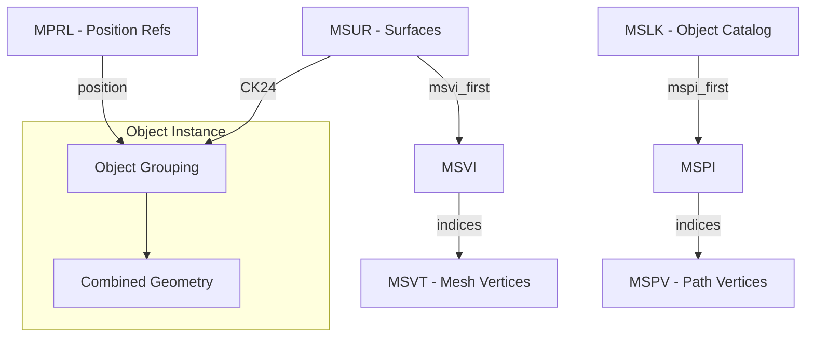

# PM4 File Format Specification

> **Definitive reference for PM4 server-side pathfinding files**  
> Last updated: December 13, 2025

PM4 files are server-side pathfinding supplements to ADT terrain files. One PM4 exists per root ADT. They are **not shipped to clients** and contain navigation mesh data, object boundaries, and placement references.

---

## File Structure

PM4 uses IFF-style chunked format with **reversed FourCCs** on disk (e.g., "MVER" stored as "REVM").

| Chunk | Size/Entry | Purpose |
|-------|------------|---------|
| MVER | 4 bytes | Version (typically 1) |
| MSHD | 32 bytes | Header metadata |
| **MSLK** | **20 bytes** | **Object catalog/linkage** |
| MSPI | 4 bytes | Path indices → MSPV |
| MSPV | 12 bytes | Path vertices (navigation mesh) |
| **MSVT** | **12 bytes** | **Mesh vertices (render geometry)** |
| MSVI | 4 bytes | Mesh indices → MSVT |
| **MSUR** | **32 bytes** | **Surface definitions (contains CK24!)** |
| MSCN | 12 bytes | Exterior/collision vertices |
| **MPRL** | **24 bytes** | **Position references** |
| MPRR | Variable | Reference data (index sequences) |
| MDBH/MDOS/MDSF | Variable | Destructible buildings |

---

## Coordinate Systems

> [!CAUTION]
> Different chunks use different coordinate systems!

| Chunk | File Order | Transform |
|-------|------------|-----------|
| MSVT | (Y, X, Z) | `new Vector3(vertex.Y, vertex.X, vertex.Z)` |
| MSPV | (X, Y, Z) | No change |
| MSCN | (X, Y, Z) | `new Vector3(vertex.Y, -vertex.X, vertex.Z)` |
| MPRL | (X, Y, Z) | Direct floats |

---

## CK24 - Object Grouping Key

> [!IMPORTANT]
> CK24 is the primary key for grouping surfaces into objects.

**Source:** `MSUR.PackedParams`
```csharp
public uint CK24 => (PackedParams & 0xFFFFFF00) >> 8;
```

**Properties:**
- 24-bit value extracted from MSUR's 32-bit PackedParams
- Groups all surfaces belonging to one **object instance**
- CK24=0 typically means terrain/non-object surfaces
- **NOT directly in MSLK** - MSLK references geometry via MSPI

**Known issue:** CK24 groups sometimes contain **multiple merged objects**. Sub-object segmentation remains unsolved.

---

## MSLK Chunk (20 bytes/entry)

Object catalog linking surfaces to geometry. **Does NOT contain CK24 directly.**

```c
struct MSLKEntry {
    uint8_t  type_flags;       // Object type (see distribution below)
    uint8_t  subtype;          // Floor/layer index (0-18 observed)
    uint16_t padding;          // Always 0
    uint32_t group_object_id;  // Grouping ID (NOT CK24!)
    int24_t  mspi_first;       // Index into MSPI (-1 = no geometry)
    uint8_t  mspi_count;       // Count of MSPI entries
    uint24_t link_id;          // Tile crossing: 0xFFFFYYXX
    uint16_t ref_index;        // Cross-reference
    uint16_t system_flag;      // Always 0x8000
};
```

### TypeFlags Distribution (from development map)
| Type | % | Likely Purpose |
|------|---|----------------|
| 1 | 52.7% | Primary walkable surfaces |
| 2 | 35.4% | Secondary surfaces (walls?) |
| 10 | 5.0% | Special object type |
| 4 | 4.3% | Terrain connections? |
| 12 | 1.8% | Unknown |
| 17,18,20,26,28 | <1% | Rare/special |

### Subtype Distribution
| Subtype | % | Interpretation |
|---------|---|----------------|
| 0 | 25.7% | Ground floor |
| 1 | 26.3% | 1st floor |
| 2 | 27.7% | 2nd floor |
| 3 | 15.8% | 3rd floor |
| 4-7 | 4.5% | Higher floors |
| 8-18 | <1% | Special/rare |

**Hypothesis:** Subtype = floor level within building. Could be used to segment merged CK24 groups.

---

## MPRL Chunk (24 bytes/entry)

Position references. **Does NOT contain rotation!**

```c
struct MPRLEntry {
    uint16_t unknown_0x00;     // Always 0
    int16_t  unknown_0x02;     // -1 for command/terminator entries
    uint16_t unknown_0x04;     // NOT rotation - varies on command entries
    uint16_t unknown_0x06;     // Always 0x8000
    float    position_x;
    float    position_y;
    float    position_z;
    int16_t  unknown_0x14;     // Floor level index (-1 to 18)
    uint16_t unknown_0x16;     // 0x0000=normal, 0x3FFF=command
};
```

### Field Analysis (from development map - 178,588 entries)

**Unknown0x14 Distribution:**
| Value | Count | Interpretation |
|-------|-------|----------------|
| -1 | 48,887 | Command/terminator |
| 0 | 40,478 | Ground level |
| 1 | 38,047 | 1st level |
| 2 | 31,265 | 2nd level |
| 3 | 16,375 | 3rd level |
| 4-18 | ~3,500 | Higher levels |

**Unknown0x16 Distribution:**
| Value | Count | Meaning |
|-------|-------|---------|
| 0x0000 | 129,701 | Normal entry |
| 0x3FFF | 48,887 | Command/terminator |

**Key Finding:** `unk16=0x3FFF` always correlates with `unk14=-1`. These are **terminators/delimiters**, not position data.

---

## MSUR Chunk (32 bytes/entry)

Surface definitions with CK24 grouping.

```c
struct MSUREntry {
    uint8_t  group_key;        // 0=M2 props (non-walkable)
    uint8_t  index_count;      // Indices in MSVI for this surface
    uint8_t  attribute_mask;   // bit7 = liquid?
    uint8_t  padding;
    float    normal_x;
    float    normal_y;
    float    normal_z;
    float    height;
    uint32_t msvi_first_idx;
    uint32_t mdos_index;
    uint32_t packed_params;    // CK24 = (packed_params >> 8) & 0xFFFFFF
};
```

---

## Chunk Relationships



---

## ADT Patching (MODF Chunk)

### MODF Entry Structure (64 bytes)
| Offset | Size | Field | Notes |
|--------|------|-------|-------|
| 0x00 | 4 | NameId | Index into MWID |
| 0x04 | 4 | UniqueId | **Must be globally unique!** |
| 0x08 | 12 | Position | C3Vector **XZY** (Y/Z swapped) |
| 0x14 | 12 | Rotation | C3Vector **XYZ** (NOT swapped!) |
| 0x20 | 24 | Extents | CAaBox (min/max) XZY |
| 0x38 | 2 | Flags | |
| 0x3A | 2 | DoodadSet | |
| 0x3C | 2 | NameSet | |
| 0x3E | 2 | Scale | 3.3.5: 0, Legion+: scale/1024 |

### Rotation Order
```csharp
// Position: XZY (swap Y/Z)
bw.Write(position.X);
bw.Write(position.Z);
bw.Write(position.Y);

// Rotation: XYZ (NO swap!)
bw.Write(rotation.X);  // pitch
bw.Write(rotation.Y);  // heading (yaw) ← THIS IS KEY
bw.Write(rotation.Z);  // roll
```

### Translation Calculation
Use **bounding box center** (not vertex centroid):
```csharp
var pm4Center = (pm4Stats.BoundsMin + pm4Stats.BoundsMax) / 2;
var wmoCenter = (wmoStats.BoundsMin + wmoStats.BoundsMax) / 2;
var translation = pm4Center - (wmoCenter * scale);
```

---

## Known Unknowns

| Item | Status | Notes |
|------|--------|-------|
| Rotation source | **UNSOLVED** | Not in MPRL.unk04 |
| CK24 sub-segmentation | **UNSOLVED** | Merged objects issue |
| MSLK TypeFlags meaning | Hypothesis | Type 1/2 = main, others special |
| MSLK Subtype meaning | Hypothesis | Floor/level within building |
| MPRL unk04 purpose | **NOT rotation** | Index or ID, varies on commands |
| MH2O serialization | Broken | SMLiquidInstance format wrong |

---

## References

- [wowdev.wiki/ADT#MODF_chunk](https://wowdev.wiki/ADT#MODF_chunk)
- [wowdev.wiki/PM4](https://wowdev.wiki/PM4)
