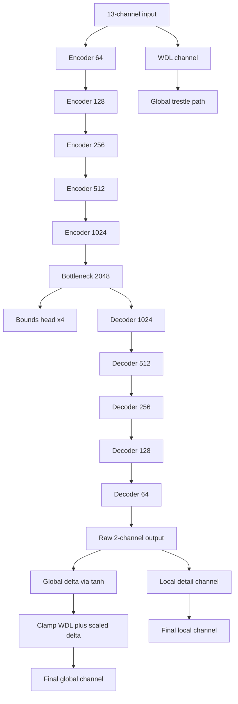
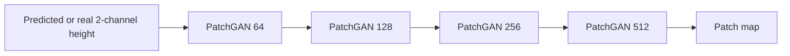
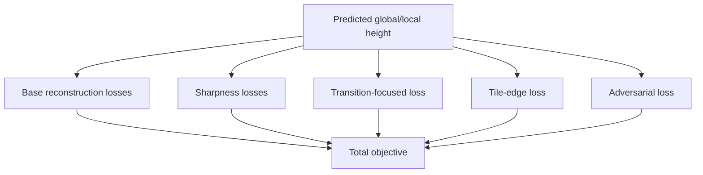
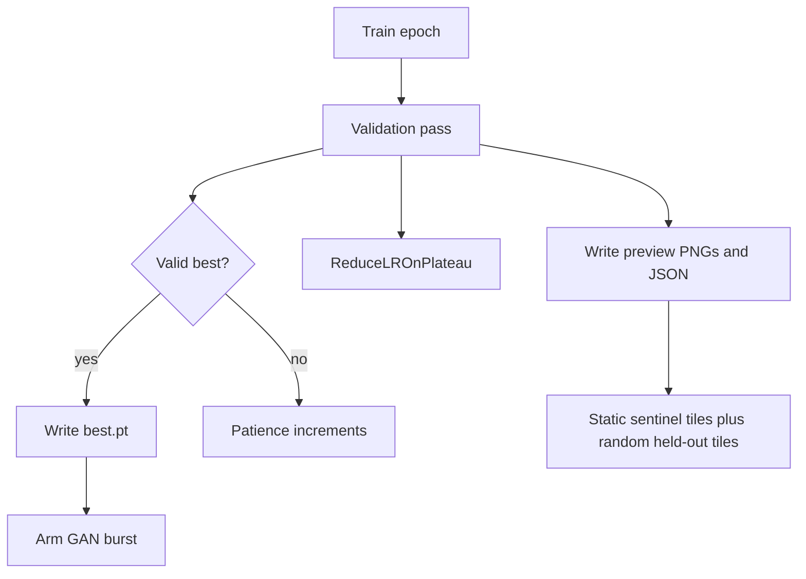

# WoW Terrain Regressor V7.4

Superseded by `docs/v75-model-architecture-guide.md` for the active terrain-only-minimap dataset contract.

Updated Apr 13, 2026.

This is the editor-friendly V7.4 architecture guide. It reflects the current code direction: WDL as a real low-resolution trestle, reflect padding to avoid border void artifacts, sharper transition losses, and tile-edge supervision.

## Snapshot

- Input channels: 13
- Output channels: 2
- Best validation loss so far: 0.0506
- Best epoch so far: 51
- Valid samples: 6070
- Curated train / val: 3237 / 613
- Audited roots: 26
- Practical epoch cap: 100

## Input Contract

1. Minimap RGB
2. Normal map RGB
3. WDL height prior
4. Height min hint
5. Height max hint
6. Liquid mask
7. Liquid height prior
8. Object footprint mask
9. Brush mask

The key architectural point is channel 7. WDL is not just extra context. It is the only reliable coarse terrain scaffold we already have for the data we want to regenerate.

## Generator

The active generator is still a 5-level U-Net, but the newer code path makes two material changes:

1. Convolutions use reflect padding instead of zero padding.
2. The global output can refine over WDL instead of predicting the whole absolute surface from scratch.

### Why this is better

- Zero padding teaches the network that every tile border is surrounded by emptiness. That is exactly how you get lips and curled edges.
- Reflect padding removes that fake border condition.
- A WDL-trestled global head makes the model solve the right problem: low-resolution terrain plus learned refinement.

## Discriminator

PatchGAN remains lightweight, but its schedule and stabilization are now treated as part of the system design.

Active stabilization controls:

- smoothed real/fake targets
- target jitter
- discriminator input noise
- discriminator gradient clipping
- real/fake mean logging per epoch

## Loss Stack

The current objective is meant to preserve both shape and stitchability.

- Global height loss
- Local height loss
- Bounds loss
- Gradient loss
- SSIM loss
- Sobel edge loss
- Frequency-domain loss
- Laplacian loss
- Transition-focused loss
- Tile-edge loss
- Adversarial loss during GAN-active epochs

### New pressure added for the current failure modes

- Transition loss increases weight where the target terrain changes sharply, so cliffs, cuts, and dry boundaries stop melting into ramps.
- Tile-edge loss increases weight on the outer border band so tiles stay quiltable.

## Validation And Training Control Loop

Validation is not passive reporting in V7.4.

Important operational facts:

- Best validated run so far: 0.0506 at epoch 51
- Early stop finished that run at epoch 112
- Practical cap is now 100 epochs
- Best-triggered GAN bursts are preferred over fixed GAN calendar epochs

## Preview Surface

Each epoch can now emit:

- global preview sheet
- local preview sheet
- context preview sheet
- preview JSON sidecar

The context sheet explicitly shows:

1. minimap
2. object overlay
3. masked minimap
4. object mask
5. liquid mask
6. brush mask

## Current Proof Boundary

- The code path now supports the stronger WDL-trestle and reflect-padding model variant.
- Inference also includes WDL edge anchoring as a safety rail for exported development-map tiles.
- Old checkpoints remain loadable under legacy semantics through checkpoint metadata.
- The next real proof step is a fresh training run under the newer variant, not more interpretation of the old checkpoint.

## Recommended Next Step

Train the next run as the improved variant and resume only from checkpoints that match the intended semantics. The end goal is:

1. WDL provides the low-resolution scaffold.
2. The model predicts refinement, not the entire absolute surface from scratch.
3. Tile borders remain stitchable without export-time rescue work.