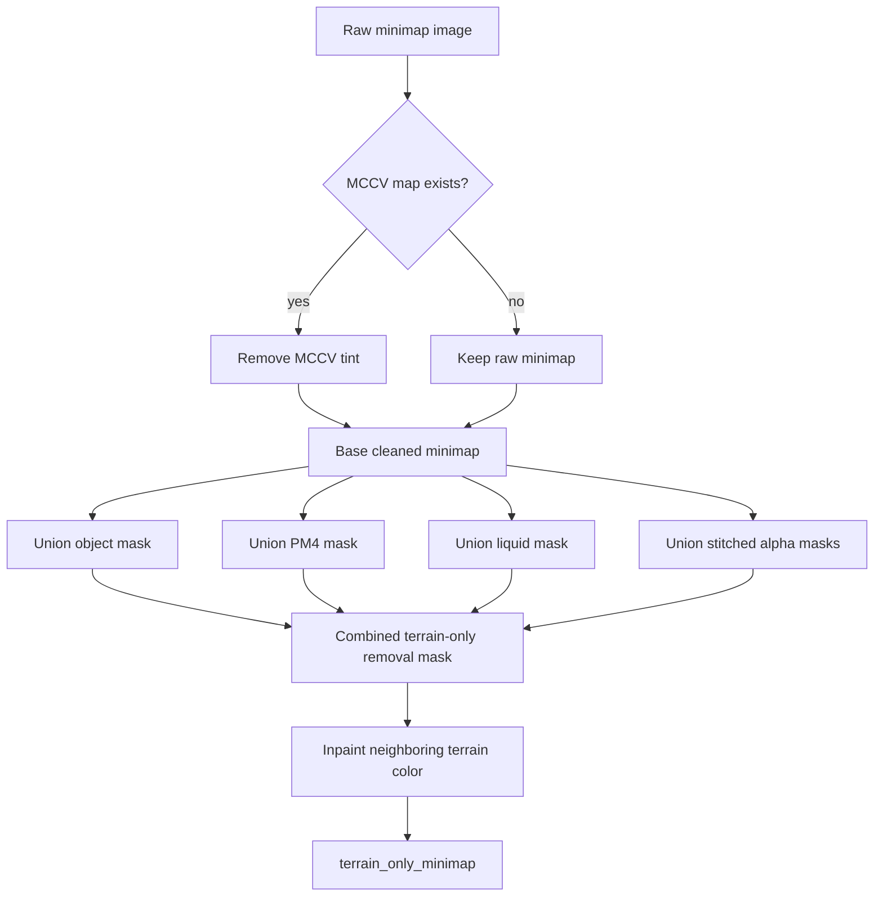
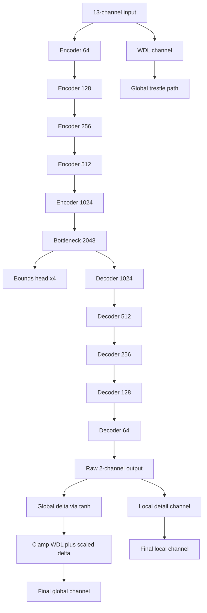

# WoW Terrain Regressor V7.5

Updated Apr 14, 2026.

This is the active architecture guide for the terrain regressor after the dataset-contract bump from V7.4 to V7.5. The network shape is still the same `13`-channel, `2`-output multichannel terrain model, but the RGB input contract is stricter: prefer a terrain-only cleaned minimap whenever the exporter can build one.

## Snapshot

- Input channels: 13
- Output channels: 2
- Core architecture: 5-level U-Net with WDL-trestled global head
- Auxiliary schedule: controller-driven PatchGAN bursts with concept-recovery windows
- Practical epoch cap: 100
- Dataset contract bump: terrain-only minimap precedence
- Early-development corpus anchors: `0.5.3`, `0.5.5`, and `0.6.0`
- Brush utilization: brush-aware train sampler biases toward tiles with trusted brush imprint evidence
- Prefab status: deferred and review-only, not part of the active training contract

## What Changed From V7.4

V7.5 is a semantic version bump, not a tensor-shape bump.

The main change is the preferred RGB surface.

Old effective precedence:

1. `no_object_minimap`
2. `no_mccv_minimap`
3. raw `image`

New V7.5 precedence:

1. `terrain_only_minimap`
2. `no_object_minimap`
3. `no_mccv_minimap`
4. raw `image`

That matters because minimaps often still carry non-mesh evidence Blizzard baked into the capture path:

- lighting direction or horizon tint from the original minimap renderer
- object occlusion
- PM4-obscured regions
- alpha-layer blend signatures from texture overlays
- liquid overwrite regions

V7.5 treats those as contamination the exporter should compensate for before the RGB surface reaches the model. Exported `MCSH` shadow data remains useful as a diagnostic surface, but it is not treated as removable terrain contamination for `terrain_only_minimap`.

## Input Contract

1. Terrain-only minimap RGB when present, otherwise older cleaned/raw fallback
2. Normal map RGB
3. WDL height prior
4. Height min hint
5. Height max hint
6. Liquid mask
7. Liquid height prior
8. Object footprint mask for all visible object families, not just WMOs
9. Brush mask

The channel count remains `13` because the RGB minimap is still three channels. What changed is the preferred provenance of those three channels.

## Terrain-Only Minimap Pipeline

The exporter now has an explicit terrain-only cleanup path. It does not invent new geometry. It removes strong known contaminants from the rendered minimap and inpaints from adjacent surviving terrain color.

Cleanup order:

1. Start from raw `image`
2. If `mccv_map` exists, generate `no_mccv_minimap`
3. Build object and PM4 masks
4. Stitch liquid and alpha masks when present
5. Union the strongest masks into one removal surface
6. Inpaint masked pixels into `terrain_only_minimap`

This is intentionally conservative. If the exporter lacks those masks, the loader falls back automatically.

## Generator

The active generator remains the same high-level V7.4 design:

- reflect padding instead of zero padding
- residual conv blocks
- bilinear upsampling instead of transposed-convolution checkerboard paths
- WDL-trestled global channel with learned residual refinement
- separate local detail channel

## Why The Version Bump Is Real

V7.5 is not just “the same model but cleaned data.” The learned function changes because the RGB evidence distribution changes.

Practical effect:

- less temptation to overfit alpha-blend patterns as terrain shape cues
- less object or liquid imprint contamination in the RGB scaffold
- stronger bias toward mesh-consistent terrain evidence flowing through RGB, while masks remain available as separate context channels

That is enough of a training-contract change to warrant a version bump even though the network dimensions stay stable.

## Loss Stack

V7.5 keeps the current shape-preserving stack:

- global height loss
- local height loss
- bounds loss
- gradient loss
- SSIM loss
- Sobel edge loss
- frequency-domain loss
- Laplacian loss
- transition-focused loss
- tile-edge loss
- adversarial loss during GAN-active epochs

The current model is still trying to preserve both geometry and stitchability, not just per-pixel average correctness.

## Training Control Loop

The active control loop is no longer a fixed warmup plus static cadence. It now has an explicit controller layer because fixed early GAN warmup was stopping runs too soon and often injected detail at the wrong point in convergence.

- geometry-first default training
- validation-driven best checkpoints
- controller-driven PatchGAN bursts
- explicit concept-recovery windows after GAN-assisted best checkpoints
- phase-aware early-stop deferral while the controller is still working through a burst or recovery window
- mixed static plus random held-out preview tiles
- explicit context preview sheets for masks

Current controller behavior:

1. Start from geometry-first training with GAN off.
2. Allow a short GAN burst once `start_gan_epoch` is reached.
3. If that burst produces a new best validation checkpoint, immediately switch GAN off for a few concept-recovery epochs.
4. If non-GAN epochs stall for `gan_patience`, re-arm another short GAN burst.
5. Do not let early stopping fire while a burst or concept-recovery window is still unresolved.

This matches the intended use of PatchGAN here: it is a periodic detail injector, not the permanent dominant objective.

What also changes in V7.5 is that the preview and training RGB input should now usually show the terrain-only cleaned surface when the dataset root has the new export.

## Brush Utilization

Brush imprints are still an input context channel, but they are no longer treated as purely passive metadata.

The trainer now reads per-tile brush stats from `brush_imprints/brush_imprint_manifest.json` when present and uses them to bias training exposure:

- tiles with brush masks or nonzero `patch_candidates` or `groups_written` receive a sampler bonus
- stronger brush tiles receive more bonus through a log-scaled patch/group signal
- non-brush tiles remain in the corpus instead of being dropped outright

This is intentionally a sampling bias, not a hard filter. The brush archaeology is good enough to steer training toward constructive terrain-edit evidence, but not complete enough to become the sole supervision path.

## Prefab Status

Prefab work exists in the repo, but it is not part of the active trusted training contract.

Current rule:

- keep prefab tooling available for research, review, and future dataset exploration
- do not present prefab outputs as part of the current grounded supervision story
- do not describe prefab surfaces as active model inputs
- keep brush harvesting as the stronger and more trusted patch-scale archaeology channel for the current model line

This distinction matters because the project needs to be legible to readers who are worried the corpus is synthetic. The strongest grounded story today is still the exported tile corpus plus deterministic brush harvesting over those tiles.

If future work raises prefab validation to the same standard, it can return as a first-class dataset channel. For now it stays deferred.

## Corpus Policy

The active V7.5 corpus should keep the early development clients in scope instead of starting only at later release-era builds.

Required early-build anchors:

1. `0.5.3`
2. `0.5.5`
3. `0.6.0`

Why these stay in the default planning set:

- they preserve early terrain and world-layout concepts that later clients still express in cleaner forms
- they expose minimap and loose-file irregularities that the exporter must handle instead of silently assuming fully packed later-client behavior
- they widen the visual and structural supervision range before the corpus reaches Wrath and Cataclysm-era data

This does not require equal weighting in every run. It does mean the default corpus policy should assume those builds remain first-class dataset sources unless a specific experiment deliberately excludes them.

## Proof Boundary

What V7.5 proves by code alone:

- exporter can emit `terrain_only_minimap`
- trainer and inference now prefer it automatically
- the cache/index path is version-bumped so stale dataset indexes do not hide the new contract

What V7.5 is now proven to execute functionally on real data:

- controller-driven burst mode executes as intended on a real brush-bearing root
- a GAN-active epoch can produce a new best checkpoint and immediately hand off into concept recovery
- brush-aware sampling executes against real brush manifests instead of a synthetic test path

Functional proof used on Apr 14, 2026:

- syntax and loader validation on `train_v7.py`
- real-data smoke run on `3_0_1_8303/EmeraldDream`
- observed epoch-2 GAN burst with nonzero discriminator activity and a new best validation loss
- recovered corpus audit showing `1803 / 2544` manifest tiles currently carry brush signal across active brush-enabled roots

What V7.5 still does not prove by code or smoke runs alone:

- that every corpus root has enough alpha, object, PM4, or liquid coverage to produce a useful terrain-only image
- that the new cleaned RGB surface improves convergence on every map family
- that the new controller schedule is globally optimal for long full-corpus CUDA runs
- that brush-aware sampling improves final terrain fidelity rather than only early detail recovery
- that the new exporter path is fully validated on real data without rerunning corpus export and longer training

## Recommended Next Step

1. Re-launch the recovered full-corpus CUDA run with the controller settings instead of the old fixed `5`-epoch GAN delay.
2. Compare early preview sheets and validation movement against the prior static-schedule run.
3. Audit which active roots still lack brush manifests and decide whether more brush harvesting is worth the runtime.
4. Re-evaluate sampler bonus strength after several real full-corpus epochs instead of a tiny smoke subset.

Until that longer real-data run is done, V7.5 is a verified functional training-path upgrade, not a final trained-model signoff.