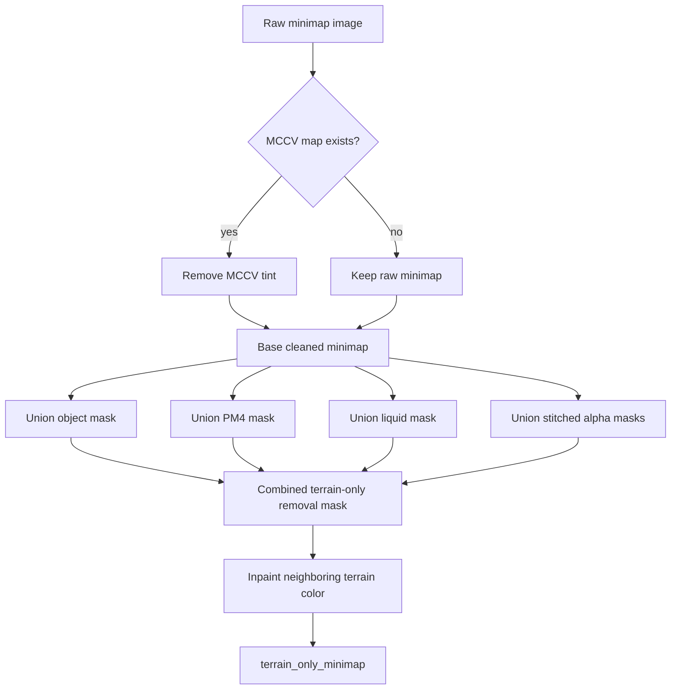
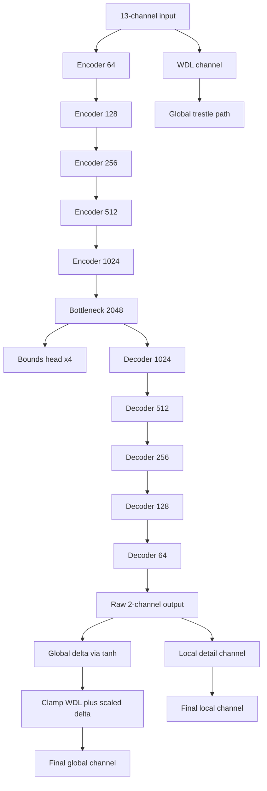

# WoW Terrain Regressor V7.5

Updated Apr 13, 2026.

This is the active architecture guide for the terrain regressor after the dataset-contract bump from V7.4 to V7.5. The network shape is still the same `13`-channel, `2`-output multichannel terrain model, but the RGB input contract is stricter: prefer a terrain-only cleaned minimap whenever the exporter can build one.

## Snapshot

- Input channels: 13
- Output channels: 2
- Core architecture: 5-level U-Net with WDL-trestled global head
- Auxiliary schedule: best-triggered GAN bursts on top of a geometry-first default
- Practical epoch cap: 100
- Dataset contract bump: terrain-only minimap precedence
- Early-development corpus anchors: `0.5.3`, `0.5.5`, and `0.6.0`

## What Changed From V7.4

V7.5 is a semantic version bump, not a tensor-shape bump.

The main change is the preferred RGB surface.

Old effective precedence:

1. `no_object_minimap`
2. `no_mccv_minimap`
3. raw `image`

New V7.5 precedence:

1. `terrain_only_minimap`
2. `no_object_minimap`
3. `no_mccv_minimap`
4. raw `image`

That matters because minimaps often still carry non-mesh evidence Blizzard baked into the capture path:

- lighting direction or horizon tint from the original minimap renderer
- object occlusion
- PM4-obscured regions
- alpha-layer blend signatures from texture overlays
- liquid overwrite regions

V7.5 treats those as contamination the exporter should compensate for before the RGB surface reaches the model. Exported `MCSH` shadow data remains useful as a diagnostic surface, but it is not treated as removable terrain contamination for `terrain_only_minimap`.

## Input Contract

1. Terrain-only minimap RGB when present, otherwise older cleaned/raw fallback
2. Normal map RGB
3. WDL height prior
4. Height min hint
5. Height max hint
6. Liquid mask
7. Liquid height prior
8. Object footprint mask for all visible object families, not just WMOs
9. Brush mask

The channel count remains `13` because the RGB minimap is still three channels. What changed is the preferred provenance of those three channels.

## Terrain-Only Minimap Pipeline

The exporter now has an explicit terrain-only cleanup path. It does not invent new geometry. It removes strong known contaminants from the rendered minimap and inpaints from adjacent surviving terrain color.

Cleanup order:

1. Start from raw `image`
2. If `mccv_map` exists, generate `no_mccv_minimap`
3. Build object and PM4 masks
4. Stitch liquid and alpha masks when present
5. Union the strongest masks into one removal surface
6. Inpaint masked pixels into `terrain_only_minimap`

This is intentionally conservative. If the exporter lacks those masks, the loader falls back automatically.

## Generator

The active generator remains the same high-level V7.4 design:

- reflect padding instead of zero padding
- residual conv blocks
- bilinear upsampling instead of transposed-convolution checkerboard paths
- WDL-trestled global channel with learned residual refinement
- separate local detail channel

## Why The Version Bump Is Real

V7.5 is not just “the same model but cleaned data.” The learned function changes because the RGB evidence distribution changes.

Practical effect:

- less temptation to overfit alpha-blend patterns as terrain shape cues
- less object or liquid imprint contamination in the RGB scaffold
- stronger bias toward mesh-consistent terrain evidence flowing through RGB, while masks remain available as separate context channels

That is enough of a training-contract change to warrant a version bump even though the network dimensions stay stable.

## Loss Stack

V7.5 keeps the current shape-preserving stack:

- global height loss
- local height loss
- bounds loss
- gradient loss
- SSIM loss
- Sobel edge loss
- frequency-domain loss
- Laplacian loss
- transition-focused loss
- tile-edge loss
- adversarial loss during GAN-active epochs

The current model is still trying to preserve both geometry and stitchability, not just per-pixel average correctness.

## Training Control Loop

The active control loop is unchanged in broad structure:

- geometry-first default training
- validation-driven best checkpoints
- best-triggered GAN bursts
- mixed static plus random held-out preview tiles
- explicit context preview sheets for masks

What changes in V7.5 is that the preview and training RGB input should now usually show the terrain-only cleaned surface when the dataset root has the new export.

## Corpus Policy

The active V7.5 corpus should keep the early development clients in scope instead of starting only at later release-era builds.

Required early-build anchors:

1. `0.5.3`
2. `0.5.5`
3. `0.6.0`

Why these stay in the default planning set:

- they preserve early terrain and world-layout concepts that later clients still express in cleaner forms
- they expose minimap and loose-file irregularities that the exporter must handle instead of silently assuming fully packed later-client behavior
- they widen the visual and structural supervision range before the corpus reaches Wrath and Cataclysm-era data

This does not require equal weighting in every run. It does mean the default corpus policy should assume those builds remain first-class dataset sources unless a specific experiment deliberately excludes them.

## Proof Boundary

What V7.5 proves by code alone:

- exporter can emit `terrain_only_minimap`
- trainer and inference now prefer it automatically
- the cache/index path is version-bumped so stale dataset indexes do not hide the new contract

What V7.5 does not prove by code alone:

- that every corpus root has enough alpha, object, PM4, or liquid coverage to produce a useful terrain-only image
- that the new cleaned RGB surface improves convergence on every map family
- that the new exporter path is fully validated on real data without rerunning corpus export and training

## Recommended Next Step

1. Re-export at least one trusted real-data root with the V7.5 exporter.
2. Confirm `terrain_only_minimap` is present in the dataset JSON and image outputs.
3. Run a bounded V7.5 smoke training pass on that root.
4. Compare preview sheets against the older V7.4-style RGB input.

Until that real-data pass is done, V7.5 is a code-path and contract upgrade, not a trained-model signoff.