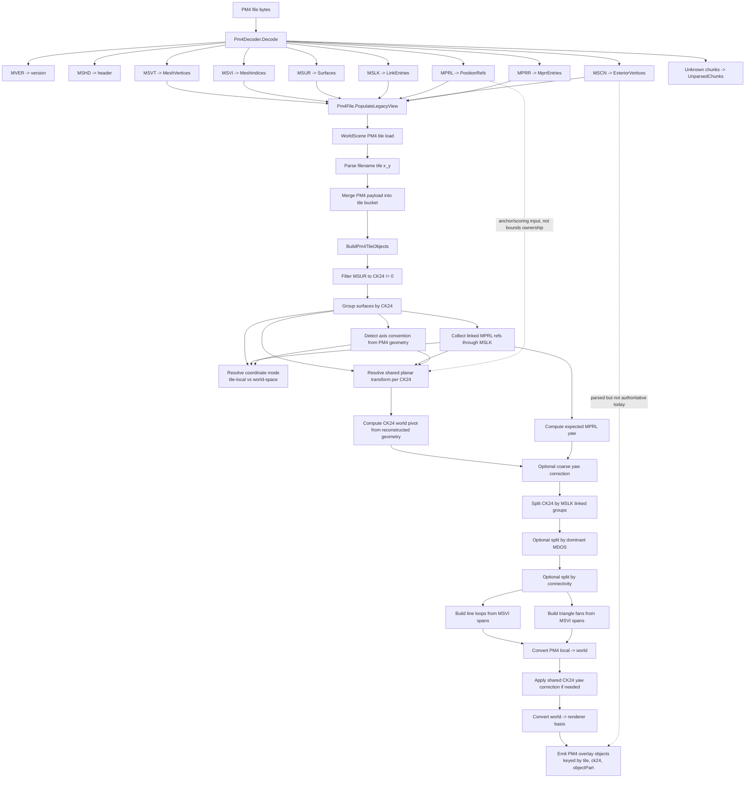
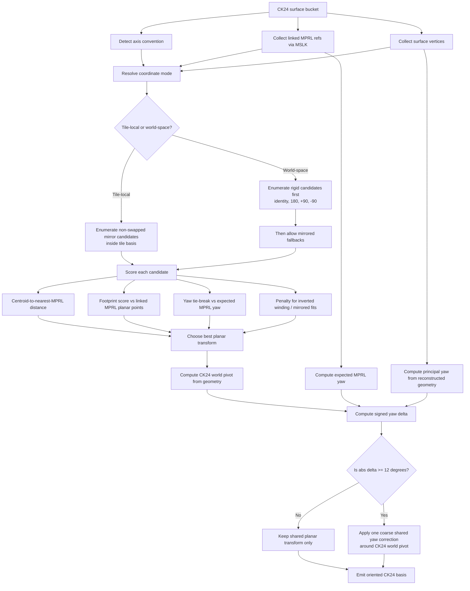

# PM4 Viewer Reconstruction Contract (Updated Mar 21, 2026)

## Why This Exists

PM4 work in the viewer has accumulated several useful fixes, several misleading hypotheses, and at least one confirmed regression experiment. This document is the current viewer-side contract for PM4 reconstruction and debugging in the active `MdxViewer` path.

This is not a final PM4 format specification. It is the authoritative description of what the active viewer does today, what assumptions are still open, and what should not be reintroduced.

## How To Use This Reference

Use this document by question, not by reading top-to-bottom every time.

| If you need to know... | Start here |
| --- | --- |
| which PM4 chunks the viewer actually consumes | `Active Data Contract In Use`, `Chunk Extraction: Parser To Pm4File` |
| how raw PM4 bytes become viewer objects | `Mermaid: Chunk-To-Viewer Reconstruction Flow` |
| where CK24 grouping/orientation decisions happen | `Object Assembly Pipeline`, `Step-By-Step Reconstruction Walkthrough` |
| how coordinate mode and planar transform are chosen | `Orientation Solver (Current)`, `Mermaid: Orientation Solver Decision Flow` |
| what `MPRL` is and is not allowed to mean right now | `MPRL Contract In The Active Viewer` |
| which fields are safe to build new logic on | `Appendix: Compact Chunk-Field Trust Map` |
| what not to resurrect from earlier experiments | `Confirmed Rejected Experiments` |

### Reading Order By Task

For parser work:

1. `Active Data Contract In Use`
2. `Chunk Extraction: Parser To Pm4File`
3. `Appendix: Compact Chunk-Field Trust Map`

For viewer reconstruction work:

1. `Object Assembly Pipeline`
2. `Step-By-Step Reconstruction Walkthrough`
3. `Orientation Solver (Current)`

For PM4 alignment triage:

1. `MPRL Contract In The Active Viewer`
2. `Orientation Solver (Current)`
3. `Diagnostics And Viewer Tooling`
4. `Confirmed Rejected Experiments`

## Validation Discipline

- Build validation is useful for guarding refactors and keeping the branch coherent.
- Build success is not PM4 correctness.
- Runtime real-data signoff is still required before claiming PM4 placement/orientation closure.
- When this document and runtime behavior disagree, runtime evidence wins and the document should be updated.
- Preferred PM4 reference tile for raw-format and viewer-forensics work is `test_data/development/World/Maps/development/development_00_00.pm4`.
- That tile is currently the best trusted PM4 anchor because it is dense, already used in multiple forensics passes, and the user has matching original ADTs outside this repo for object-placement cross-checks.

## Current Confidence Level

- Strong: PM4 tile assignment is deterministic from filename: `map_x_y.pm4 -> (tileX = x, tileY = y)`.
- Strong: duplicate PM4 payloads merge rather than overwrite.
- Strong: PM4 overlay object identity is keyed by `(tile, ck24, objectPart)`, not only `(tile, ck24)`.
- Strong: coordinate mode and planar solve are resolved per CK24, not once per file.
- Strong: axis convention is now held file-level again so neighboring CK24 groups do not drift into different mesh bases.
- Strong: tile-local PM4 and world-space PM4 no longer share the same unrestricted planar candidate set.
- Strong: the linked-`MPRL` bounds-center translation experiment is no longer active.
- Strong negative result: current runtime evidence does not support an `MPRL` bounding-box or `MPRL` container-frame paradigm for viewer reconstruction.
- Strong semantic guidance from user/domain knowledge: `MPRL` points are terrain/object collision-footprint intersections where ADT terrain is pierced by object collision geometry.
- Open: final PM4 frame ownership is still not fully closed, but `MPRL` should currently be treated as collision-footprint reference data used for scoring and linkage, not as a bounding-box ownership model.
- Open: `MSCN` is parsed and important to the broader PM4 pipeline, but it is not yet the authoritative source for active viewer object extents/orientation.
- Open: runtime visual signoff is still pending for remaining alignment and visibility edge cases.

## Reference Model: Three PM4 Reading Layers

This is the cleanest mental model for the active codebase.

1. Raw per-file PM4 data
   - chunk contents and decoded fields from `Pm4File`
   - this is where `MSVT`, `MSVI`, `MSUR`, `MSLK`, `MPRL`, and `MSCN` exist as storage

2. Linked object-assembly view
   - viewer reconstruction groups surfaces into CK24-scoped objects and sub-objects
   - this is where coordinate mode, planar transform, and linked-group splitting are decided
   - axis convention is detected from PM4 geometry once per file and then reused across CK24 groups

3. Final viewer render derivation
   - object-local PM4 lines/triangles plus a baked base placement transform, renderer-basis conversion, object-local debug transforms, bounds, and pickability
   - this is where many regressions show up even when raw PM4 decode is technically present

Confusing these layers caused several previous dead ends. A raw chunk fact is not automatically a viewer placement rule.

## Active Data Contract In Use

The active overlay path reads from `WoWMapConverter.Core.Formats.PM4.Pm4File` and currently uses:

- `MSVT`: mesh vertices via `Pm4File.MeshVertices`
- `MSVI`: mesh index stream via `Pm4File.MeshIndices`
- `MSUR`: surface loops via `Pm4File.Surfaces`
  - consumes `Ck24`, `MsviFirstIndex`, `IndexCount`, `MdosIndex`, `GroupKey`, `AttributeMask`, and `Height`
- `MSLK`: link graph via `Pm4File.LinkEntries`
  - consumes `GroupObjectId`, `MsurIndex`, and `RefIndex`
- `MPRL`: placement refs via `Pm4File.PositionRefs`
  - currently used as anchor and scoring input, especially for coordinate-mode selection, planar solve, and yaw comparison
- `MSCN`: parsed but not authoritative for the current viewer object reconstruction contract

## Chunk Extraction: Parser To `Pm4File`

The current parser path is:

- `Pm4Decoder.Decode(byte[])`
- read chunk signature + chunk size
- dispatch by FourCC
- build `Pm4FileStructure`
- `Pm4File.PopulateLegacyView(...)`
- expose the legacy/viewer-facing lists consumed by `WorldScene`

### Chunk Dispatch In `Pm4Decoder`

- `MVER` -> PM4 version
- `MSHD` -> PM4 header fields
- `MSLK` -> link entries
- `MSPV` -> path vertices
- `MSPI` -> path indices
- `MSVT` -> mesh vertices
- `MSVI` -> mesh indices
- `MSUR` -> surface descriptors
- `MSCN` -> scene/exterior vertices
- `MPRL` -> position refs
- `MPRR` -> graph/reference entries
- unknown chunks -> `UnparsedChunks`

The decoder also records per-chunk byte sizes in `ChunkSizes`, which is useful for diagnostics and format drift detection.

### Viewer-Relevant Extraction Table

| Chunk | Decoder output | `Pm4File` view | Fields the viewer actually uses | Current role in `MdxViewer` |
| --- | --- | --- | --- | --- |
| `MSVT` | `List<Vector3>` | `MeshVertices` | raw PM4 mesh vertex positions | source geometry for CK24 reconstruction |
| `MSVI` | `List<uint>` | `MeshIndices` | per-surface index references | drives loop edges and triangle fans |
| `MSUR` | `List<MsurChunk>` | `Surfaces` | `Ck24`, `MsviFirstIndex`, `IndexCount`, `MdosIndex`, `GroupKey`, `AttributeMask`, `Height` | defines CK24 grouping and surface membership |
| `MSLK` | `List<MslkChunk>` | `LinkEntries` | `GroupObjectId`, `MsurIndex`, `RefIndex` | links surfaces to linked groups and position refs |
| `MPRL` | `List<MprlChunk>` | `PositionRefs` | `Position`, low-16 `RotationOrFlags` | terrain/object collision-footprint refs; current viewer uses them as scoring and yaw-reference input |
| `MSCN` | `List<Vector3>` | `ExteriorVertices` | parsed only | not authoritative for active viewer reconstruction |
| `MPRR` | `List<MprrChunk>` | `MprrEntries` | graph edge values | not part of the active viewer orientation path |

### Important Field-Level Notes

`MSUR`:

- `Ck24` is decoded from `PackedParams >> 8`
- `Ck24Type` is the top byte of `PackedParams`
- `Ck24ObjectId` is the low 16 bits of decoded `Ck24`
- `MsviFirstIndex` and `IndexCount` define the index span used to reconstruct the surface loop

`MSLK`:

- the viewer prefers `MsurIndex` when linking a link entry to a surface
- it only falls back to `RefIndex` as a surface id when `MsurIndex` does not resolve
- `RefIndex` is also treated as a position-ref index when it falls in `MPRL` range

`MPRL`:

- `Position` is stored as `(PositionX, PositionY, PositionZ)`
- active viewer now converts this to world as `(PositionX, PositionZ, PositionY)` when scoring against `MSVT`-derived geometry and when drawing PM4 position-ref markers
- this is paired with the restored fixed `MSVT` viewer/world basis of `(Y, X, Z)` that older PM4 R&D used when the mesh lined up with placed WMO/M2 assets
- `RotationOrFlags` currently aliases the low 16 bits of `Unk04`

## Mermaid: Chunk-To-Viewer Reconstruction Flow

### Implementation Map: Chunk-To-Viewer Flow

Line numbers below are anchor points for this branch state. If they drift, the function names are the stable reference.

| Flow step | Primary implementation site | Notes |
| --- | --- | --- |
| PM4 file bytes -> decoder entry | `src/WoWMapConverter/WoWMapConverter.Core/Formats/PM4/Pm4Decoder.cs`, `Pm4Decoder.Decode(byte[])` at line 11 | top-level byte-array decode entry |
| decoder stream walk | `src/WoWMapConverter/WoWMapConverter.Core/Formats/PM4/Pm4Decoder.cs`, `Pm4Decoder.Decode(BinaryReader)` at line 18 | reads FourCC + size and dispatches by chunk |
| `MVER` / `MSHD` / `MSLK` / `MSUR` / `MPRL` chunk readers | `src/WoWMapConverter/WoWMapConverter.Core/Formats/PM4/Pm4Decoder.cs`, `ReadMshd` line 115, `ReadMslk` line 128, `ReadMsur` line 156, `ReadMprl` line 184, `ReadMprr` line 208 | exact chunk-layout decode lives here |
| vector and index chunk readers | `src/WoWMapConverter/WoWMapConverter.Core/Formats/PM4/Pm4Decoder.cs`, `ReadVectors` line 215, `ReadUints` line 222, `ReadSignedInt24` line 229 | used by `MSPV`, `MSPI`, `MSVT`, `MSVI`, `MSCN` |
| `Pm4File` construction | `src/WoWMapConverter/WoWMapConverter.Core/Formats/PM4/Pm4File.cs`, constructor path at lines 34-35 | `Pm4Decoder.Decode(data)` then `PopulateLegacyView(Structure)` |
| structure -> viewer-facing lists | `src/WoWMapConverter/WoWMapConverter.Core/Formats/PM4/Pm4File.cs`, `PopulateLegacyView(...)` at line 38 | converts canonical chunk records into `MeshVertices`, `MeshIndices`, `Surfaces`, `LinkEntries`, `PositionRefs`, `ExteriorVertices` |
| surface-level triangle extraction helper | `src/WoWMapConverter/WoWMapConverter.Core/Formats/PM4/Pm4File.cs`, `GetSurfaceTriangles(...)` at line 125 | useful for sanity-checking mesh-side reconstruction |
| PM4 tile load -> object build call | `src/MdxViewer/Terrain/WorldScene.cs`, PM4 tile build call at line 743 | tile payloads are converted into overlay objects here |
| CK24 object reconstruction entry | `src/MdxViewer/Terrain/WorldScene.cs`, `BuildPm4TileObjects(...)` at line 924 | main viewer reconstruction pipeline |
| linked `MPRL` collection | `src/MdxViewer/Terrain/WorldScene.cs`, `CollectLinkedPositionRefs(...)` at line 1341 | extracts linked refs from `MSLK`/surface membership |
| coordinate mode selection | `src/MdxViewer/Terrain/WorldScene.cs`, `ResolveCk24CoordinateMode(...)` at line 1055 | chooses tile-local vs world-space per CK24 |
| axis convention detection | `src/MdxViewer/Terrain/WorldScene.cs`, `DetectPm4AxisConvention(...)` at lines 2056 and 2085 | file-wide and per-surface-group variants |
| planar transform solve | `src/MdxViewer/Terrain/WorldScene.cs`, `ResolvePlanarTransform(...)` at line 2119 | selects the shared CK24 planar basis |
| coarse yaw correction solve | `src/MdxViewer/Terrain/WorldScene.cs`, `TryComputeWorldYawCorrectionRadians(...)` at line 1536 | applies the `12°` guardrail |
| linked-group split | `src/MdxViewer/Terrain/WorldScene.cs`, `SplitSurfaceGroupByMslk(...)` at line 1168 | separates CK24 into linked components |
| line emission | `src/MdxViewer/Terrain/WorldScene.cs`, `BuildCk24ObjectLines(...)` at line 1670 | reconstructs loop edges from `MSVI` spans |
| triangle emission | `src/MdxViewer/Terrain/WorldScene.cs`, `BuildCk24ObjectTriangles(...)` at line 1728 | reconstructs triangle fans from `MSVI` spans |
| PM4 local -> world | `src/MdxViewer/Terrain/WorldScene.cs`, `ConvertPm4VertexToWorld(...)` at line 2458 | canonical PM4 basis conversion |
| world -> renderer | `src/MdxViewer/Terrain/WorldScene.cs`, `ConvertPm4VertexToRenderer(...)` at line 2535 | world-space PM4 into viewer render basis |
| interchange dump for offline triage | `src/MdxViewer/Terrain/WorldScene.cs`, `BuildPm4OverlayInterchangeJson(...)` at line 418 | emits tile/object/geometry debug export |
| UI entry for JSON dump | `src/MdxViewer/ViewerApp_Pm4Utilities.cs`, `Dump PM4 Objects JSON` button at lines 109, 310 and `_worldScene.BuildPm4OverlayInterchangeJson(...)` call at line 359 | easiest runtime export hook |

## Step-By-Step Reconstruction Walkthrough

This is the actual extraction path that leads to the PM4 data the viewer can currently orient with some confidence.

### 1. Raw mesh comes from `MSVT` + `MSVI` + `MSUR`

- `MSVT` provides the raw 3D points
- `MSVI` provides the shared index pool
- `MSUR` tells the viewer which contiguous span inside `MSVI` belongs to a surface, and which `CK24` that surface belongs to

The viewer does not build oriented objects straight from `MSCN` today. The oriented objects are reconstructed from the mesh-side path above.

### 2. `MSUR.CK24` is the first durable object key

`BuildPm4TileObjects(...)` ignores surfaces where `CK24 == 0` and starts object reconstruction by grouping surfaces on `CK24`.

That CK24-scoped bucket is the first place where the viewer has enough structure to ask:

- which axis convention fits this data?
- does this look tile-local or world-space?
- which planar mapping best fits linked references?

### 3. `MSLK` tells the viewer how to narrow linkage

After the CK24 bucket is built, `MSLK` is used to:

- split a CK24 into linked groups
- find the dominant `GroupObjectId`
- discover which `MPRL` refs are linked to those surfaces

This is why `MSLK` sits in the middle of the viewer reconstruction path rather than only being a side-channel.

### 4. `MPRL` is used as scoring input, not direct ownership

For each CK24 bucket, linked `MPRL` refs feed three decisions:

- coordinate mode selection: tile-local vs world-space
- planar transform scoring
- expected yaw comparison against reconstructed principal yaw

The important constraint is what does **not** happen anymore:

- the viewer does not translate the CK24 into a linked `MPRL` center frame
- the viewer does not assume the CK24 should fit inside an `MPRL` bounds container

### 5. Axis convention is chosen from geometry, not from a chunk flag

`DetectPm4AxisConvention(...)` evaluates candidate bases:

- `XZ + Y up`
- `XY + Z up`
- `YZ + X up`

The score prefers the basis that produces the most horizontal, floor-like triangles or surface normals. If that is inconclusive, it falls back to range-based heuristics.

Current viewer rule: this axis convention is chosen once per PM4 file and then reused across CK24 groups. The earlier per-CK24 basis solve could make neighboring wall/object pieces choose different mesh bases, which showed up as random offsets or mirrored-looking local fits even when the broader tile placement was closer.

### 6. Coordinate mode is solved per CK24

`ResolveCk24CoordinateMode(...)` compares:

- tile-local interpretation
- world-space interpretation

Each side is scored by:

- `MPRL` footprint fit
- centroid distance to nearest `MPRL` ref

This is not one file-wide switch. One PM4 file can contain CK24 buckets that prefer different interpretations.

### 7. Planar transform candidates differ by coordinate mode

Tile-local PM4 candidates:

- remain inside the established south-west tile basis
- test only rigid non-mirrored variants inside that basis (`default`, `180°`)

World-space PM4 candidates:

- test only the rigid set: identity, `180°`, `+90°`, `-90°`

This split exists because applying the world-space quarter-turn search to tile-local PM4 produced the coherent `90°` non-origin tile rotation regression.

### 8. Continuous yaw correction is a coarse final adjustment only

After planar transform resolution:

- the viewer computes a geometry-derived principal yaw
- it computes an expected yaw from linked `MPRL` refs
- it applies the delta only if the residual is larger than `12°`

This keeps principal-axis noise from performing small destructive "corrections" on already-near-correct objects.

### 9. The viewer builds the actual renderable objects from surface loops

Once the CK24 basis is fixed, the viewer emits render geometry by walking the `MSVI` spans defined by each `MSUR`:

- `BuildCk24ObjectLines(...)` reconstructs loop edges and explicitly closes each surface loop
- `BuildCk24ObjectTriangles(...)` triangulates each surface as a fan from the first indexed vertex
- mirrored transforms flip triangle winding during emission

This is the point where the viewer produces the PM4 data it actually knows how to orient and render today.

After that geometry is emitted, each `Pm4OverlayObject` keeps:

- placed-space bounds and center for picking/culling/debugging
- object-local line/triangle geometry rebased around a preserved pre-split linked-group placement anchor
- a baked base placement transform that restores that anchored local geometry into the solved placed frame during rendering/export

This is an important guardrail: if a CK24 is later split by linked-group, `MdosIndex`, or connectivity, the split fragments must keep the original linked-group placement anchor instead of inventing new per-fragment centers, otherwise the viewer loses the source placement offsets that existed before the split.

## What We Currently Know How To Orient Reliably

The active viewer has the best footing on PM4 data built through this path:

- `MSUR` surfaces with nonzero `CK24`
- mesh geometry reconstructed from `MSVT` + `MSVI`
- CK24-level axis convention
- CK24-level coordinate-mode selection
- CK24-level planar transform resolution
- linked-group / MDOS / connectivity splitting after the shared CK24 basis is chosen

That is the current "known orientation" zone.

What is outside that zone today:

- treating `MSCN` as the authoritative source for oriented viewer objects
- treating `MPRL` as an enclosing bounding-box/container frame
- any theory that bypasses CK24 surface reconstruction and still claims to explain the visible viewer objects

## Tile Mapping Contract

In `WorldScene` PM4 overlay loading:

1. Parse PM4 filename tile from `*_x_y.pm4`
2. Map directly to viewer tile `(tileX = x, tileY = y)`
3. Do not reassign tiles from `MPRL` centroid heuristics
4. If multiple PM4 files map to one tile, merge payloads and rebase `objectPart`

This prevents sparse-dataset drift and silent overwrite loss.

Rendering follow-up:

- PM4 overlay rendering and picking should not require ADT tile residency for PM4-only sparse tiles.
- AOI-loaded-tile gating remains for ADT-backed tiles.

## Object Assembly Pipeline

Implemented in `WorldScene.BuildPm4TileObjects(...)`:

1. Keep only `MSUR` surfaces with `CK24 != 0` for object reconstruction
2. Group surfaces by CK24
3. Reuse one file-level axis convention detected from PM4 geometry
4. Resolve coordinate mode per CK24
   - tile-local vs world-space is chosen by `MPRL` fit, not once per file
5. Resolve one shared planar transform per CK24
6. Compute one CK24 world pivot from reconstructed geometry
7. Optionally apply one coarse CK24 yaw correction when the residual error is meaningfully large
8. Split CK24 by `MSLK`-linked groups
9. Optionally split by dominant `MDOS` index
10. Optionally split by connectivity
11. Emit per-component overlay objects keyed by `(tile, ck24, objectPart)`

Current render-derivation detail:

- `Pm4OverlayObject` now stores its line/triangle geometry in object-local space around the placed object center.
- each object also carries a baked base placement transform that translates that local geometry back into the solved placed frame.
- overlay-wide transforms and user PM4 alignment transforms are applied on top of that baked base frame instead of assuming the geometry itself is already the final placed frame.

Important guardrail: transform resolution is shared per CK24, not solved independently per linked subgroup or per tiny fragment. That keeps one real object from exploding into internally inconsistent orientations.

## MSLK And MPRL Linkage Rules

When associating `MSLK` links to surfaces:

- prefer `MsurIndex` as the surface reference
- only fall back to `RefIndex` as a surface id when `MsurIndex` does not resolve

For `MPRL` association:

- treat `RefIndex` as a position-ref index when it is in `MPRL` range
- deduplicate refs by index

## MPRL Contract In The Active Viewer

`MPRL` is important, but the current viewer contract is narrower than the earlier failed experiment.

Authoritative semantic update from user/domain knowledge:

- `MPRL` points are literal terrain/object collision-footprint intersections.
- they mark the `XYZ` positions where ADT terrain is pierced by object collision geometry so terrain and object participate in one stitched collision surface.
- this means `MPRL` is not an object-center cloud and not an enclosing bounds container.

Negative result from runtime debugging:

- PM4 geometry, PM4 bounds, and visible object extents are not currently conforming to an `MPRL` bounding-box paradigm.
- Treat that as observed falsification of the current bounding-box theory, not as something that only needs more tuning.
- In practice: if a future fix starts from "the CK24 should sit inside the `MPRL` bounds/container," that is reintroducing a disproven assumption and should require new evidence first.

What `MPRL` does today:

- semantically, it represents terrain/object collision-footprint reference points
- helps decide tile-local vs world-space interpretation
- helps score planar transform candidates
- provides expected yaw for comparison against geometry-derived principal yaw
- provides anchor references for debugging and inspection

What `MPRL` does not do today:

- it does not translate a whole CK24 group into a linked `MPRL` world-bounds center
- it does not override every geometry-derived decision unconditionally

Reason: the linked-center translation experiment regressed runtime placement and was removed.

Working interpretation for now:

- `MPRL` should be treated as collision-footprint reference data.
- the earlier failure was specifically the viewer's attempt to translate whole CK24 groups into an `MPRL` center/bounds frame.
- do not collapse that into the wrong conclusion that `MPRL` is generic noise; the better conclusion is that its semantics are footprint/collision seam points, not enclosing containers.

## Orientation Solver (Current)

`ResolvePlanarTransform(...)` evaluates candidate planar transforms and scores them by:

1. centroid-to-nearest-`MPRL` distance
2. footprint score between sampled object points and `MPRL` planar points when enough linked refs exist
3. yaw tie-break between candidate principal axis and averaged `MPRL` yaw
   - `MPRL` packed low-16 rotation is currently decoded as a raw packed angle only
   - sign and quarter-turn ambiguity are left to the existing basis-fallback comparison path instead of hardcoding a world-yaw rebase
   - basis fallback evaluates direct, sign-flipped, and quarter-turn variants
4. an explicit penalty for mirrored or winding-inverting candidates

### Candidate Sets

Tile-local PM4:

- tests only rigid non-mirrored variants inside the established south-west tile basis
- does not allow the quarter-turn swap set that caused coherent non-origin tile rotations

World-space PM4:

- evaluates only the rigid set: identity, `180°`, `+90°`, `-90°`

This separation matters. Applying the world-space quarter-turn search to tile-local PM4 caused the reported `90°` non-origin tile regression.

### Continuous Yaw Correction

After planar transform selection, the viewer may apply one CK24-scoped continuous yaw correction:

- derive candidate principal yaw from reconstructed object footprint
- derive expected yaw from linked `MPRL` refs
- compute best signed delta with basis/parity fallback
- rotate geometry around the CK24 world centroid before world-to-renderer conversion

Guardrail:

- residual yaw deltas below `12°` are ignored
- this is intentional because the principal-axis solve is useful for coarse basis recovery, but too noisy for small final alignment tweaks

## Mermaid: Orientation Solver Decision Flow

### Implementation Map: Orientation Solver Flow

Line numbers below are anchor points for this branch state. If they drift, the function names are the stable reference.

| Solver step | Primary implementation site | Notes |
| --- | --- | --- |
| axis convention detection | `src/MdxViewer/Terrain/WorldScene.cs`, `DetectPm4AxisConvention(Pm4File)` line 2056 and `DetectPm4AxisConvention(Pm4File, IEnumerable<MsurEntry>)` line 2085 | chooses `XZ+Yup`, `XY+Zup`, or `YZ+Xup` |
| linked `MPRL` ref collection | `src/MdxViewer/Terrain/WorldScene.cs`, `CollectLinkedPositionRefs(...)` line 1341 | links `MPRL` refs to the current surface bucket |
| coordinate mode selection | `src/MdxViewer/Terrain/WorldScene.cs`, `ResolveCk24CoordinateMode(...)` line 1055 | compares tile-local and world-space scoring |
| coordinate-mode scoring helper | `src/MdxViewer/Terrain/WorldScene.cs`, `EvaluateCoordinateModeScore(...)` just below line 1055 | footprint + centroid score blend |
| planar transform solve | `src/MdxViewer/Terrain/WorldScene.cs`, `ResolvePlanarTransform(...)` line 2119 | shared CK24 transform selection |
| planar candidate enumeration | `src/MdxViewer/Terrain/WorldScene.cs`, `EnumeratePlanarTransforms(...)` in the `ResolvePlanarTransform` block around line 2231 | different candidate sets for tile-local vs world-space |
| expected `MPRL` yaw | `src/MdxViewer/Terrain/WorldScene.cs`, `TryComputeExpectedMprlYawRadians(...)` line 1381 | circular-average of the raw packed low-16 angle signal |
| principal yaw from reconstructed geometry | `src/MdxViewer/Terrain/WorldScene.cs`, `TryComputePlanarPrincipalYaw(...)` immediately below the `TryComputeExpectedMprlYawRadians(...)` block | geometry-driven comparison yaw |
| coarse yaw delta gate | `src/MdxViewer/Terrain/WorldScene.cs`, `TryComputeWorldYawCorrectionRadians(...)` line 1536 | rejects residual deltas under `12°` |
| CK24 world pivot | `src/MdxViewer/Terrain/WorldScene.cs`, `ComputeSurfaceWorldCentroid(...)` just below the yaw-correction helper | shared rotation pivot for the CK24 |
| final world-space emission path | `src/MdxViewer/Terrain/WorldScene.cs`, `BuildCk24ObjectLines(...)` line 1670, `BuildCk24ObjectTriangles(...)` line 1728, `ConvertPm4VertexToWorld(...)` line 2458, `ConvertPm4VertexToRenderer(...)` line 2535 | where the chosen basis becomes visible geometry |

### Solver Interpretation Notes

- Axis convention is decided from geometry first, not from a PM4 chunk flag.
- Coordinate mode is chosen before the final planar transform because tile-local and world-space PM4 do not use the same candidate set anymore.
- `MPRL` helps score the solve, but does not contribute a trusted bounding box or enclosing frame.
- The final continuous yaw correction is intentionally conservative and only exists to recover obvious basis misses.

### Solver Debug Checklist

When a PM4 object looks wrong in the viewer, check these in order:

1. Did the object come from `MSUR`/`CK24` reconstruction, or are you reasoning from `MSCN`/bounds instead?
2. Did the CK24 choose tile-local or world-space mode?
3. Which planar candidate won, and was it rigid or mirrored?
4. Did the object receive a coarse yaw correction, or was the delta under `12°` and intentionally suppressed?
5. Are you looking at geometry output, PM4 bounds output, or `MPRL` refs and assuming they should coincide exactly?

## Coordinate Conversion Contract

### PM4 Local To World

- choose planar/up axes from detected convention: `XY+Zup`, `XZ+Yup`, or `YZ+Xup`
- for the common `XY+Zup` case, the active viewer uses the older fixed `MSVT` planar order `(Y, X, Z)` instead of raw `(X, Y, Z)`
- apply the chosen planar transform
- if tile-local:
   - `worldX = tileY * TileSize + mappedU`
   - `worldY = tileX * TileSize + mappedV`
  - `worldZ = localUp`
- else use world-like planar values directly

This swap is intentional in viewer world space. File `tileX` advances along world `Y`, and file `tileY` advances along world `X`; leaving them unswapped only happens to look correct on origin tiles and shifts non-origin tile-local PM4 onto the wrong grid.

### World To Renderer Space

- `rendererX = MapOrigin - worldY`
- `rendererY = MapOrigin - worldX`
- `rendererZ = worldZ + 0.5`

This matches the active terrain/object renderer basis.

## Diagnostics And Viewer Tooling

The active viewer already includes several PM4 debugging surfaces:

- `BuildPm4OverlayInterchangeJson(...)` exports overlay summary, tile/object metadata, alignment state, and optional geometry
- PM4 Alignment UI exposes `Dump PM4 Objects JSON`
- PM4 Alignment UI edits selected-object 9DoF only: translation, rotation, and scale
- `Flip Obj X`, `Flip Obj Y`, `Flip Obj Z` are object-local mirror tests
- object-local rotation and scale are applied around object center so the object stays in place during parity testing
- PM4 debug overlay includes `PM4 X-Ray`
- PM4 debug overlay includes `PM4 Bounds`
- PM4 debug UI can split CK24 by `MdosIndex`

Important scope note:

- current PM4 bounds come from rendered PM4 object geometry, not from `MSCN` directly
- they are a debugging aid, not final proof of authoritative PM4 extents
- current PM4 JSON export emits placed-space geometry by reapplying each object's baked base placement transform to its object-local geometry

## Appendix: Compact Chunk-Field Trust Map

This appendix is intentionally narrow. It covers the chunk fields the active parser and viewer currently trust enough to use, and flags the ones still treated as opaque or only partially understood.

### Trusted Enough To Drive Active Viewer Behavior

| Chunk | Layout detail currently trusted | Why it is trusted in the active path |
| --- | --- | --- |
| `MVER` | 4-byte version value | parsed directly and stable |
| `MSVT` | repeated `Vector3` entries, 12 bytes each | directly consumed as PM4 mesh geometry |
| `MSVI` | repeated `uint32` indices, 4 bytes each | directly consumed as the mesh index pool |
| `MSUR` | 32-byte entries | size is explicit in decoder and stable under active datasets |
| `MSUR.GroupKey` | byte 0 | used in object metadata/debugging |
| `MSUR.IndexCount` | byte 1 | used as the surface loop span length |
| `MSUR.AttributeMask` | byte 2 | used in object metadata/debugging |
| `MSUR.Normal` | bytes 4..15 as 3 floats | used in surface/axis scoring context |
| `MSUR.Height` | bytes 16..19 float | used in object metadata/debugging |
| `MSUR.MsviFirstIndex` | bytes 20..23 uint32 | used to locate the surface index span inside `MSVI` |
| `MSUR.MdosIndex` | bytes 24..27 uint32 | used for optional MDOS-based splitting |
| `MSUR.PackedParams` | bytes 28..31 uint32 | used to derive `Ck24`, `Ck24Type`, `Ck24ObjectId` |
| `MSLK` | 20-byte entries | size is explicit in decoder and stable under active datasets |
| `MSLK.GroupObjectId` | bytes 4..7 uint32 | used to split a CK24 into linked groups and choose dominant group id |
| `MSLK.MsurIndex` | legacy-viewer field reconstructed from the 24-bit index slot | preferred surface reference when linking surfaces |
| `MSLK.RefIndex` | bytes 16..17 uint16 | used as fallback surface id or as `MPRL` ref index depending on context |
| `MPRL` | 24-byte entries | size is explicit in decoder and stable under active datasets |
| `MPRL.Position` | bytes 8..19 as 3 floats | used as anchor/scoring data after the active viewer/world interpretation `(X, Z, Y)`, paired with `MSVT -> (Y, X, Z)` |
| `MPRL.RotationOrFlags` | low 16 bits aliased from `Unk04` | used as the current best available yaw signal |
| `MSCN` | repeated `Vector3` entries, 12 bytes each | parsing is trusted; semantic ownership in the viewer is not |
| `MPRR` | 4-byte entries as two uint16s | parsing is trusted even though the active viewer orientation path does not use it |

### Parsed Correctly But Not Trusted As Viewer Semantics Yet

| Chunk / field | Current status |
| --- | --- |
| `MSCN` extents / object ownership | parsed, but not trusted as the authoritative source for active viewer object bounds or orientation |
| `MPRL` as container / bounding-box frame | explicitly not trusted; runtime evidence contradicts this paradigm |
| `MPRL` low-16 angle exact semantic meaning beyond current yaw comparison use | partially trusted for scoring, not treated as a closed full-orientation spec |
| `MPRR` graph semantics | parsed, not part of the active `WorldScene` orientation path |
| `MSPV` / `MSPI` path mesh | parsed in core, not part of the active viewer object reconstruction path |

### Still Opaque Or Poorly Named In Active Code

| Field | Current handling |
| --- | --- |
| `MSHD.Field00 .. Field1C` | preserved as header values, not used as trusted viewer semantics |
| `MPRL.Unk00`, `Unk02`, `Unk06`, `Unk14`, `Unk16` | preserved, but not part of active viewer orientation rules |
| `MSLK.TypeFlags`, `Subtype`, `Padding`, `LinkId`, `SystemFlag` | parsed and preserved, but not central to the active orientation contract |
| `MSUR.Padding` | parsed only |

### Size Summary Used By The Current Decoder

| Chunk | Entry size in active decoder |
| --- | --- |
| `MSLK` | 20 bytes per entry |
| `MSUR` | 32 bytes per entry |
| `MPRL` | 24 bytes per entry |
| `MPRR` | 4 bytes per entry |
| `MSVT` / `MSPV` / `MSCN` | 12 bytes per `Vector3` |
| `MSVI` / `MSPI` | 4 bytes per `uint32` |

### Practical Rule For Future Edits

- If a field is only in the "parsed correctly but not trusted" or "opaque" buckets, do not promote it into viewer placement/orientation logic without runtime evidence.
- If a future pass needs a new PM4 theory, attach it to one of these specific fields and say exactly what changed in the trust level.

### Safe Extension Rules

- New parser work is safer when it adds preserved data first and viewer semantics second.
- New viewer semantics should attach to one specific trusted field or one specific new runtime observation.
- Do not promote a whole paradigm such as "MPRL is the object box" without naming the exact field and exact behavioral evidence.

## Confirmed Rejected Experiments

Do not silently reintroduce these without fresh runtime evidence:

- no PM4 tile reassignment from `MPRL` centroid heuristics
- no linked-`MPRL` bounds-center translation for whole CK24 groups
- no per-linked-subgroup transform solving that lets one CK24 split spin differently per part
- no fallback to `(tile, ck24)` identity keys without `objectPart`
- no requirement that PM4-only sparse tiles must also have loaded ADT terrain to render or pick

## Open Questions

- whether `MSCN` should become authoritative for some parts of viewer-side object extents or grouping
- whether `MPRL` has a narrower semantic role than the earlier "container/bounds frame" hypothesis suggested
- whether any remaining misalignment is now in reconstruction, visibility/culling, or asset/render parity rather than PM4 basis solving itself

## Next Investigations

1. Use `Dump PM4 Objects JSON` on a known failing live scene.
2. Compare tile/object counts, bounds, and transform metadata against what is visible in the viewer.
3. Validate the current CK24 yaw correction on the same scene before changing ownership rules again.
4. If residual issues remain, prefer narrow reconstruction or visibility fixes over new global PM4 frame theories.
