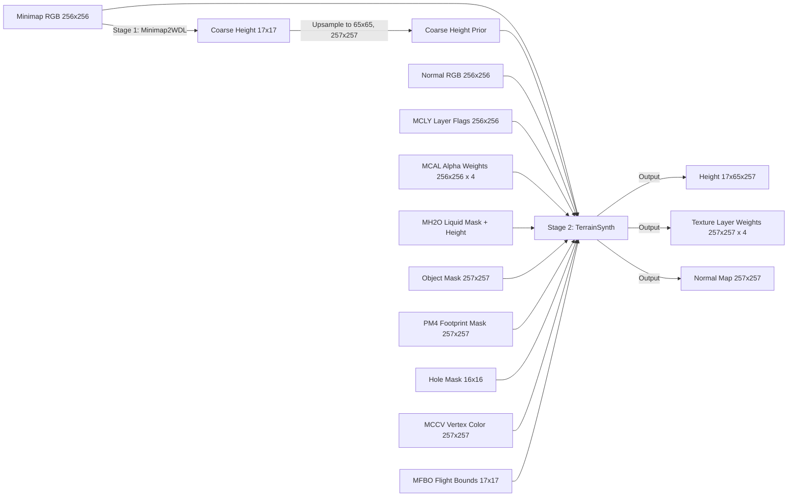

# V10 Terrain Training Architecture Plan

## Intent

Replace the v9 single-stage terrain model with a two-stage pipeline that can generate beautiful terrain from **minimap-only inputs** while leveraging every available client data signal during training.

- **Stage 1** synthesizes a coarse WDL-like height prior from minimap RGB alone.
- **Stage 2** refines that coarse prior into full-resolution terrain using all available ground-truth signals.
- At inference time, a tile with only a minimap can flow through both stages and produce a complete, patchable ADT.
- During training, both stages are grounded on real client data with rich supervision.

This remains a Bring Your Own Data workflow. Do not ship client data, harvested corpora, model weights, or outputs derived from proprietary game data.

---

## Why Two Stages

The v9 model conflates two hard problems:

1. **Global shape inference** — figuring out where mountains, valleys, and coastlines are from a top-down RGB image.
2. **Local detail recovery** — reconstructing exact vertex heights, cliffs, roads, and brush detail from coarse evidence plus masks.

When both problems are forced into one network, the model struggles because:
- gradients from fine-detail loss fight with gradients from global-shape loss
- the WDL prior acts as a crutch; remove it and the model collapses
- training data is biased toward tiles that happen to have both WDL and full ADT

Separating the stages makes each one tractable:
- **Stage 1** trains on every tile that has *any* height ground truth, regardless of WDL presence. It learns to hallucinate plausible coarse terrain from minimap texture cues (green=grass=flat, brown=rock=rough, white=snow=high, blue=water=low, etc.).
- **Stage 2** trains on tiles with full ADT ground truth. It learns to add detail to a coarse prior, using real MCLY layers, MCAL blends, object footprints, and liquid boundaries as guidance.

---

## Architecture Overview



---

## Stage 1: Minimap2WDL — Coarse Height Synthesis

### Purpose
Learn to map a 256x256 minimap RGB tile into a 17x17 coarse height field that approximates what WDL would have provided.

### Training Data

**Positive examples** — every tile that has both:
- minimap RGB (any variant: terrain_only, no_liquid, no_object, raw)
- real WDL 17x17 height OR real MCVT-derived 17x17 height

**Negative/augmented examples** — synthetic minimaps generated from real terrain to increase diversity:
- Render a "fake minimap" from the real height + MCLY + MCAL using a lightweight differentiable shader
- Train the model to recover the real height from the fake minimap
- This makes the model robust to minimaps that come from different rendering pipelines (your renderer, Blizzard's, third-party tools)

### Input Contract

- `minimap_rgb_256` — 3 channels, whatever variant is available
- `minimap_source_tag` — one-hot encoding of which variant (terrain_only, no_liquid, no_object, no_mccv, raw) so the model knows what was subtracted

### Output Contract

- `coarse_height_17` — 1 channel, continuous height in meters
- `height_range_estimate` — scalar, estimated min/max height for the tile (helps Stage 2 set its residual scale)

### Network Shape

- Encoder: ResNet-style CNN downsampling 256→128→64→32→17
- Bottleneck: 512-dim with sinusoidal positional encoding for spatial awareness
- Decoder: 2-layer MLP per spatial position producing height + range
- Loss: L1 on height + gradient loss on height + L1 on range estimate

### Key Insight

A minimap encodes strong terrain priors:
- **Water color** → low elevation, flat
- **Snow/ice color** → high elevation
- **Forest green** → moderate elevation, rolling
- **Rock/brown** → steep, high variance
- **Beach/sand** → transition zone, slope
- **Road gray** → artificially flattened corridor

Stage 1 learns these texture-to-elevation associations from millions of real tile pairs.

---

## Stage 2: TerrainSynth — Fine Terrain Reconstruction

### Purpose
Take a coarse height prior (from Stage 1 or real WDL) and all available local signals, then produce:
1. Full-resolution height at 17x17, 65x65, 257x257
2. Optional: texture layer dominance map (which MCLY layer is primary per vertex)
3. Optional: normal map refinement

### Input Contract

The expanded v10 input stack — approximately **32-40 channels** depending on what is available:

| Signal | Channels | Resolution | What it tells the model |
|---|---|---|---|
| `minimap_rgb` | 3 | 256x256 | Color texture, biome hint |
| `normal_rgb` | 3 | 256x256 | Surface orientation from shading |
| `minimap_luma` | 1 | 256x256 | Intensity for edge detection |
| `minimap_detail_gradient` | 1 | 256x256 | Local roughness |
| `coarse_height_prior` | 1 | 17x17 → upsampled | Large-scale shape anchor |
| `height_range_context` | 1 | scalar | Scale of residuals |
| `detail_energy_context` | 1 | scalar | Expected local variance |
| `minimap_variance_context` | 1 | scalar | Texture complexity hint |
| `mclay_layer_mask` | 4 | 256x256 | Which texture families present |
| `mcal_alpha_pack` | 4 | 256x256 | Blend weights — **extremely strong shape signal** |
| `mccv_vertex_color` | 3 | 257x257 | Ambient occlusion, shadowing |
| `mh2o_liquid_mask` | 1 | 257x257 | Where water is |
| `mh2o_liquid_height` | 1 | 257x257 | Water surface level |
| `object_mask_257` | 1 | 257x257 | Object footprints |
| `object_precise_mask_257` | 1 | 257x257 | Exact object boundaries |
| `pm4_footprint_mask_257` | 1 | 257x257 | PM4 path footprints |
| `brush_imprint_mask_257` | 1 | 257x257 | Hand-sculpted brush marks |
| `hole_mask_16x16` | 1 | 16x16 → upsampled | ADT holes |
| `mfbo_max_bend` | 1 | 17x17 | Flight ceiling — indicates cliffs/hard edges |
| `mtxf_texture_flags` | 2 | 16x16 → upsampled | Texture transformation hints |

### What Each Signal Is Actually Good For

**`mcal_alpha_pack` (the secret weapon)**
- The alpha layers in an ADT literally encode where grass fades to dirt, where roads cut through, where snow blends to rock.
- These blend boundaries almost always correspond to height discontinuities or slope changes.
- A model that sees MCAL alphas during training learns that "grass-dirt edge = possible ledge or path."
- At inference time, we don't have MCAL — but the model has learned to infer similar boundaries from minimap + normal + MCLY hints.

**`mclay_layer_mask`**
- Tells the model which texture families are present: snow implies high/cold, sand implies beach/low, rock implies steep.
- Even without exact blend weights, the *presence* of a layer is a strong elevation/diffuse-color prior.

**`mh2o_liquid_height`**
- v9 only gave a binary liquid mask. v10 gives the actual water surface Z.
- This tells the model the exact elevation of shorelines and riverbeds.
- It also constrains nearby terrain: land adjacent to water at Z=100 must be >= 100.

**`mccv_vertex_color`**
- Baked ambient occlusion: crevices are darker, peaks are lighter.
- Dark spots in MCCV often correspond to local minima or overhangs.
- Provides a secondary shape cue independent of height.

**`mfbo_max_bend`**
- Flight bounds override. If MFBO says "flight ceiling drops here," that almost always means a cliff or steep wall.
- Very sparse signal, but extremely precise where present.

**`mtxf_texture_flags`**
- Texture animation flags, transformation matrices.
- Animated textures (flowing lava, waterfalls) indicate special terrain types.
- Transformation flags indicate repeating patterns that may correspond to roads or walls.

**`normal_rgb`**
- v9 already uses this. It captures surface orientation from the renderer's lighting model.
- Steep slopes face certain directions; flat areas are uniformly lit.
- Strong complement to height data.

### Output Contract

- `height_17` — coarse anchor
- `height_65` — mid-resolution refinement
- `height_257` — full-resolution final terrain
- `layer_dominance_257` — optional, 4-class softmax per vertex indicating predicted primary texture layer
- `refined_normal_257` — optional, 3-channel surface normal refinement

### Network Shape

- **Coarse path**: 17x17 prior goes through a small ConvNet to produce `height_17` directly
- **Mid path**: 65x65 upsample + residual ConvNet using 256x256 image features at stride-4
- **Fine path**: 257x257 upsample + residual ConvNet using full-resolution mask signals
- **Cross-stage connections**: Stage 1's bottleneck features are fed into Stage 2 as a global context vector (tile-level embedding)
- **Channel attention**: Squeeze-and-Excitation blocks weight the 32+ input channels dynamically per tile — if MCAL is missing, its channels are down-weighted automatically

### Loss Stack

```
full_l1      = L1(height_257, target_257)
mid_l1       = L1(height_65, target_65)
coarse_l1    = L1(height_17, target_17)
gradient     = L1(∇height_257, ∇target_257)
mid_residual = L1(height_65 - upsample(height_17), target_65 - upsample(target_17))
detail_res   = L1(height_257 - upsample(height_65), target_257 - upsample(target_65))
layer_ce     = CrossEntropy(layer_dominance_257, target_mclay_argmax)  # optional
normal_l1    = L1(refined_normal_257, target_normal_257)              # optional
```

---

## Data Augmentation and Control Signals

### Synthesized Minimap Variants

The current v9 pipeline already produces several minimap variants. v10 expands this:

1. **`terrain_only_minimap`** — remove all objects, liquids, decals
2. **`no_liquid_minimap`** — remove water, keep objects
3. **`no_object_minimap`** — remove objects, keep water
4. **`no_mccv_minimap`** — remove vertex color tinting
5. **`wireframe_minimap`** — render only mesh edges, no texturing (extreme ablation)
6. **`height_colormap_minimap`** — render terrain as a false-color elevation map
7. **`normal_map_minimap`** — render raw surface normals as RGB
8. **`layer_mask_minimap`** — render MCLY layer indices as distinct colors

During training, Stage 1 sees all of these as inputs and must recover the same height. This forces it to be invariant to rendering style.

During inference, you can use any available minimap. If you only have a raw screenshot or a third-party-rendered map, Stage 1 still works because it has seen synthetic variants.

### Synthetic Minimaps from Real Terrain

Use your existing `wow-viewer` renderer to generate minimaps from real ADT tiles with randomized lighting, camera angles, and texture packs. This creates an unlimited supply of "minimap → height" training pairs without needing more client data.

### Dropout Augmentation on Input Channels

During Stage 2 training, randomly zero out some input channels (e.g. MCAL, MCCV, MFBO) with probability 0.1-0.3. This makes the model robust to missing signals at inference time.

---

## Training Pipeline

### Stage 1 Training

```powershell
# Build Stage 1 dataset: all tiles with minimap + any height ground truth
# This includes tiles with WDL, tiles with MCVT, and tiles where we derived coarse height from ADT
& $PythonExe `
  build_v10_stage1_dataset.py `
  --client-roots $StagingRoot `
  --output-dir $OutputRoot/v10_stage1_dataset `
  --synthesize-minimap-variants 8 `
  --include-development-map $DevelopmentDatasetRoot

# Train Stage 1
& $PythonExe `
  train_v10_stage1_minimap2wdl.py `
  $OutputRoot/v10_stage1_dataset/manifest.json `
  --output-dir $OutputRoot/runs/v10_stage1 `
  --epochs 200 `
  --batch-size 16
```

### Stage 2 Training

```powershell
# Build Stage 2 dataset: tiles with full ADT + all signal channels
# Stage 2 needs the coarse prior from Stage 1 for tiles that lack real WDL
& $PythonExe `
  build_v10_stage2_dataset.py `
  --client-roots $StagingRoot `
  --stage1-checkpoint $OutputRoot/runs/v10_stage1/best_model.pt `
  --output-dir $OutputRoot/v10_stage2_dataset `
  --include-development-map $DevelopmentDatasetRoot

# Train Stage 2
& $PythonExe `
  train_v10_stage2_terrain_synth.py `
  $OutputRoot/v10_stage2_dataset/manifest.json `
  --output-dir $OutputRoot/runs/v10_stage2 `
  --epochs 120 `
  --batch-size 4
```

### End-to-End Inference

```powershell
# Inference on a minimap-only tile
& $PythonExe `
  infer_v10.py `
  --minimap minimap_256.png `
  --stage1-checkpoint $OutputRoot/runs/v10_stage1/best_model.pt `
  --stage2-checkpoint $OutputRoot/runs/v10_stage2/best_model.pt `
  --output-adt reconstructed.adt `
  --output-obj terrain.obj
```

---

## Local Execution Plan

### Why Local First

- Both stages can train on a single consumer GPU (RTX 4090, 24GB VRAM)
- Stage 1 is lightweight (17x17 output, smaller batches possible)
- Stage 2 is heavier but can use gradient accumulation for effective batch size 4-8
- `torch.compile` + `torch.cuda.amp` (mixed precision) should be enabled by default
- Cache `.npz` shards locally on fast SSD; training reads from SSD, not network

### Expected Resource Usage

| Stage | VRAM | Epoch Time (local) | Disk per 10k tiles |
|---|---|---|---|
| Stage 1 | ~6 GB | ~2 min | ~2 GB |
| Stage 2 | ~18 GB | ~8 min | ~8 GB |

### Resume and Checkpointing

Both trainers support the same resume pattern as v9:
- Auto-resume from `last_checkpoint.pt` if present
- Save `best_model.pt` based on validation MAE
- Write preview images every N epochs

---

## Implementation Order

### Phase 1 — Stage 1 Foundation
1. `build_v10_stage1_dataset.py` — collect minimap+height pairs from all client roots
2. `train_v10_stage1_minimap2wdl.py` — lightweight CNN, 17x17 output
3. Validate Stage 1 on held-out tiles: does it beat naive "flat tile" baseline?

### Phase 2 — Stage 2 Foundation
4. `build_v10_stage2_dataset.py` — expand cache builder to export all 32+ channels
5. `train_v10_stage2_terrain_synth.py` — full model with residual upsampling
6. Validate Stage 2 on development map holdout

### Phase 3 — Integration
7. `infer_v10.py` — two-stage inference pipeline
8. ADT patch writer — inject predicted heights into existing ADT template
9. End-to-end test: minimap-only → ADT → viewer renders correctly

### Phase 4 — Augmentation and Polish
10. Synthetic minimap renderer for data augmentation
11. Channel dropout for robustness
12. Optional outputs: layer dominance, refined normals

---

## What V10 Should Claim

**Can claim:**
- Generates plausible coarse terrain shape from minimap RGB alone
- Refines coarse shape into detailed 257x257 height fields using all available signals
- Produces patchable ADT output for world-building workflows
- Generalizes across multiple WoW client eras

**Cannot yet claim:**
- Perfect texture/alpha map reconstruction (MCAL synthesis is future work)
- Object placement recovery (uses masks to avoid objects, doesn't place them)
- Runtime viewer parity with real client terrain
- Full map reconstruction without any human curation

---

## Open Questions

1. Should Stage 2 also predict MCAL alpha layers, or is height-only the right first boundary?
2. Should the synthetic minimap renderer be a Python script using PyGame/PIL, or should it reuse `wow-viewer` C# rendering code?
3. Do we need a third stage for liquid surface reconstruction, or should liquid be part of Stage 2?
4. How do we handle tiles that have no minimap at all — skip them, or synthesize minimap from height+normals?
