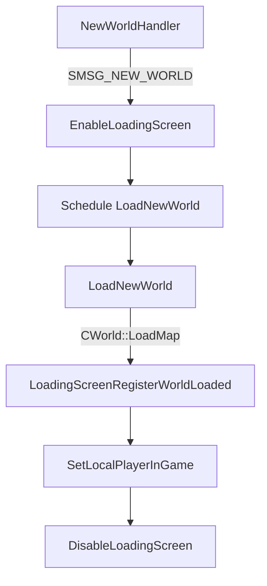

# Loading Screen State Machine

## Overview

The loading screen lifecycle is managed by a simple state machine that transitions between `EnableLoadingScreen`, `LoadNewWorld`, and `DisableLoadingScreen`.

## State Machine Diagram

## Detailed Flow

1.  **NewWorldHandler (00401bc9)**:
    *   Received `SMSG_NEW_WORLD` packet.
    *   Calls `EnableLoadingScreen`.
    *   Schedules `LoadNewWorld` to run on the next frame (or after a delay).

2.  **EnableLoadingScreen (00408172)**:
    *   Calls `DisableLoadingScreen` (cleanup).
    *   Loads textures (`Interface\Glues\loading.blp`, etc.).
    *   Creates screen layer (`ScrnLayerCreate`).
    *   Registers input handlers.
    *   Initializes progress bar (`DAT_008c3cd0 = 0`).

3.  **LoadNewWorld (0040895a)**:
    *   Calls `CWorld::LoadMap` with the Map ID.
    *   Calls `LoadingScreenRegisterWorldLoaded`.

4.  **LoadingScreenRegisterWorldLoaded (0040895a)**:
    *   Sets `DAT_008c3cd0 = 1` (World Loaded Flag).
    *   Calls `UpdateProgressBar` to force a redraw.

5.  **SetLocalPlayerInGame (005d9a65)**:
    *   Called when the player object is fully initialized and ready.
    *   Calls `DisableLoadingScreen`.

6.  **DisableLoadingScreen (00408167)**:
    *   Destroys screen layer (`HandleClose`).
    *   Destroys textures (`GxTexDestroy`).
    *   Unregisters input handlers.
    *   Cleans up progress bar.

## Timing

*   The loading screen is displayed immediately upon receiving `SMSG_NEW_WORLD`.
*   The actual map loading happens in `LoadNewWorld`, which is scheduled asynchronously.
*   The screen remains visible until `SetLocalPlayerInGame` is called, which happens after map loading and object initialization.

## Implementation Notes

*   Ensure `EnableLoadingScreen` is called before any heavy loading operations.
*   Use a separate thread or coroutine for map loading to keep the UI responsive (though Alpha 0.5.3 seems to block the main thread during `CWorld::LoadMap` but updates the progress bar via callbacks).
*   The `UpdateProgressBar` function calls `GxScenePresent`, which implies it forces a frame render during the blocking load operation.
