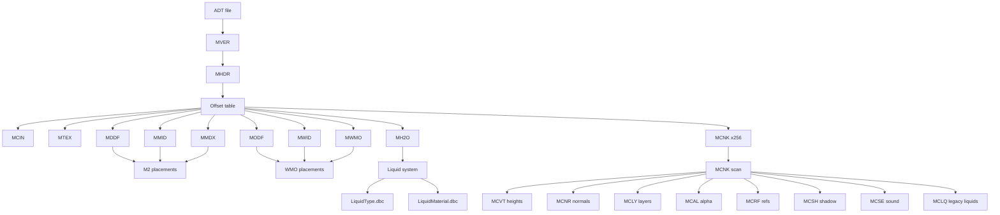

# Ghidra Versioned Analysis Template (ADT/MH2O/MCNK)

Use this template to replicate the analysis for other client versions. Save early and often; split outputs into multiple files to avoid context limits.

## Folder and file conventions

- Root output folder: `specifications/outputs/<version>/ADTs/`
- One task group per file. Suggested files:
  - `terrain-loading-<version>-task1-task2.md`
  - `terrain-loading-<version>-task3-task10.md`
  - `terrain-loading-<version>-mcnk-deep-dive.md`
  - `terrain-loading-<version>-mh2o-liquids.md`
  - `terrain-loading-<version>-lighting-shaders-wmo-liquids.md`
  - `terrain-loading-<version>-mcnr-vertex-layout.md`
  - `terrain-loading-<version>-mddf-modf.md`
  - `ghidra-<version>-analysis-notes.md`

## Save cadence

- Save after every 2-3 functions decompiled.
- If a file starts getting long, split it immediately.
- Always write to the versioned `ADTs` folder.

---

# Task File Template

## Task <n>: <title>

### Function addresses
- `FUN_...`: <short description>

### Decompiled evidence

```c
// function
<snippet>
```

### Definitive answer
- <bullet list of conclusions>

### Constants
- <list constants>

### Confidence
- High / Medium / Low

---

# MCNK Deep Dive Template

## MCNK chunk base and scan

### Function addresses
- `FUN_...`: MCNK init
- `FUN_...`: subchunk scan

### Decompiled evidence

```c
<snippet>
```

### Definitive answer
- <bullet list>

---

## MCNK header layout (observed vs not observed)

| Offset | Field | Type | Observed usage |
| --- | --- | --- | --- |
| 0x00 | flags | uint32 | <yes/no + ref> |
| 0x04 | IndexX | uint32 | <yes/no + ref> |
| 0x08 | IndexY | uint32 | <yes/no + ref> |
| 0x0C | nLayers | uint32 | <yes/no + ref> |
| 0x10 | nDoodadRefs | uint32 | <yes/no + ref> |
| 0x14 | ofsHeight | uint32 | <yes/no + ref> |
| 0x18 | ofsNormal | uint32 | <yes/no + ref> |
| 0x1C | ofsLayer | uint32 | <yes/no + ref> |
| 0x20 | ofsRefs | uint32 | <yes/no + ref> |
| 0x24 | ofsAlpha | uint32 | <yes/no + ref> |
| 0x28 | sizeAlpha | uint32 | <yes/no + ref> |
| 0x2C | ofsShadow | uint32 | <yes/no + ref> |
| 0x30 | sizeShadow | uint32 | <yes/no + ref> |
| 0x34 | areaId | uint32 | <yes/no + ref> |
| 0x38 | nMapObjRefs | uint32 | <yes/no + ref> |
| 0x3C | holes | uint16/uint32 | <yes/no + ref> |
| 0x5C | soundEmitters | uint32 | <yes/no + ref> |
| 0x70 | position.z | float | <yes/no + ref> |
| 0x74 | position.x | float | <yes/no + ref> |
| 0x78 | position.y | float | <yes/no + ref> |

---

## Subchunk mapping (by FourCC)

### Function addresses
- `FUN_...`: subchunk scan

### Decompiled evidence

```c
<snippet>
```

### Definitive answer
- <subchunk list and pointers>

---

# MH2O Deep Dive Template

## MH2O chunk discovery

### Function addresses
- `FUN_...`: ADT parse and MHDR offset mapping

### Decompiled evidence

```c
<snippet>
```

### Definitive answer
- <offset rules>

---

## MH2O per-liquid struct layout (inferred)

### Function addresses
- `FUN_...`: geometry builder
- `FUN_...`: height solver
- `FUN_...`: mask decode

### Field map
- `+0x04`: liquid type id
- `+0x08`: texture coord mode
- `+0x10`: sub-rect count
- `+0x14`: sub-rect list pointer
- `+0x34..+0x40`: bounds
- `+0x44`: vtable
- `+0x54`: mask pointer
- `+0x78`: vertex list

### Definitive answer
- <bullet list>

---

## MH2O mask byte layout

### Evidence

```c
<mask decode snippet>
```

### Definitive answer
- low nibble: 0..f (f = no-liquid)
- bit 6 / bit 7: flags
- index = x + y * 8

---

## Height solver and triangle tests

### Function addresses
- `FUN_...`: bilinear height
- `FUN_...`: triangle intersection

### Definitive answer
- <bullet list>

---

# ADT Read Flow (Mermaid)



---

# Evidence capture checklist

- Record **function addresses** and **brief purpose**.
- Include **exact decompiled snippets** that prove each claim.
- List **constants** (scale, origin, sizes) near the evidence.
- Note **confidence level** and why.
- Save each section as you go.
