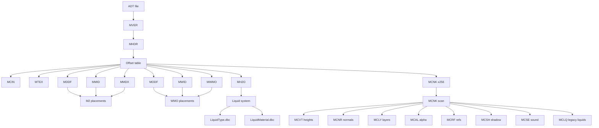

# Wow.exe 3.3.5.12340 - MCNK Deep Dive

Scope: MCNK header usage, subchunk discovery, and how each subchunk is consumed. Notes include where MH2O fits in (it does not live inside MCNK).

## MCNK chunk base and scan

### Function addresses
- FUN_007c64b0: MCNK init
- FUN_007c3a10: subchunk scan

### Decompiled evidence

```c
// FUN_007c64b0
*(undefined4 *)(param_1 + 0x10c) = param_2;      // MCNK chunk header pointer
FUN_007c3a10(param_3);                          // scan subchunks
*(int *)(param_1 + 0x110) = *(int *)(param_1 + 0x10c) + 8; // MCNK data start
```

```c
// FUN_007c3a10
puVar4 = (uint *)(chunkStart + 0x88); // subchunks begin after 0x80 header + 8
for (iVar5 = chunkSize - 0x80; 0 < iVar5; iVar5 = (iVar5 - 8) - size) {
  fourcc = *puVar4;
  data = puVar4 + 2; // data start after FourCC+size
  ...
  puVar4 = (uint *)((int)data + size);
}
```

### Definitive answer
- MCNK data start is **chunk header + 8** (skip FourCC+size).
- Subchunks are found by **sequential scanning** from `chunkStart + 0x88`.
- Subchunk offsets in the MCNK header are **not used** in this path.

---

## MCNK header fields used by the client

### Function addresses
- FUN_007c64b0

### Decompiled evidence

```c
// FUN_007c64b0
*(undefined4 *)(param_1 + 0xb0) = *(undefined4 *)(*(int *)(param_1 + 0x110) + 0x34); // areaId
*(undefined4 *)(param_1 + 0x84) = *(undefined4 *)(*(int *)(param_1 + 0x110) + 0x70); // position.z
FUN_007c6150(..., *(undefined4 *)(pbVar2 + 0x10), *(undefined4 *)(pbVar2 + 0x38));   // nDoodadRefs, nMapObjRefs
```

### Definitive answer
- Used MCNK header offsets (from data start):
  - `0x00`: `flags` (bit 1 checked)
  - `0x10`: `nDoodadRefs`
  - `0x34`: `areaId`
  - `0x38`: `nMapObjRefs`
  - `0x70`: `position.z` (base height)

---

## MCNK header layout (observed vs not observed)

Offsets are from MCNK **data start** (chunk header + 8). This table only marks fields observed in code paths traced via Ghidra. Unknown fields are listed but marked as not observed.

| Offset | Field | Type | Observed usage |
| --- | --- | --- | --- |
| 0x00 | flags | uint32 | Used (bit 1 checked in `FUN_007c64b0`) |
| 0x04 | IndexX | uint32 | Not observed in traced paths |
| 0x08 | IndexY | uint32 | Not observed in traced paths |
| 0x0C | nLayers | uint32 | Not observed in traced paths |
| 0x10 | nDoodadRefs | uint32 | Used (`FUN_007c64b0` -> `FUN_007c6150`) |
| 0x14 | ofsHeight | uint32 | Not used (scan-based subchunk discovery) |
| 0x18 | ofsNormal | uint32 | Not used (scan-based subchunk discovery) |
| 0x1C | ofsLayer | uint32 | Not used (scan-based subchunk discovery) |
| 0x20 | ofsRefs | uint32 | Not used (scan-based subchunk discovery) |
| 0x24 | ofsAlpha | uint32 | Not used (scan-based subchunk discovery) |
| 0x28 | sizeAlpha | uint32 | Used indirectly when MCLQ forces MCAL size |
| 0x2C | ofsShadow | uint32 | Not used (scan-based subchunk discovery) |
| 0x30 | sizeShadow | uint32 | Not used (scan-based subchunk discovery) |
| 0x34 | areaId | uint32 | Used (`FUN_007c64b0`) |
| 0x38 | nMapObjRefs | uint32 | Used (`FUN_007c64b0` -> `FUN_007c6150`) |
| 0x3C | holes | uint16/uint32 | Not observed in traced paths |
| 0x40 | unknown | uint16/uint32 | Not observed |
| 0x44 | unknown | uint32 | Not observed |
| 0x48 | unknown | uint32 | Not observed |
| 0x4C | unknown | uint32 | Not observed |
| 0x50 | unknown | uint32 | Not observed |
| 0x54 | unknown | uint32 | Not observed |
| 0x58 | unknown | uint32 | Not observed |
| 0x5C | soundEmitters | uint32 | Used to gate MCSE (`FUN_007c3a10`) |
| 0x60 | unknown | uint32 | Not observed |
| 0x64 | unknown | uint32 | Not observed |
| 0x68 | unknown | uint32 | Not observed |
| 0x6C | unknown | uint32 | Not observed |
| 0x70 | position.z | float | Used as base height (`FUN_007c64b0`) |
| 0x74 | position.x | float | Not observed in traced paths |
| 0x78 | position.y | float | Not observed in traced paths |

### Notes
- Offsets not observed here may still be used in other code paths or builds. The client in 3.3.5 relies on subchunk scanning rather than header offsets for MCVT/MCNR/MCLY/MCAL/MCRF/MCSH/MCLQ/MCSE.

---

## Subchunk mapping (by FourCC)

### Function addresses
- FUN_007c3a10

### Decompiled evidence

```c
// FUN_007c3a10
MCVT (0x4d435654) -> param_1 + 0x11c
MCNR (0x4d434e52) -> param_1 + 0x124 (size forced to 0x1c0)
MCLY (0x4d434c59) -> param_1 + 0x12c
MCAL (0x4d43414c) -> param_1 + 0x130
MCRF (0x4d435246) -> param_1 + 0x134
MCSH (0x4d435348) -> param_1 + 0x128
MCSE (0x4d435345) -> param_1 + 0x13c (only if header+0x5c != 0)
MCLQ (0x4d434c51) -> param_1 + 0x138 (legacy liquid data)
MCV? (0x4d434356) -> param_1 + 0x120 (vertex color data)
```

### Definitive answer
- MCNK subchunk discovery is driven by FourCC scanning, not header offsets.
- The client recognizes a **legacy MCLQ** liquid subchunk in MCNK.
- **MH2O is not a MCNK subchunk**; it is an ADT-level chunk referenced from MHDR.

---

## MCVT (heights) usage

### Function addresses
- FUN_007c5220

### Decompiled evidence

```c
// FUN_007c5220
pfVar6 = (float *)(*(int *)(param_1 + 0x11c) + 8); // MCVT data
...
// 29 iterations, 5 samples each = 145 heights
pfVar6 = pfVar6 + 5;
```

### Definitive answer
- MCVT provides **145 height samples** per MCNK chunk.
- Heights are combined with `position.z` in `FUN_007c5220` to compute min/max and chunk bounds.

---

## MCNR (normals) usage

### Function addresses
- FUN_007c3f30 / FUN_007c4620 / FUN_007c4f10 / FUN_007c4960

### Evidence summary
- MCNR data is treated as **signed bytes** scaled by `_DAT_00a40360`.
- The pointer is read from `param_1 + 0x124` and advanced by **3 bytes per vertex**.

### Definitive answer
- MCNR stores **145 normals**, 3 bytes each.
- Decoding is consistent across the mesh builders: `(float)(int)byte * _DAT_00a40360`.

---

## MCLY / MCAL / MCRF / MCSH / MCSE

### Function addresses
- FUN_007c5690: processes MCLQ/MCLY related data
- FUN_007c6060: processes MCSE list

### Evidence summary
- `param_1 + 0x12c` (MCLY) is used to build per-layer data and material bindings.
- `param_1 + 0x130` (MCAL) is referenced for alpha map sizing (size uses header `+0x28`).
- `param_1 + 0x134` (MCRF) is used to link doodad and WMO references to the chunk.
- `param_1 + 0x128` (MCSH) is present (shadow map subchunk).
- `param_1 + 0x13c` (MCSE) is used to spawn per-chunk sound emitters.

### Definitive answer
- These subchunks are discovered and stored even when not all of them are consumed in the same function.
- MCSE handling is gated by `header+0x5c` and the pointer at `param_1 + 0x13c`.

---

## Legacy MCLQ in MCNK

### Function addresses
- FUN_007c5690

### Evidence summary
- `param_1 + 0x138` (MCLQ) is used to create per-layer liquid data in MCNK.
- This path is **separate** from the MH2O system.

### Definitive answer
- The client supports **both** MCNK-level MCLQ and ADT-level MH2O liquids.
- Modern WotLK ADTs usually rely on MH2O, but the MCNK MCLQ path remains in the client.

---

## Important correction: MH2O location

- MH2O is **not** a MCNK subchunk.
- It is an **ADT chunk** referenced via MHDR offset `+0x28`.
- MCNK contains **MCLQ** as the legacy liquid subchunk.

---

## Practical implementation notes

1. Do not treat MCNK header offsets as authoritative; the client **scans subchunks sequentially**.
2. If MCNR is missing or mis-sized, force size to `0x1c0` as the client does.
3. If you support MH2O, keep MCLQ decoding for backwards compatibility.
4. Treat `MCV? (0x4d434356)` as a **vertex-color** subchunk; it is optional but recognized.

---

## ADT read flow (with DBC dependencies)



### Chunk order notes
- The file is generally laid out in a **linear chunk sequence**, but the client treats **MHDR offsets as authoritative**.
- For safety, parse by **MHDR offsets first**, then fall back to sequential scan only if an offset is missing.

### Confidence
Medium-High. Subchunk discovery, header field usage, and MCVT/MCNR decoding are directly evidenced. Some MCLY/MCAL/MCSH semantics are inferred from usage patterns and may differ slightly in naming.
