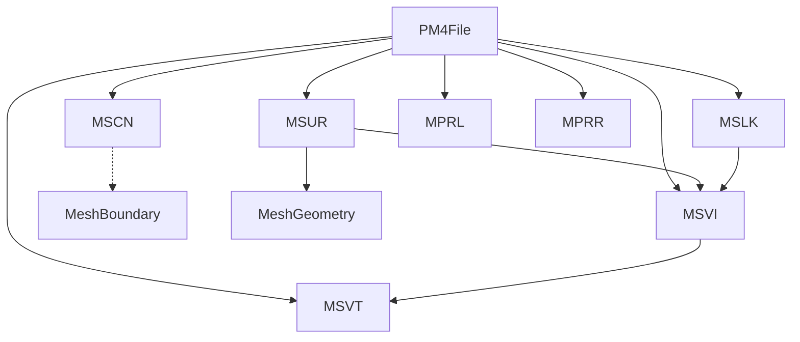

# PM4 Chunk Structure

## Summary Table

| Chunk | Purpose | Key Fields | Decoding Notes |
|-------|---------|------------|---------------|
| MSVT  | Vertex table (geometry) | List<MsvtVertex> (Y, X, Z floats) | Reads 12 bytes per vertex, YXZ order, see MSVTChunk.cs |
| MSVI  | Index table | List<uint> | Reads 4 bytes per index, references MSVT, see MSVIChunk.cs |
| MSUR  | Surface definitions (faces) | Indices into MSVI, face type | Not detailed here |
| MSCN  | Exterior (boundary) vertices | List<Vector3> (X, Y, Z floats) | Reads 12 bytes per vertex, see MSCNChunk.cs |
| MSLK  | Doodad placement entries | List<MSLKEntry> | 20 bytes per entry, anchor index via MSVI, see MSLK.cs |

---

## Detailed Decoding: Major Chunks

### MSVT (Vertex Table)
- **File:** `MSVTChunk.cs`
- **Type:** `List<MsvtVertex>`
- **Decoding:**
  - Reads a sequence of 12-byte structures (float Y, float X, float Z).
  - Each vertex is stored as a struct with properties Y, X, Z.
  - Provides a method to convert file coordinates to world coordinates.
  - Handles various coordinate system transforms (see code comments).
- **Notes:** Referenced by MSVI indices.

### MSVI (Index Table)
- **File:** `MSVIChunk.cs`
- **Type:** `List<uint>`
- **Decoding:**
  - Reads a sequence of 4-byte unsigned integers.
  - Each index references a vertex in MSVT.
  - Provides validation and range retrieval methods.
- **Notes:** Used by MSUR (surface definitions) and MSLK (anchor points).

### MSCN (Exterior/Boundary Vertices)
- **File:** `MSCNChunk.cs`
- **Type:** `List<Vector3>`
- **Decoding:**
  - Reads a sequence of 12-byte (float X, float Y, float Z) values.
  - Each vertex is added to the `ExteriorVertices` list.
  - Throws if the chunk size is not a multiple of 12.
  - Provides a static method to convert file coordinates to canonical world coordinates.
- **Notes:** The count of MSCN points often exceeds MSVT vertex count. The mapping to MSVT or MSLK is not direct and remains an open question.

### MSLK (Doodad Placement Entries)
- **File:** `MSLK.cs`
- **Type:** `List<MSLKEntry>`
- **Decoding:**
  - Each entry is 20 bytes, with fields for flags, group/object ID, anchor index, and more.
  - `MspiFirstIndex` is a 24-bit signed integer; `Unknown_0x10` is the anchor point MSVI index for doodad nodes.
  - Loads all entries into a list.
- **Notes:** Some fields are speculative; anchor points are resolved via MSVI/MSVT. The relationship to MSCN is not fully understood.

---

## Open Questions
- Why does the MSCN point count often exceed the MSVT vertex count?
- Is there a spatial or indirect mapping between MSCN and MSVT or MSLK anchor points?
- Are all MSLK anchors present in MSCN, or are they distinct sets?

## Key Chunks

| Chunk | Purpose | Key Fields |
|-------|---------|------------|
| MSVT  | Vertex table (geometry) | Vertices (Vector3) |
| MSVI  | Index table | Indices (uint/int) |
| MSUR  | Surface definitions (faces) | Indices into MSVI, face type |
| MSCN  | Exterior (boundary) vertices | ExteriorVertices (Vector3) |
| MSLK  | Doodad placement entries | Entries (group/object IDs, anchor indices) |
| MPRL  | Pathfinding positions | Entries (Position, etc.) |
| MPRR  | Pathfinding sequences | Sequences (indices) |
| MDSF  | Destructible object state mapping | msur_index, mdos_index |
| MDOS  | Destructible object states | UniqueID, state fields |
| MDBH  | Model filename table | Filenames |
| MSPI  | Path points | Points |

## Chunk Relationships

## Notes
- MSUR faces reference MSVI indices, which in turn reference MSVT vertices.
- MSCN provides a list of exterior (boundary) vertices, useful for mesh boundary analysis.
- MSLK entries are used for doodad placements, referencing anchor points via MSVI/MSVT.
- MPRL/MPRR provide pathfinding data, often used in navigation mesh analysis.
- MDSF/MDOS link mesh surfaces to destructible object states and ADT placements. 