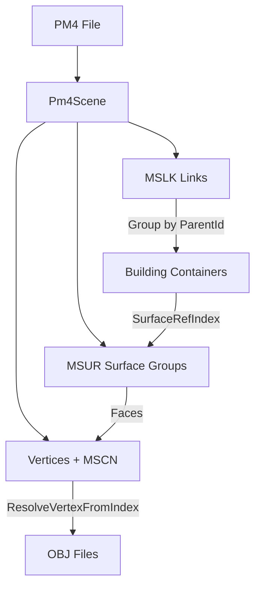

# Direct PM4 to OBJ Exporter - Development Log

## Overview

Development log for the direct PM4 → multiple OBJ building exporter, documenting the evolution from concept to current implementation, including all major discoveries, challenges, and solutions.

## Project Goals

- **Primary**: Export PM4 scenes as multiple building-level OBJ files (not single scene OBJ)
- **Secondary**: Skip SQLite database dependency for simplified workflow
- **Tertiary**: Produce accurate, complete building geometry using proper PM4 data relationships

## Development Timeline

### Phase 1: Initial Implementation (Triangle Chunking)
**Status**: ✅ **Working but Incorrect**

**Approach**: Simple triangle chunking (every 1000 triangles = 1 building)
- Created `DirectPm4Exporter.cs` with basic geometry extraction
- Used `SceneLoaderHelper.LoadSceneAsync` for PM4 loading
- Implemented basic OBJ export with vertex remapping per building
- **Result**: 6 building OBJs from 5200 triangles (reasonable count)
- **Problem**: Arbitrary triangle boundaries cut across real object boundaries

### Phase 2: Surface Group-Based Grouping (MSUR)
**Status**: ✅ **Working but Incomplete**

**Discovery**: PM4 scenes contain `scene.Groups` (MSUR surface groups) for object boundaries
**Implementation**: 
- Replaced triangle chunking with surface group iteration
- Each surface group becomes one building OBJ
- Fixed tuple access (`.Item1/.Item2/.Item3` instead of `.A/.B/.C`)
- **Result**: 16 surface group OBJs (good object count)
- **Problem**: Surface groups are fragments (walls, roofs, floors), not complete buildings

### Phase 3: Vertex Pool Resolution (MSCN Integration)
**Status**: ✅ **Working but Still Incomplete**

**Discovery**: PM4 has two vertex pools that must be properly resolved:
- **Regular vertices**: `scene.Vertices` (indices 0 to `scene.Vertices.Count-1`)
- **MSCN vertices**: `scene.MscnVertices` (indices `scene.Vertices.Count` and above)

**Implementation**:
- Added `ResolveVertexFromIndex()` method for proper vertex pool mapping
- Replaced naive vertex concatenation with index-range-aware resolution
- **Result**: Proper vertex resolution but same incomplete geometry
- **Problem**: MSUR surface groups still only fragments, not complete buildings

### Phase 4: MSLK-Driven Building Assembly (Current)
**Status**: ❌ **Problematic - Over-Aggregation Issues**

**Discovery**: MSLK (linkage table) connects MSUR fragments into complete buildings:
- **`ParentId`**: Building container identifier for grouping
- **`SurfaceRefIndex`**: References specific MSUR surface fragments
- **`HasGeometry`**: Indicates links with actual geometry

**Implementation**:
- `AssembleBuildingsFromMslkLinkage()`: Groups MSLK entries by ParentId
- `AssembleBuildingFromParentGroup()`: Aggregates MSUR fragments per building
- Fixed coordinate system: X-axis flip (`-vertex.X`) for proper orientation

**Current Issues**:
1. **Too many objects**: Excessive building count from ParentId grouping
2. **Cross-contamination**: Buildings contain geometry from unrelated objects
3. **Incorrect aggregation**: Some related parts separated, unrelated combined
4. **Coordinate system**: X-axis flip fixed but may need further validation

## Technical Implementation Details

### Core Classes and Methods

#### `DirectPm4Exporter` Class
- **`ExportDirectPm4ToObj()`**: Main export entry point
- **`ExtractBuildingsFromScene()`**: Building extraction orchestration
- **`AssembleBuildingsFromMslkLinkage()`**: MSLK-driven building assembly
- **`AssembleBuildingFromParentGroup()`**: Per-building MSUR fragment aggregation
- **`CreateBuildingFromSurfaceGroup()`**: Single surface group to building (fallback)
- **`ResolveVertexFromIndex()`**: Proper vertex pool resolution
- **`ExportBuildingToObj()`**: OBJ file generation per building

#### Data Flow

### Key Data Structures

#### PM4 Scene Components
- **`scene.Links`**: MSLK entries (linkage/hierarchy data)
- **`scene.Groups`**: MSUR surface groups (geometry fragments)  
- **`scene.Vertices`**: Regular vertex pool (indices 0+)
- **`scene.MscnVertices`**: MSCN vertex pool (indices after regular)

#### MSLK Entry Fields
- **`ParentId`**: Building container identifier
- **`SurfaceRefIndex`**: Index into MSUR surface groups
- **`HasGeometry`**: Boolean indicating geometry presence
- **`MspiFirstIndex`**: Index into MSPI (geometry data)

#### Surface Group Structure
- **`Faces`**: Triangle face data as `(A,B,C)` tuples
- **`GroupKey`**: Material/type grouping identifier
- **`Name`**: Descriptive group name

## Current Status and Issues

### Working Components ✅
- PM4 scene loading and data extraction
- Vertex pool resolution (regular + MSCN)
- OBJ file generation with proper vertex remapping
- Coordinate system correction (X-axis flip)
- Multiple building OBJ export (vs single scene OBJ)

### Current Problems ❌
1. **Over-Aggregation**: MSLK ParentId grouping creates too many/incorrect buildings
2. **Cross-Contamination**: Buildings contain unrelated geometry
3. **Grouping Logic**: Need better criteria for determining building boundaries
4. **Validation**: No ground truth comparison for correct building assembly

### Possible Solutions Under Investigation
1. **Refine ParentId Grouping**: Filter or sub-group MSLK entries more precisely
2. **Spatial Clustering**: Use geometric proximity in addition to linkage data
3. **MPRR Sentinels**: Investigate MPRR chunk for building boundary markers
4. **Multi-Level Hierarchy**: Consider parent-child relationships beyond ParentId

## Next Steps

1. **Analyze MSLK ParentId Distribution**: Understand why grouping creates excessive buildings
2. **Investigate Alternative Grouping**: Combine MSLK with spatial or MPRR data
3. **Validation Framework**: Create reference comparisons for correct building assembly
4. **Performance Testing**: Test on multiple PM4 files for consistency

## Files Modified

- **`DirectPm4Exporter.cs`**: Complete implementation with all approaches
- **`Program.cs`**: CLI integration for `direct-export` command
- **Documentation**: Various markdown files documenting approaches and findings

## Key Learnings

1. **PM4 is Hierarchical**: Buildings are not flat collections but nested structures
2. **Multiple Data Sources**: Complete buildings require combining MSLK, MSUR, and vertex data
3. **Fragment-Based**: PM4 stores geometry as fragments that must be assembled, not complete objects
4. **Coordinate Systems**: PM4 uses different coordinate conventions requiring transformation
5. **Linkage is Critical**: MSLK provides the key relationships for proper assembly

---

*Last Updated: 2025-08-06*
*Status: Active Development - Over-Aggregation Issues*
