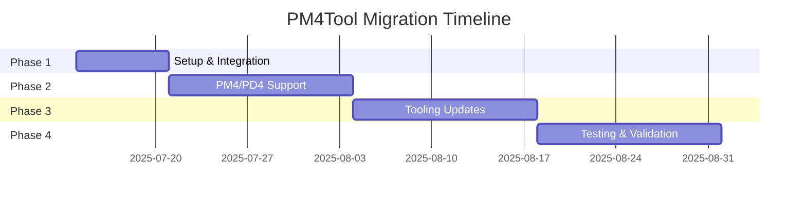

# PM4Tool Migration to WoWFormatLib - 2025 Roadmap

## Overview
This document outlines the strategic migration of PM4Tool to leverage the WoWFormatLib for file format handling, focusing on maintainability, performance, and feature completeness.

## Migration Phases

### Phase 1: Setup & WoWFormatLib Integration (Current Phase)
**Goal**: Establish foundation for WoWFormatLib usage
- [ ] Add WoWFormatLib to solution
- [ ] Create adapter layer for model conversion
- [ ] Update WmoObjExporter
- [ ] Basic testing infrastructure

**Success Metrics**:
- WMO files load and export via WoWFormatLib
- All existing tests pass
- No performance regressions

### Phase 2: PM4/PD4 Support
**Goal**: Add native support for PM4/PD4 formats
- [ ] Define PM4/PD4 structs
- [ ] Implement PM4Reader
- [ ] Integration with file provider system
- [ ] Comprehensive testing

**Success Metrics**:
- PM4 files load successfully
- All known chunks parsed correctly
- Performance meets requirements

### Phase 3: Tooling Updates
**Goal**: Modernize and enhance tools
- [ ] Refactor existing tools
- [ ] Add PM4/PD4 support to ChunkInspector
- [ ] Develop new Pm4Explorer tool
- [ ] Performance optimization

**Success Metrics**:
- All tools work with new backend
- No loss of functionality
- Performance improvements

### Phase 4: Testing & Validation
**Goal**: Ensure quality and stability
- [ ] Unit and integration testing
- [ ] Performance benchmarking
- [ ] Real-world validation
- [ ] Documentation updates

**Success Metrics**:
- 100% test coverage
- Performance metrics met
- No critical bugs in production

## Timeline

## Dependencies
- WoWFormatLib project
- Test files and assets
- Performance testing tools
- Community feedback

## Risks & Mitigation
| Risk | Impact | Probability | Mitigation |
|------|--------|-------------|------------|
| Incomplete format specs | High | Medium | Document known fields, mark unknowns |
| Performance regressions | High | Medium | Profile early, optimize hot paths |
| Breaking changes | Medium | Low | Maintain backward compatibility |
| Missing features | Medium | Low | Document gaps, plan extensions |

## Success Metrics
- All existing functionality preserved
- Performance equal to or better than current
- Comprehensive test coverage
- Clear documentation for new features
- Positive user feedback

## Next Steps
1. Begin Phase 1 implementation
2. Set up CI/CD for automated testing
3. Engage community for feedback
4. Monitor performance metrics
5. Document progress and findings
