# v10.1 Corpus Expansion Plan — All Staged Client Roots

## Goal

Build a **v10.1 dataset** of no more than ~750-1500 unique tiles by extracting ALL maps from ALL staged clients, deduplicating at the ADT level **before** building shards, then running v10 extraction only on the unique tiles.

## Current State

| Source | Tiles | Format | Signals |
|--------|-------|--------|--------|
| Development map (v10) | 27 unique | v10 NPZ | Full: MCAL, MCLY, PM4, normals, liquids |
| All clients (v9 cache) | ~1,600 | v9 NPZ | Limited: no MCAL, no MCLY, no PM4 |

## Staged Clients

All at `I:\parp\parp-tools\output\tmp\wowarchive-clients\`:

| Client | Maps |
|--------|------|
| `0_5_3_3368` | Azeroth, Kalimdor |
| `0_5_5_3494` | Azeroth, Kalimdor, EmeraldDream |
| `0_7_0_3694` | Azeroth, Kalimdor, EmeraldDream |
| `3_0_1_8303` | Northrend |
| `3_3_5_12340` | Azeroth, Kalimdor, Northrend, EmeraldDream, PvPZone01-04 |
| `4_0_0_11927` | Azeroth, Kalimdor, EmeraldDream, LostIsles, LostIslesPhase1 |

## Pipeline

```mermaid
flowchart LR
    A[Staged client roots] --> B[extract-map per client/map]
    B --> C[Raw ADT files]
    C --> D[Lightweight ADT fingerprint]
    D --> E[Deduplicate at ADT level]
    E --> F[Only unique ADTs]
    F --> G[dataset-build-v10-stage1]
    G --> H[v10.1 NPZ shards ~750-1500]
    H --> I[Wave 2 pattern mining]
    I --> J[Final deduplication]
    J --> K[Train]
```



## Key Insight: Deduplicate Before Shard Building

The expensive part is v10 extraction (reading ADTs, building tensor packs, writing NPZs). By fingerprinting and deduplicating at the raw ADT level first, we only run v10 extraction on unique tiles.

### Lightweight ADT Fingerprint

For each root ADT, compute a hash from:
- **MCLY chunk**: Texture layer combinations (which textures are used)
- **MCVT chunk**: Heightmap summary (min/max/mean height)
- **MCNK headers**: Chunk flags, area IDs
- **Tile coordinates**: Map name + X + Y

This is much faster than full v10 extraction because we only read a few chunks per ADT.

## Implementation

### New Command: `adt-fingerprint`

A lightweight C# command in `WowViewer.Tool.Converter` that:
1. Reads a root ADT file
2. Extracts MCLY texture IDs, MCVT height range, MCNK flags
3. Computes a SHA256 fingerprint
4. Outputs JSON with fingerprint + metadata

### New Script: `build_v10_corpus.py`

Orchestrates the full pipeline:

```python
# Phase 1: Extract ADTs from all clients
for each client in staged_clients:
    for each map in client_maps:
        run extract-map --client-root <client> --map <map> --output-dir <adt_dir>

# Phase 2: Fingerprint all ADTs
for each ADT in adt_dirs:
    run adt-fingerprint --input <adt> --output <fingerprint.json>

# Phase 3: Deduplicate at ADT level
fingerprints = load all fingerprint.json
unique_fingerprints = group_by_fingerprint(fingerprints, max_per_group=1)
selected_adts = select_best_per_group(unique_fingerprints)
# Target: ~750-1500 tiles

# Phase 4: Run v10 extraction only on unique ADTs
for each selected ADT:
    run extract-v10-tensors --input <adt> --output <shard_dir>

# Phase 5: Build combined manifest
build v10.1 manifest from all shards

# Phase 6: Wave 2 pattern mining
run mine-v10-mcly, mine-v10-height-profiles, etc.

# Phase 7: Final deduplication
run deduplicate_v10_shards.py

# Phase 8: Train
run train_v10_stage2_terrain_synth.py
```

## Output Structure

```
datasets/v10.1/
  adt_extracted/
    0_5_3_3368__azeroth/
      Azeroth_0_0.adt
      Azeroth_0_0_tex0.adt
      ...
  fingerprints/
    adt_fingerprints.json
    adt_dedup_selection.json
  shards/
    Azeroth_0_0_v10.npz
    ...
  v10.1_manifest.json
  v10.1_deduplicated_manifest.json
```

## Target Size

- **Total unique tiles**: ~750-1500 (user-specified cap)
- **Current development map**: 27 unique tiles
- **Estimated from all clients**: ~2000-4000 raw tiles before dedup
- **After ADT-level dedup**: ~1000-2000
- **After final pattern dedup**: ~750-1500

## Files to Create/Modify

| File | Purpose |
|------|---------|
| `wow-viewer/tools/converter/WowViewer.Tool.Converter/AdtFingerprintCommand.cs` | New lightweight ADT fingerprint command |
| `wow-viewer/scripts/build_v10_corpus.py` | Orchestrate the full pipeline |
| `wow-viewer/scripts/deduplicate_v10_shards.py` | Already exists, reuse for final dedup |

## Phases

### Phase 1: ADT Fingerprint Command
Create the lightweight `adt-fingerprint` command that reads MCLY/MCVT/MCNK from raw ADTs and produces a hash.

### Phase 2: Extract + Fingerprint All Clients
Run `extract-map` + `adt-fingerprint` on all 6 clients. Collect fingerprints.

### Phase 3: Deduplicate + Select
Group by fingerprint, select best representative per group. Cap at ~1500.

### Phase 4: v10 Extraction on Selected
Run `extract-v10-tensors` only on the selected unique ADTs.

### Phase 5: Pattern Mining + Final Dedup
Run Wave 2 mining on the v10.1 shards, then final deduplication.

### Phase 6: Train
Train the Stage 2 model on the deduplicated v10.1 dataset.
