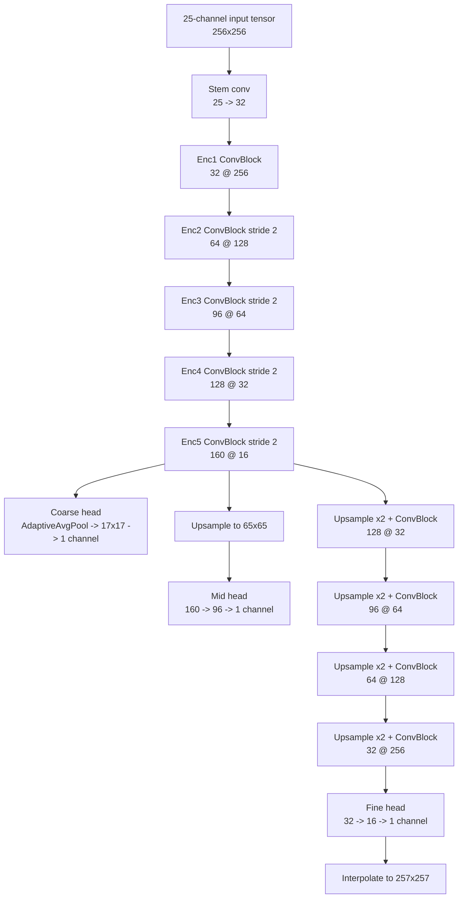
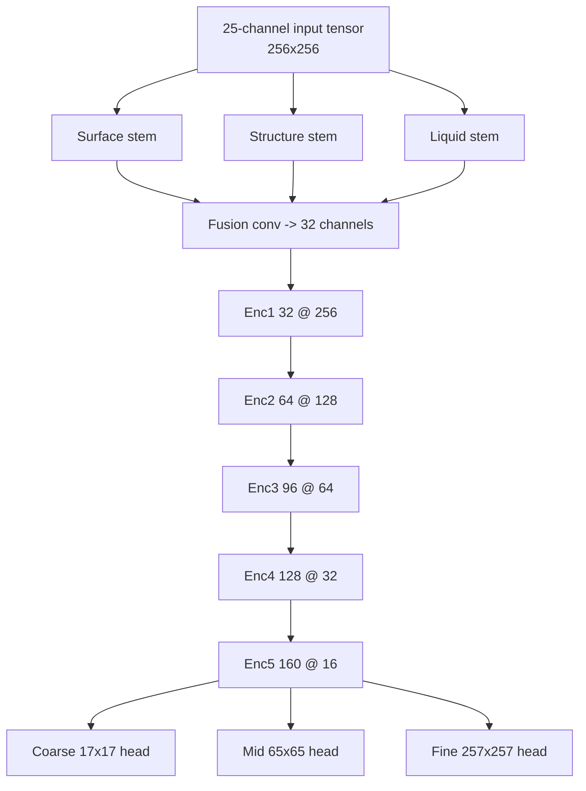

# v10 Stage 2 Terrain Synth Architecture

This document explains what the current Stage 2 terrain model actually is, which shard signals it consumes, how each signal is preprocessed before it reaches the network, and how the currently measured validation probes react when those signals are removed.

Scope:

- Canonical trainer: `wow-viewer/scripts/train_v10_stage2_terrain_synth.py`
- Canonical mixed manifest: `output/ml-training/v10_curated/v10_v9all_plus_native_dev_balanced_manifest.json`
- Canonical measured ablation artifact for this document: `output/ml-training/probes/v10_stage2_run2_analysis_stratified_full_plus_mccv_normals_20260427/metrics.json`

## Executive Summary

There are now two Stage 2 architecture states you need to keep separate.

1. The documented run-2 checkpoint in this file is `early_fusion_v1`.
2. New training runs now default to `structured_fusion_v2`.

`early_fusion_v1` is a pure early-fusion CNN regressor.

- All input signals are concatenated into one 25-channel `256x256` tensor.
- There are no per-signal branches, no explicit cross-attention blocks, no learned gating per signal family, and no separate terrain-vs-object-vs-PM4 towers.
- The entire 25-channel tensor is fed into one shared encoder, then split into three regression heads that predict normalized height at `17x17`, `65x65`, and `257x257`.

`structured_fusion_v2` keeps the same targets and decoder heads, but splits the input front-end before fusion.

- `surface`, `structure`, and `liquid` channel groups each get their own stem before the shared encoder.
- The trainer now decodes legacy `normal_rgb_256` into the Stage 2 normal channel when native `mcnr_normal_xyz` is absent.
- The train loader now uses a weighted sampler to upsample native-v10 and rare structural-signal rows.

The measured validation impact in this file still comes from the older `early_fusion_v1` checkpoint, so read those ablations as the baseline we are trying to move past, not as proof about the new default architecture yet.

## Dataset And Split

The current mixed curated manifest contains `1,262` shards across `22` dataset buckets.

- Train: `1,072`
- Validation: `190`
- Split strategy: `quota-aware-stratified-signal-holdout.v1`
- Priority holdout groups: `native_v10`, `pm4_present`, `mcal_present`, `mccv_present`, `normal_present`

Training data sources:

1. Legacy broad-coverage v9 tensor cache:
   `output/ml-training/cache/v9_direct_archive_core_devholdout_plus11927_alphafix_companionfix_20260420/cache/v9_tensor_cache_manifest.json`
2. Native richer-signal v10 development corpus:
   `output/build-validation/v10-stage1-development-corpus/v10_stage1_manifest.json`

Important current coverage facts from the measured probe:

| Signal family | All samples | Train | Validation | Notes |
|---|---:|---:|---:|---|
| `minimap_rgb_256` | 1262 | 1072 | 190 | Required; always present |
| `hole_mask_16` | 1262 | 1072 | 190 | Required by current trainer path via alias support |
| `object_mask_257` | 1221 | 1039 | 182 | Nearly ubiquitous in the mixed corpus |
| `wl_liquid_mask` / `wl_liquid_height` | 1230 | 1048 | 182 | Also nearly ubiquitous |
| `pm4_path_mask` / `pm4_building_footprint_mask` | 41 | 33 | 8 | Native development-only slice |
| `mcnr_normal_xyz` | 41 in the documented probe; now broad via legacy fallback | 33 in the documented probe; now broad | 8 in the documented probe; now broad | The documented run-2 analysis predates the `normal_rgb_256` fallback |
| `mcal_alpha_pack_256` | 11 | 9 | 2 | Extremely sparse |
| `mccv_rgb` | 5 | 4 | 1 | Extremely sparse |
| `mh2o_surface_height` / `mh2o_depth` | 8 | 8 | 0 | Present only in train on this measured split |
| `mclq_surface_height` | 0 | 0 | 0 | Defined in the trainer, not present in this measured corpus |
| `mtxf_animated_mask` | 0 | 0 | 0 | Defined in the trainer, not present in this measured corpus |

## What Is Fed Into The Model

The input tensor always has `25` channels.

Formula:

$$
3 + 4 + 3 + 3 + 1 + 1 + 1 + 1 + 1 + 1 + 1 + 1 + 1 + 1 + 1 + 1 = 25
$$

The trainer builds one tensor in this exact order:

| Channel range | Signal | Shard keys consumed | Preprocessing before concat | Coverage in measured corpus | Validation effect available? |
|---|---|---|---|---|---|
| `0:3` | `minimap_rgb_256` | `minimap_rgb_256` | Converted to float in `[0,1]`, kept at `256x256` | `1262/1262` | Not ablated in current probes |
| `3:7` | `mcal_alpha_pack_256` | `mcal_alpha_pack_256` | Expected as `4x256x256`; otherwise replaced with zeros | `11/1262` | Yes |
| `7:10` | `mccv_rgb` | `mccv_rgb` | `257`-res RGB bilinearly resized to `256x256` | `5/1262` | Yes |
| `10:13` | `mcnr_normal_xyz` | `mcnr_normal_xyz`, alias `normal_rgb_256` | Native XYZ stays in `[-1,1]`; legacy RGB normals are decoded to `[-1,1]` then resized to `256x256` | `41/1262` in the documented probe; now broad via alias | Yes |
| `13:14` | `mh2o_surface_height` | `mh2o_surface_height` | Bilinearly resized to `256x256` | `8/1262` | Only via grouped liquid ablation |
| `14:15` | `mh2o_depth` | `mh2o_depth` | Bilinearly resized to `256x256` | `8/1262` | Only via grouped liquid ablation |
| `15:16` | `object_mask_257` | `object_mask_257` | Bilinearly resized to `256x256` | `1221/1262` | Yes |
| `16:17` | `object_precise_mask_257` | `object_precise_mask_257`, alias `object_mask_precise_257` | Bilinearly resized to `256x256` | Coverage not reported separately; grouped with objects | Only via grouped object ablation |
| `17:18` | `pm4_path_mask` | `pm4_path_mask`, alias `pm4_mask_257` | Bilinearly resized to `256x256` | `41/1262` | Yes |
| `18:19` | `pm4_building_footprint_mask` | `pm4_building_footprint_mask` | Bilinearly resized to `256x256` | `41/1262` | Only via grouped PM4 ablation |
| `19:20` | `wl_liquid_mask` | `wl_liquid_mask`, alias `liquid_mask_257` | Bilinearly resized to `256x256` | `1230/1262` | Only via grouped liquid ablation |
| `20:21` | `wl_liquid_height` | `wl_liquid_height`, alias `liquid_height_257` | Bilinearly resized to `256x256` | `1230/1262` | Only via grouped liquid ablation |
| `21:22` | `mclq_surface_height` | `mclq_surface_height` | `129`-res bilinearly resized to `256x256` | `0/1262` in measured corpus | Only via grouped liquid ablation |
| `22:23` | `hole_mask_16` | `hole_mask_16`, alias `hole_mask_16x16` | Nearest-neighbor upsample `16 -> 256` | `1262/1262` | Not ablated in current probes |
| `23:24` | `mtxf_animated_mask` | `mtxf_animated_mask` | Nearest-neighbor upsample `16 -> 256` | `0/1262` in measured corpus | Not ablated in current probes |
| `24:25` | `coarse_height_17_prior` | Derived from target `height_17` | Normalize with train-set mean/std, bilinear upsample `17 -> 256` | `1262/1262` | Not ablated in current probes |

Important current object-mask caveat:

- In the current `wowviewer-converter extract-v10-tensors` path, `object_mask_257` is still a placement-derived proxy, not a rendered silhouette.
- The current builder in `WowViewer.Tool.Converter/Program.cs` reads MDDF or MODF placements and paints small centroid disks into tile space.
- That means the Stage 2 `objects` ablation currently measures the value of approximate object occupancy hints, not full geometry-subtracted object truth.
- So the current small-but-real `objects` delta should not be over-read as a verdict on true rendered object masks yet.

### Important Architectural Consequence

For the documented run-2 checkpoint, every row above was concatenated into the same tensor and immediately sent through one shared stem convolution.

That is no longer true for newly started runs.

`structured_fusion_v2` now groups inputs like this before fusion:

- `surface`: minimap, MCAL, MCCV, normals, coarse prior
- `structure`: object masks, PM4 masks, holes, MTXF animation mask
- `liquids`: MH2O, WL, MCLQ liquid signals

The practical change is that sparse structural signals now get dedicated initial capacity instead of competing with minimap and liquid channels from the first convolution onward.

## What Is Used As A Target Instead Of An Input

The trainer predicts normalized height only.

| Array | Role |
|---|---|
| `height_17` | Coarse supervision target and also the derived coarse prior input |
| `height_65` | Mid-resolution supervision target |
| `height_257` | Full-resolution supervision target |

The model does not currently predict:

- MCAL layers
- MCLY palettes
- hole masks
- PM4 classes
- liquid masks
- object masks

Those are all conditioning inputs only.

## What Exists In Shards But Is Not Consumed By Stage 2

The mixed v9 cache contains several arrays that the current Stage 2 trainer does not read.

Examples visible in the curated manifest include:

- `brush_mask_257`
- `chunk_heights_256x145`
- `height_129`
- `height_33`
- `height_hints_v7`
- `normal_rgb_256`
- `wdl_17`
- `wdl_delta_17`

Native v10 Stage 1 shards also carry data that is not consumed by this trainer, including:

- `mcly_texture_ids`
- `mcly_texture_names`

That matters because the answer to "are we using all available signals?" is currently no.

The trainer uses the specific arrays listed in the input matrix above, plus the three height targets. Other shard content is ignored by this model.

That mismatch has now been removed in code: the trainer decodes legacy `normal_rgb_256` into the Stage 2 `mcnr_normal_xyz` channel when native XYZ normals are absent.

## Model Topology

### `early_fusion_v1` checkpoint topology

The documented checkpoint uses a single encoder with three regression heads.

Encoder width schedule:

| Stage | Resolution | Channels |
|---|---:|---:|
| Stem | `256x256` | 32 |
| Enc1 | `256x256` | 32 |
| Enc2 | `128x128` | 64 |
| Enc3 | `64x64` | 96 |
| Enc4 | `32x32` | 128 |
| Enc5 | `16x16` | 160 |

Heads:

- Coarse head predicts `17x17`
- Mid head predicts `65x65`
- Fine head predicts `257x257`

The heads are not autoregressive. The fine head does not explicitly reuse the coarse or mid prediction as input; all three heads branch from the same deepest encoder state.

### `structured_fusion_v2` trainer default topology

New training runs now default to a split-stem variant before the shared encoder.

The decoder and loss targets stay the same. The architectural change is entirely in the front-end signal routing.

## Training Method

### Normalization

- Height targets are normalized with train-set `height_mean` and `height_std`
- The same normalization is used to form the coarse prior channel from `height_17`

### Signal Dropout

Optional input planes can be zeroed during training with probability `--signal-dropout`.

Default:

- `0.15` for optional channels during training
- `0.0` during validation

This is intended to make the model robust to missing signals, but it also reduces the pressure to rely on sparse channels.

### Weighted Training Sampler

New training runs now also apply weighted sampling on the train split.

Default boosts:

- `native_v10_boost = 1.0`
- `rare_signal_boost = 3.0`

The weighted sampler gives extra probability mass to rows containing:

- native v10 data
- PM4
- MCAL
- MCCV
- normals

This is the first concrete trainer-side answer to the earlier problem where sparse structural rows were present in the manifest but still rarely seen by the optimizer.

### Loss Stack

Per-sample loss is:

$$
L = L_{full} + 0.5L_{mid} + 0.25L_{coarse} + 0.3L_{grad} + 0.3L_{mid-residual} + 0.3L_{detail-residual}
$$

Where:

- $L_{full}$ is L1 on `257x257`
- $L_{mid}$ is L1 on `65x65`
- $L_{coarse}$ is L1 on `17x17`
- $L_{grad}$ is XY gradient mismatch on `257x257`
- `mid-residual` compares mid detail against upsampled coarse structure
- `detail-residual` compares fine detail against upsampled mid structure

## Validation Subsets And Measured Impact

Baseline metrics for the documented checkpoint probe:

- Checkpoint: `output/ml-training/v10_stage2_v9cache_native_dev_cuda_run2/checkpoints/best.pt`
- Model variant: `early_fusion_v1`
- Evaluated epoch: `6`
- Stratified validation baseline: `loss=0.3426`, `MAE=70.12m`, `RMSE=82.52m`

### Subset Matrix

| Validation subset | Count | MAE | RMSE | Reading |
|---|---:|---:|---:|---|
| Baseline all validation samples | 190 | `70.12m` | `82.52m` | Global mixed score |
| `native_v10` | 8 | `41.60m` | `48.03m` | Native development subset currently scores much better than legacy holdout |
| `legacy_only` | 182 | `71.37m` | `84.04m` | Most of the difficulty remains in the legacy-dominant bulk set |
| `pm4_present` | 8 | `41.60m` | `48.03m` | Same current rows as native/normals subset in this probe |
| `mcal_present` | 2 | `41.94m` | `49.48m` | Too small to support strong conclusions |
| `mccv_present` | 1 | `29.85m` | `30.70m` | Single-sample subset only |
| `normal_present` | 8 | `41.60m` | `48.03m` | Same current rows as native/PM4 subset in this probe |

### Signal Impact Matrix

The validation-analysis path measures effect by zeroing selected input channels at evaluation time and re-running the checkpoint.

These numbers still describe the older `early_fusion_v1` checkpoint. They are now the baseline comparison point for future `structured_fusion_v2` runs, not the expected result of the new default architecture.

| Ablation group | Zeroed channels | Overall delta MAE | Delta MAE on applicable subset | Interpretation |
|---|---|---:|---:|---|
| `pm4` | `17:19` | `+0.006m` | `+0.146m` on `pm4_present` | PM4 is wired in, but current checkpoint barely depends on it |
| `mcal` | `3:7` | `+0.000m` | `+0.000m` on `mcal_present` | No measurable use in current checkpoint on a 2-sample subset |
| `objects` | `15:17` | `+0.077m` | `+0.081m` on `object_present` | Object masks have small but real effect |
| `liquids` | `13:15`, `19:22` | `+17.359m` | `+18.122m` on `liquid_present` | Liquid conditioning is by far the strongest currently used signal family |
| `mccv` | `7:10` | `+0.009m` | `+1.771m` on `mccv_present` | Localized effect, but evidence is only one validation sample |
| `normals` | `10:13` | `+0.112m` | `+2.656m` on `normal_present` | Normals matter on the native subset more than PM4 does right now |

Practical reading:

- The model is clearly using liquid-related channels.
- The model is only weakly using PM4 in the current checkpoint.
- The model appears not to be using MCAL at all in the current checkpoint.
- Normals and MCCV show stronger localized effect than PM4, but their sample counts are too small for strong confidence.
- Sparse-signal underuse is consistent with the current early-fusion architecture and current data imbalance.

## Rendered Object Silhouettes And Shadow Residuals

There is now a more concrete next signal slice than the original placeholder `object_mask_257` path.

The repo already contains two relevant footholds:

1. A rendered-object-mask pipeline hook in `wow-viewer/scripts/generate_m2_masks.py`.
2. A shadow-residual framing in `gillijimproject_refactor/docs/SHADOW_SCAR_OBJECT_RECOVERY.md`.

Those two surfaces suggest a cleaner decomposition of what the minimap is carrying.

### Current State

- Stage 2 currently sees placement-derived occupancy hints through `object_mask_257` and `object_precise_mask_257`.
- Those masks are useful, but they do not remove object geometry from the minimap and they do not explicitly explain static chunk shadows.
- `MCSH` is already understood elsewhere in the repo as chunk-local baked shadow evidence, not as a direct object id list.

### Stronger Working Hypothesis

The stronger training signal is not just "where objects are placed."

It is:

$$
M_{terrain\_only} \approx \text{observed minimap} - \text{rendered object contribution} - \text{explained baked shadow contribution}
$$

That gives two new artifact families that are more defensible than centroid masks alone:

- `rendered_object_mask_257` or equivalent: object silhouette or footprint generated from placed model geometry or bounds
- `shadow_residual_mask_257`: the part of baked shadow evidence not explained by current surviving placements

### Why This Matters For Stage 2

- If a tile contains dense object placement, the current minimap can encode object roofs, walls, canopies, and their cheap baked shadows as if they were terrain appearance.
- That is exactly the failure mode you called out on object-heavy tiles such as `development_22_18`: the model may learn to treat object content as terrain evidence.
- A rendered subtraction path gives the model a better chance to learn actual terrain from minimap color, instead of treating object silhouettes as ground truth height cues.
- A shadow residual path also creates a retrieval and recovery lane for cases like old Theramore, where shadow evidence may outlive complete object placement truth in early builds.

### Important Guardrail

The right reading of `MCSH` is still the narrower one documented in `SHADOW_SCAR_OBJECT_RECOVERY.md`:

- `MCSH` is evidence of static shadowed terrain regions
- it is not a direct object catalog
- the useful supervised target is likely `explained shadow` versus `unexplained scar`, not "decode exact object ids straight from shadow bits"

So the most defensible next training path is residual modeling, not magical direct object recovery.

### Recommended Narrow Validation Slice

The next bounded experiment should be:

1. Pick a PM4 or object-heavy tile such as `development_22_18`.
2. Re-run or validate the existing rendered-mask path from `generate_m2_masks.py` against that tile.
3. Compare three masks side by side:
   - centroid placement mask
   - rendered or bounds-derived object mask
   - chunk-shadow or `MCSH` overlay
4. Measure how much minimap area can be explained by current placements alone.
5. Derive an initial `terrain_only_minimap` or `object_subtracted_minimap` preview artifact for manual inspection.

That slice is small enough to validate without committing to a full new model family, but strong enough to tell us whether full-object masks and shadow subtraction will materially improve the supervision signal.

## Method Of Operation End To End

1. Discover NPZ shards from a manifest, NPZ file, or NPZ directory.
2. Reject shards missing `minimap_rgb_256`, `height_257`, or `height_17`.
3. Read optional arrays and legacy aliases when present.
4. Build train/validation split with signal-aware quota protection.
5. Normalize height targets from train-set statistics.
6. Build one `25x256x256` input tensor per sample.
7. Apply optional signal dropout during training.
8. Predict coarse, mid, and fine normalized heights.
9. Optimize the multi-term loss stack.
10. Save `last.pt`, update `best.pt`, and emit preview PNGs for improved checkpoints.
11. After training, reload `best.pt` and run validation subset and ablation analysis.
12. Write `metrics.json`, `validation_samples.json`, and preview sidecars for inspection and sharing.

## Current Limits

- The broad corpus is still dominated by legacy v9 cache shards.
- PM4, normals, MCCV, and especially MCAL are sparse.
- `mclq_surface_height` and `mtxf_animated_mask` have no measured presence in the current mixed corpus.
- The legacy cache contains potentially useful arrays that Stage 2 does not currently consume.
- The documented `early_fusion_v1` checkpoint gave sparse signals no dedicated path or weighting advantage; `structured_fusion_v2` plus the weighted sampler now address that partially, but there is not yet a full trained proof showing how much this improves real signal usage.
- The current ablation results do not prove a signal is intrinsically unhelpful; they only show that the current checkpoint is or is not using it.

## Immediate Follow-On Questions Suggested By This Document

If the goal is to make the model actually use PM4 and other sparse structural signals, the most direct next questions are:

1. Should sparse-signal samples be oversampled or loss-weighted?
2. Should PM4, normals, and MCAL get dedicated encoder branches instead of only early fusion?
3. Should the legacy cache be regenerated so normals and other richer signals are available across a broader fraction of the corpus?
4. Should Stage 2 predict auxiliary targets such as PM4, object occupancy, or liquid fields so those features cannot be ignored while optimizing height alone?