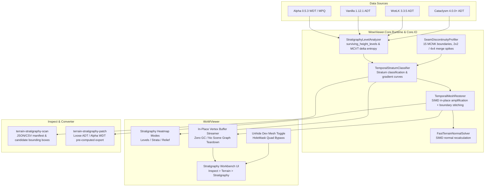

# Architecture & Implementation Plan: Temporal Stratigraphy & Weak Signal Development Mesh Restoration

## 1. Technical Approach & Architectural Overview

Spec 194 establishes a unified, high-performance architecture for discovering, analyzing, visualizing, and restoring historical temporal stratigraphy across World of Warcraft map tiles.

---

## 2. File & Component Breakdown

### Phase 1: Core Stratigraphy Analysis & Classification (`WowViewer.Core.Runtime`)
- [NEW] `src/core/WowViewer.Core.Runtime/World/Terrain/Stratigraphy/TemporalStratum.cs`
  - Enum: `Active_1x`, `LateRevision_4x_8x`, `ClassicErasure_33x`, `DeepProto_64x_512x`, `Holed_DevMesh_1x`, `Submerged_OceanFloor`, `StagingArea_Untextured`, `BitExact_Flat`.
- [NEW] `src/core/WowViewer.Core.Runtime/World/Terrain/Stratigraphy/StratigraphyLevelAnalyzer.cs`
  - Computes `surviving_height_levels` ($|\{h\}|$), raw MCVT delta histograms, and amplitude relief without $|Z| < 50\text{m}$ bias.
- [NEW] `src/core/WowViewer.Core.Runtime/World/Terrain/Stratigraphy/SeamDiscontinuityProfiler.cs`
  - Evaluates C0 and C1 discontinuities across internal chunk indices 1..15; detects 2x2 merge spike at 8, 4x4 merge spikes at 4/8/12, or MCNK-sized 128x128 world cells.
- [NEW] `src/core/WowViewer.Core.Runtime/World/Terrain/Stratigraphy/TemporalStratumClassifier.cs`
  - Combines level count, amplitude, hole mask, and surrounding elevation to classify chunks and tiles into `TemporalStratum` records.
- [NEW] `tests/WowViewer.Core.Tests/StratigraphyLevelAnalyzerTests.cs`
  - Comprehensive unit test suite for level counting, seam profiling, and stratum classification.

### Phase 2: High-Performance SIMD Restoration & Normal Solver (`WowViewer.Core.Runtime`)
- [NEW] `src/core/WowViewer.Core.Runtime/World/Terrain/Stratigraphy/FastTerrainNormalSolver.cs`
  - Vectorized (`Vector<float>`) normal generation across 257x257 and 9x9/8x8 chunk lattices.
- [NEW] `src/core/WowViewer.Core.Runtime/World/Terrain/Stratigraphy/TemporalMeshRestorer.cs`
  - Zero-allocation in-place height transformation with negative floor anchoring, continuous scale factors ($1\times \to 512\times$), and C0/C1 slope boundary stitching against adjacent non-weak chunks.
- [NEW] `tests/WowViewer.Core.Tests/TemporalMeshRestorerTests.cs`
  - Unit tests verifying exact mathematical scaling ($\times 33.334$, $\times 16$, $\times 64$), seam stitching, and normal generation.

### Phase 3: In-Viewer Interactive Stratigraphy Workbench (`WoWViewer`)
- [MODIFY] `src/viewer/WoWViewer/ViewerApp.cs`
  - Replace unoptimized `RefreshTerrainWeakSignalRestoreForLoadedTiles()` and `ReplaceTileChunksAndRebuild()` with `TemporalMeshRestorer` in-place vertex stream updates.
- [MODIFY] `src/viewer/WoWViewer/ViewerApp_Sidebars.cs`
  - Modernize "Weak Signal Amplifier" into the "Temporal Stratigraphy Workbench":
    - Continuous gradient slider ($1.0\times \to 512.0\times$).
    - Quick preset snap buttons ($1/0.03 = 33.334\times$, $16\times$, $64\times$).
    - False-color heatmap visualization modes (Level Count, Stratum Class, Relief Amplitude).
    - "Unhide Dev Meshes" toggle (renders geometry behind `HoleMask`).
    - "Submerged Floor Relief" toggle.
- [MODIFY] `src/viewer/WoWViewer/Terrain/TerrainRenderer.cs` / `TerrainMeshBuilder.cs`
  - Support in-place dynamic vertex buffer height/normal patching without mesh recreation.

### Phase 4: Corpus-Wide Batch Scanner & Dual-Era Offline Patcher (`Tools`)
- [NEW] `tools/converter/WowViewer.Tool.Converter/TerrainStratigraphyPatchCommand.cs`
  - CLI command `terrain-stratigraphy-patch` supporting `--client-root`, `--map`, `--output-dir`, `--format alpha|lk|both`, and `--stratum-filter`.
- [NEW] `tools/inspect/WowViewer.Tool.Inspect/TerrainStratigraphyScanCommand.cs`
  - CLI command `terrain-stratigraphy-scan` producing `stratigraphy_manifest.json` with per-chunk level counts, seam spikes, and candidate dev mesh bounding boxes.
- [MODIFY] `tools/inspect/WowViewer.Tool.Inspect/Program.cs` & `tools/converter/WowViewer.Tool.Converter/Program.cs`
  - Register new commands.

---

## 3. Phased Implementation Roadmap

1. **Phase 1 (Analysis & Classification)**: Implement core data models, `StratigraphyLevelAnalyzer`, `SeamDiscontinuityProfiler`, `TemporalStratumClassifier`, and unit tests.
2. **Phase 2 (SIMD Restoration & Boundary Stitching)**: Implement `TemporalMeshRestorer`, `FastTerrainNormalSolver`, anchor preservation, and unit tests.
3. **Phase 3 (Viewer Workbench Integration & Zero-Allocation Path)**: Wire `TemporalMeshRestorer` into `ViewerApp` and `ViewerApp_Sidebars.cs`, replacing legacy hitching paths with smooth in-place vertex streaming and false-color heatmaps.
4. **Phase 4 (CLI Batch Scanner & Dual-Era Patcher)**: Implement `terrain-stratigraphy-scan` and `terrain-stratigraphy-patch` CLI tooling and verification.
