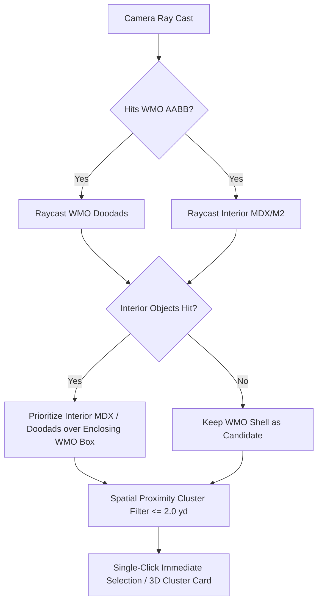

# Spec 211: Implementation Plan — WMO Interior Ray Picking, Doodad Selection & Ghost Transparent Wireframes

## 1. Architectural Design

### Phase 1: WMO Interior Fall-Through & Doodad Ray Picking
- **WMO Doodad Raycast**: Expose `TryPickDoodadByRay` in `WmoRenderer` to test ray intersections against doodads using their local transforms and model bounds transformed by `wmoInstance.Transform`.
- **WMO Fall-Through**: In `WorldScene.CollectSceneObjectPickHits`, when a WMO is hit along with interior MDX/M2 models or WMO doodads located inside the WMO's AABB, prioritize the interior items over the outer WMO envelope.
- **Candidate Presentation**: Format WMO doodads in `ViewerApp_ClickSelection` with model names, local positions, and def indices, wiring selection to highlight and frame in the inspector.

### Phase 2: Ghost Transparent Wireframe Rendering
- **ModelRenderer (MDX/M2)**: In `ModelRenderer.RenderWithTransform`, when `_wireframe` is active:
  1. Draw Pass 1 (Ghost Textured Fill): `PolygonMode.Fill`, `GL_BLEND`, `fadeAlpha = 0.33f`.
  2. Draw Pass 2 (Crisp Wireframe): `PolygonMode.Line`, `GL_POLYGON_OFFSET_LINE (-1.0, -1.0)`.
- **WmoRenderer**: In `WmoRenderer.RenderWithTransform`, when `_wireframe` is active:
  1. Draw Pass 1: Transparent textured fill at 33% opacity.
  2. Draw Pass 2: Line mode wireframe overlay with polygon offset.
- **TerrainRenderer**: In `TerrainRenderer.RenderTerrainWithQuality`, when `_wireframe` is active:
  1. Draw Pass 1: Standard textured terrain fill (so texturing and terrain features remain clearly visible).
  2. Draw Pass 2: `PolygonMode.Line` with polygon offset on top.

---

## 2. File Changes

| Component | File | Changes |
|---|---|---|
| **WMO Rendering** | [`src/viewer/WoWViewer/Rendering/WmoRenderer.cs`](file:///I:/parp/parp-tools/wow-viewer/src/viewer/WoWViewer/Rendering/WmoRenderer.cs) | Add `TryPickDoodadByRay`; implement ghost transparent pass + prominent wireframe overlay in `RenderWithTransform` |
| **Model Rendering** | [`src/viewer/WoWViewer/Rendering/ModelRenderer.cs`](file:///I:/parp/parp-tools/wow-viewer/src/viewer/WoWViewer/Rendering/ModelRenderer.cs) | Implement dual-pass ghost wireframe (Pass 1 fill at 33% alpha, Pass 2 offset wireframe line overlay) |
| **Terrain Rendering** | [`src/viewer/WoWViewer/Terrain/TerrainRenderer.cs`](file:///I:/parp/parp-tools/wow-viewer/src/viewer/WoWViewer/Terrain/TerrainRenderer.cs) | Implement dual-pass terrain wireframe (Pass 1 textured fill, Pass 2 wireframe overlay) |
| **Scene Picking** | [`src/viewer/WoWViewer/Terrain/WorldScene.cs`](file:///I:/parp/parp-tools/wow-viewer/src/viewer/WoWViewer/Terrain/WorldScene.cs) | Add `ObjectType.WmoDoodad`; implement WMO container fall-through and WMO doodad picking in `CollectSceneObjectPickHits` |
| **Click Selection** | [`src/viewer/WoWViewer/ViewerApp_ClickSelection.cs`](file:///I:/parp/parp-tools/wow-viewer/src/viewer/WoWViewer/ViewerApp_ClickSelection.cs) | Handle `ObjectType.WmoDoodad` candidates; link to inspector; verify fallback and spatial proximity |
| **Registry & Memory** | [`specs/STATUS.md`](file:///I:/parp/parp-tools/wow-viewer/specs/STATUS.md), [`memory-bank/activeContext.md`](file:///I:/parp/parp-tools/wow-viewer/memory-bank/activeContext.md) | Register Spec 211 and update operational context |

---

## 3. Verification Plan

1. **Unit & Build Validation**:
   - `dotnet build WoWViewer.csproj -c Debug` (0 errors).
   - Core test suites pass.
2. **Interactive Operator Verification**:
   - Fly into Goldshire Lion's Pride Inn or Stormwind Cathedral.
   - Click directly on interior chairs, tables, and decorations inside the building: verify clicks fall through to the interior objects and WMO doodads without getting locked to the exterior WMO shell.
   - Toggle Wireframe mode on objects and terrain: verify textured polygons are rendered transparently at 33% opacity with obvious wireframe lines on top.
