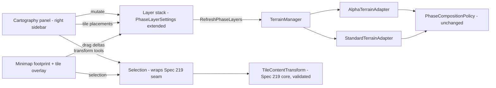

# Technical Design Plan: Cartography — Multi-Map, Multi-Tile Composition Workbench (Spec 222)

**Created**: 2026-09-04 (v2 — expanded to tile-granularity + transform consolidation)
**Spec**: [spec.md](spec.md)
**Status**: Draft — implementation-ready for Phases 1–2; Phase 3 settles the open questions

## Architecture Overview

Cartography is a **right-sidebar workbench + minimap interaction layer over the existing composition
engine**. Composition semantics do not change: `PhaseCompositionPolicy`, `PhaseChunkMerger`, channel
gates, presence gating, placement ownership, and name-table remapping stay exactly as they are. What
changes is the surface (right sidebar), the granularity (map AND tile), and the interaction
(minimap drag instead of numeric offsets).



## Key Decisions

### D1 — Extend `PhaseLayerSettings`; add `TilePlacement` as a first-class child
- Layer gains: `ResolvedState` (Resolved / Unresolved / NotYetChecked), `FootprintColor`
  (palette by stack index), and the existing `TilePlacements` list (Spec 219) becomes the
  single-tile mechanism — promoted from "advanced setting" to a primary Cartography object.
- `PhaseTilePlacement` (donor tile → target tile) already exists in Core from Spec 219; Cartography
  reuses it rather than inventing a parallel type. Composition order: a placement claims its target
  over the whole-layer offset (219 semantics, unchanged).

### D2 — Footprints and donor tile grids come from the adapters
- `ITerrainAdapter.GetOccupiedTiles(mapName)` — Alpha: phase WDT MAIN offsets; Standard: overlay
  WDT existing-ADT set. Powers footprints AND the donor tile-picker grid.
- `ITerrainAdapter.TryResolveMap(mapName)` → resolution state for inline badges.
- Resolution failures return empty sets + `Unresolved`; the UI renders an error row (FR-6).

### D3 — Minimap overlay: one draw pass, two object kinds
Screen-space pass over the minimap widget (tile-rect fills at current zoom/pan, reusing the
teleport path's tile↔pixel mapping):
- **Footprints** (whole-map layers): translucent fill + border in the layer's color.
- **Tile placements**: solid rects in the layer's color with a target-side ghost at the drop site.
- Interaction: hover selects; drag moves (layer offset or placement target); release applies once
  and calls `RefreshPhaseLayers()` exactly once. Click-without-drag on base terrain still teleports
  (FR-9). Drag re-stream storms are impossible by construction — refresh is release-only.

### D4 — Transform tools wrap the validated Spec 219 seam
`TileContentTransform` (Core, 55/55 tests green) already owns exact-grid rotate/mirror and the
free-angle approximation reporting. Cartography's tools are UI over it:
- Selection scope: whole layer | tile set | single tile.
- Copy/paste: a copied selection is a staged `TileLoadResult` set + placements; paste applies ALL
  channels the source carries, gated by the target layer's channel checkboxes — the direct fix for
  Spec 195's partial-paste defect. Spec 208's channel reconciliation (Phase 0 complete) is the
  contract for cross-map texture remapping on paste.
- 45°/free-angle results report their approximation mode in the UI (219 US2), never silent resample.

### D5 — One surface: retire the old panels in the same change
- Left-sidebar Phase Map Layers panel: deleted when Cartography's layer rows land (Phase 3).
- Chunk manipulator (Spec 195 UI): deleted when Cartography's selection+transform parity checklist
  passes (Phase 4) — each 195 capability is either present in Cartography or listed as deferred with
  an owner spec, so nothing silently vanishes (FR-11, spec US6).
- DBC child-map discovery moves into Cartography's add flow as suggested layers.

### D6 — Alignment is computed, not guessed
`ComputeAlignmentOffset(layer, targetMode)`: base occupied tiles B, layer occupied tiles L;
offset = target − centroid(L), target = centroid(B) (default) or camera tile. Deterministic,
unit-testable on synthetic WDTs. Single-tile placements need no alignment — the drop IS the target.

## File Changes

| File | Change |
|---|---|
| `src/viewer/WoWViewer/Terrain/ITerrainAdapter.cs` | `GetOccupiedTiles(mapName)` + `TryResolveMap(mapName)`. |
| `src/viewer/WoWViewer/Terrain/AlphaTerrainAdapter.cs` | Occupied tiles from phase WDT MAIN; resolution state from `ResolvePhaseAdapter` (already caches failures); donor tile-grid source. |
| `src/viewer/WoWViewer/Terrain/StandardTerrainAdapter.cs` | Same from overlay WDT existence set. |
| `src/viewer/WoWViewer/Terrain/TerrainManager.cs` | `GetLayerFootprint`, `GetDonorTileGrid(mapName)`, `ComputeAlignmentOffset`, `MoveLayerBy`, `MoveTilePlacement`, `StageSelection`/`CommitSelection` (copy/paste staging). |
| `src/viewer/WoWViewer/ViewerApp_PhaseLayers.cs` | Rewritten as the Cartography panel: layer stack rows (swatch, state badge, expandable details), add-map combo + DBC suggestions, donor tile-grid picker, transform toolbar. Old panel entry point removed. |
| `src/viewer/WoWViewer/ViewerApp_MinimapAndStatus.cs` | Footprint + placement overlay draw pass; drag interaction; teleport contract preserved. |
| `src/viewer/WoWViewer/MinimapHelpers.cs` | Tile↔pixel mapping helpers extended for the overlay. |
| `src/viewer/WoWViewer/ViewerApp.cs` (chunk manipulator call sites) | Retire 195 UI once parity checklist passes; keep `GlobalChunkCoordinate` concepts where 208 consumes them. |
| `tests/WowViewer.Core.Tests/Maps/CartographyWorkbenchTests.cs` | New: occupied-tile queries (synthetic Alpha/Standard WDTs), alignment math, clamps, placement claim-over-offset, copy/paste full-channel invariant, rotate-selection round-trip. |

## Phase Roadmap

### Phase 1 — Footprints & tile placements visible (P1 foundation)
1. Adapter occupied-tile queries + resolution state + unit tests (synthetic WDTs).
2. `ResolvedState`/`FootprintColor` on the layer model.
3. Minimap footprint pass (layers) + placement-rect pass (single tiles), badges included.
4. Inline state badges in layer rows.
**Gate 1**: Shadowfang over Azeroth shows its 10-tile footprint with zero input; a single donor tile
from an unoverlapping map is visible and droppable; unresolvable maps error inline.

### Phase 2 — Drag-to-align (P1 interaction)
5. Minimap drag: layer offsets and placement targets; release-only refresh; teleport contract.
6. Unit tests: delta math, clamps, placement-claim-over-offset, offset→source round-trip.
**Gate 2**: dragging a layer N tiles shifts 3D composition by exactly N tiles on both eras; dragging
a placement moves only that placement.

### Phase 3 — Transform tools + consolidation (P1/P2)
7. Transform toolbar wrapping `TileContentTransform`: rotate 90/45/free, mirror, copy/paste on the
   current selection; full-channel paste per channel gates.
8. Donor tile-grid picker in the add flow (single-tile placements without the minimap).
9. **Retire the left-sidebar phase panel**; chunk manipulator UI retired after the parity checklist.
10. DBC child-map suggestions inside Cartography.
**Gate 3**: 30-second add→align criterion; copy→rotate→paste keeps all channels; exactly one
manipulation surface remains.

### Phase 4 — Cleanup + docs
11. Dead-code removal; full suite gate (no new failures vs the 1441/10 baseline).
12. `specs/STATUS.md` + `activeContext.md` updates; operator interactive verification (Alpha:
    Shadowfang over Azeroth; Standard: one 3.3.5 map; plus a tile copy/rotate/paste flight).

## Risks

- **Scope creep is the historical failure mode**: mitigated by the phase gates — footprints and drag
  land before any transform tool; chunk granularity is explicitly a fast follow (Q2 default).
- **Minimap interaction conflicts**: click-vs-drag contract (D3) + teleport preserved on base-tile
  click without drag.
- **Re-stream storms**: release-only refresh, never per-frame.
- **195 parity gaps on retirement**: the parity checklist (US6.2) makes every capability explicitly
  owned before the old UI is deleted.
- **Saved settings**: layer model is extended, not forked; `OverlayMapName` shim stays.

## Validation

```powershell
dotnet build I:/parp/parp-tools/wow-viewer/WowViewer.slnx -c Debug
dotnet test I:/parp/parp-tools/wow-viewer/tests/WowViewer.Core.Tests/WowViewer.Core.Tests.csproj -c Debug --filter "FullyQualifiedName~Phase|FullyQualifiedName~Composition|FullyQualifiedName~Cartography|FullyQualifiedName~TileContentTransform"
```

Operator-owned: interactive drag/align on real 0.5.3 and 3.3.5 maps, plus a tile copy/rotate/paste
flight. Never claimed from unit tests alone.
