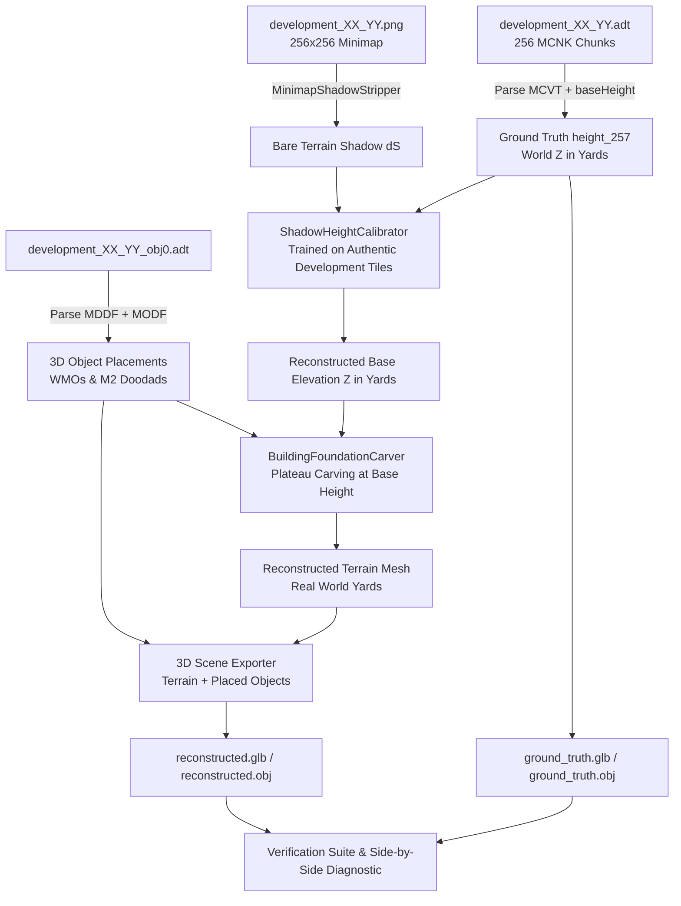

# Technical Design Plan: Spec 264

## 1. System Architecture

---

## 2. Component Design

### 2.1 Authentic Development Dataset Extractor (`harvester/v60/development_ground_truth.py`)
- Reads authentic root ADT chunks:
  - 256 MCNK chunks: header at `+8` contains chunk position $(X, Y, Z)$ and offset to MCVT (`+0x14`).
  - MCVT subchunk: 145 float32 heights.
  - Assembles into $(257, 257)$ float32 grid using exact WoW quincunx lattice coordinates:
    - 9x9 outer vertices on even half-steps ($X, Y \in \{0, 2, \dots, 16\}$).
    - 8x8 inner vertices on odd half-steps ($X, Y \in \{1, 3, \dots, 15\}$).
    - Fills interleaved nodes via 4-neighbor averaging.
- Reads `_obj0.adt`:
  - `MMDX` (M2 model names) and `MDDF` (265 doodad placements: nameId, uniqueId, pos XYZ, rot XYZ, scale).
  - `MWMO` (WMO building names) and `MODF` (WMO placements: nameId, uniqueId, pos XYZ, rot XYZ, bounding box min/max).
- Reads matching minimap PNG: $256 \times 256$ RGB array in $[0.0, 1.0]$.
- Computes rasterized building footprint mask: $256 \times 256$ boolean array.

### 2.2 Shadow-to-Height Calibrator (`harvester/v60/shadow_height_calibrator.py`)
- Analyzes relationship between bare terrain shadow residual $dS(x, y)$ (or reconstructed integrated surface) and true ground-truth world-space elevation $Z(x, y)$ across authentic development tiles.
- Solves optimal affine and non-linear scale parameters:
  $$\hat{Z}(x, y) = Z_0 + \alpha \cdot \Phi(dS(x, y)) + \beta \cdot Z_{\text{macro}}(x, y)$$
  where $\alpha$ is calibrated against authentic relief ranges (yards), avoiding the arbitrary `height_scale = 45.0` guesswork.
- Yields calibrated elevation grids directly in real world yards.

### 2.3 Building Foundation Carver (`harvester/v60/building_foundation_carver.py`)
- For tiles with WMO buildings (e.g. `development_16_38` with Goldshire Inn & Blacksmith, or `development_14_35` with Stormwind Harbor):
  - Identifies building footprint polygon and bounding box.
  - Samples perimeter terrain elevation at building entrance / foundation edge.
  - Carves a leveled foundation plateau inside the footprint at the foundation elevation:
    $$Z_{\text{foundation}}(x, y) = Z_{\text{base}} \quad \text{for } (x, y) \in \text{Footprint}$$
  - Applies cubic Hermite taper around building foundation border to smoothly blend with surrounding terrain.
  - Eliminates flat pancake terrain pits.

### 2.4 End-to-End 3D Scene Materialization (`harvester/v60/mesh_exporter.py` & CLI)
- Extends mesh export to package:
  - Scupted terrain mesh (vertices, faces, UVs, normal map).
  - Placed WMO and M2 bounding boxes / markers positioned at their authentic world coordinates.
  - Ground-truth reference mesh export for direct comparison in Windows 3D Viewer / Blender.
- Diagnostic visual report comparing reconstructed vs ground truth elevation profiles.

---

## 3. Implementation Phases

- **Phase 1: Ground Truth Extractor**: Implement `development_ground_truth.py` and unit tests validating extraction across `test_data/original_development`.
- **Phase 2: Shadow-to-Height Calibrator**: Implement `shadow_height_calibrator.py` and benchmark on non-flat development tiles.
- **Phase 3: Foundation Plateau Carver**: Implement `building_foundation_carver.py` to carve foundations under WMO footprints.
- **Phase 4: Pipeline Integration & CLI**: Update `v60_reconstruct_minimap.py` to use calibrated elevation and foundation carving, exporting side-by-side 3D GLB/OBJ meshes.
- **Phase 5: Verification & Receipts**: Run validation on held-out authentic tiles (`development_16_33`, `development_16_38`, `development_15_34`), generate receipts per AGENTS.md §9.2, and update status ledgers.
